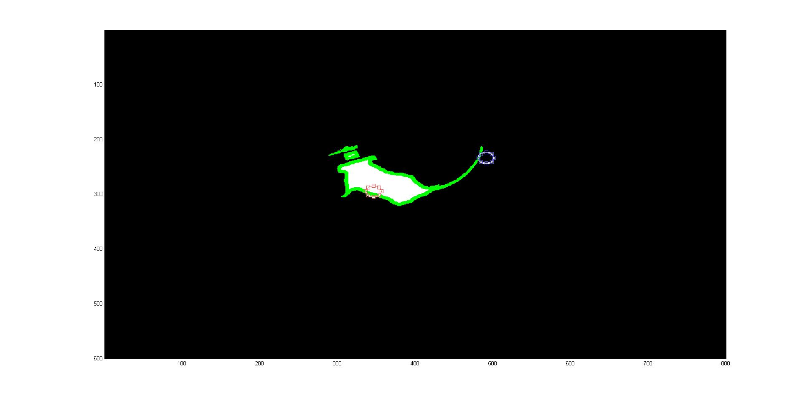
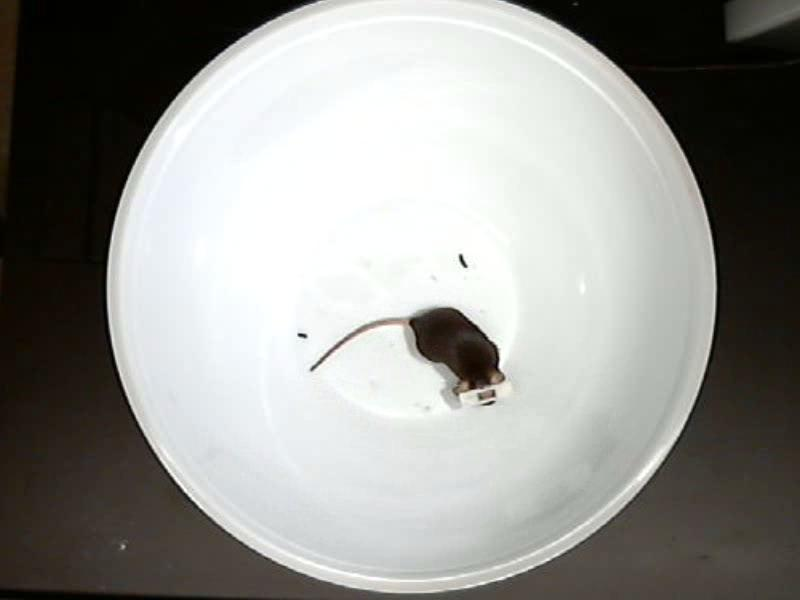
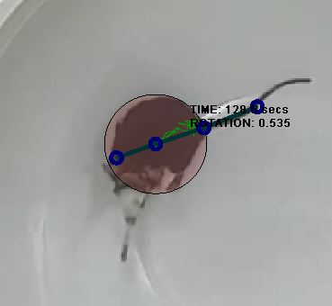
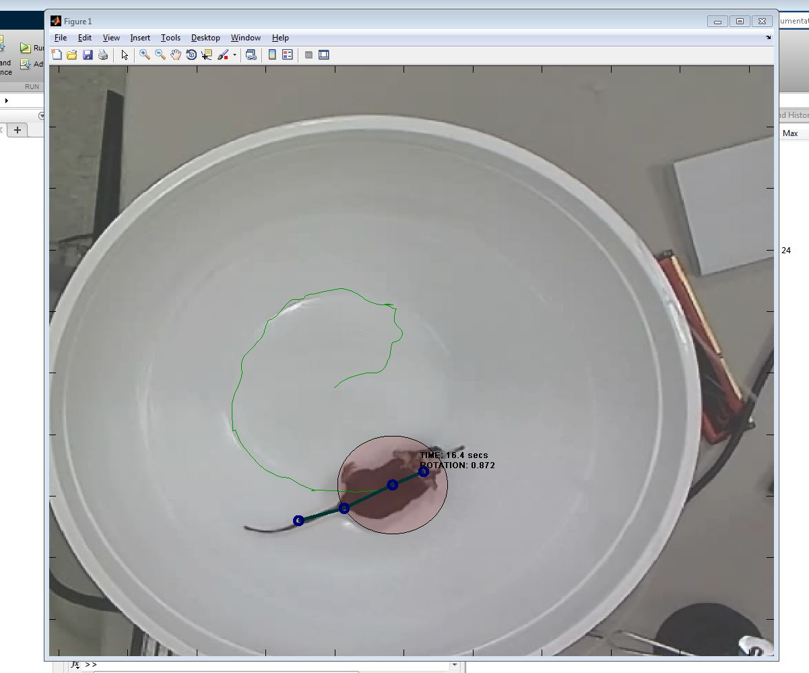
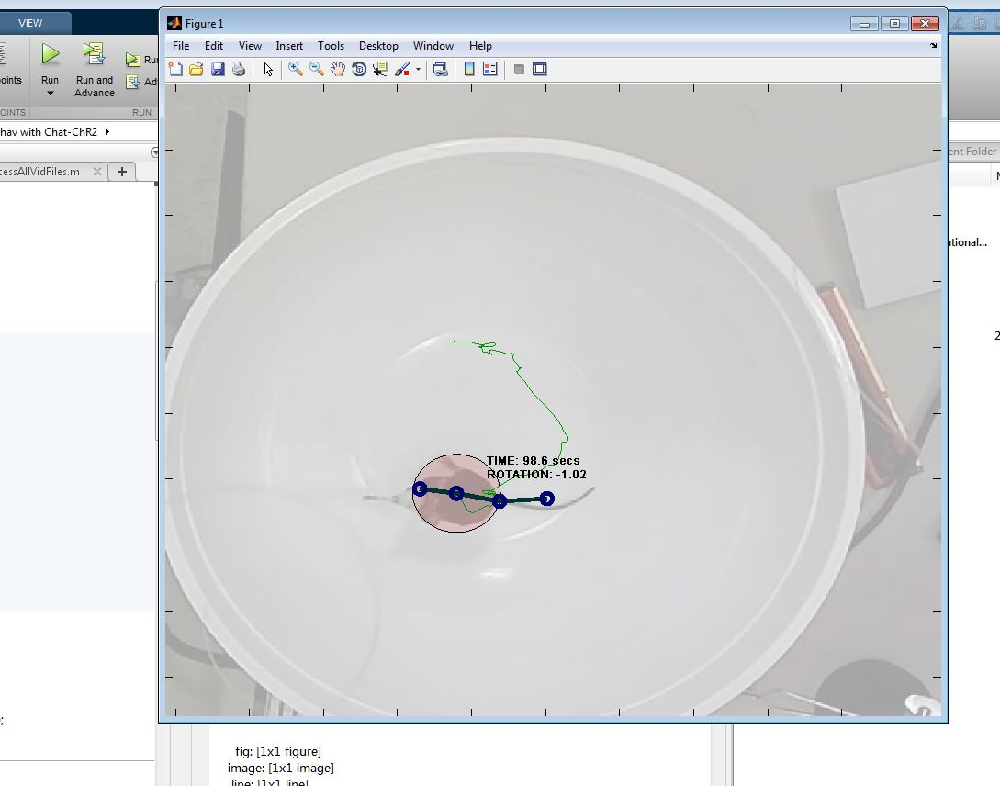
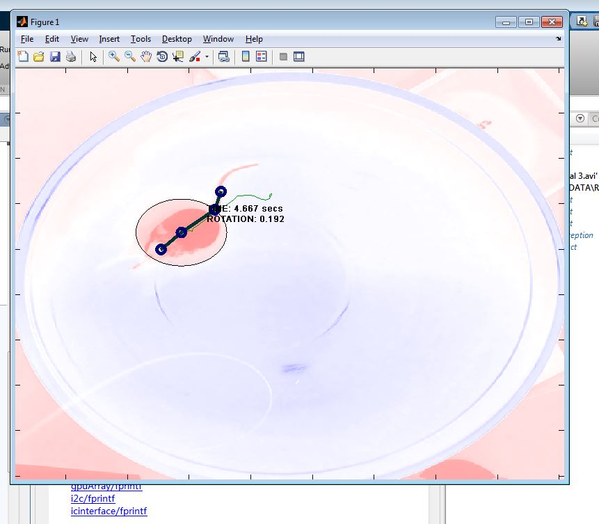

## Animal Tracking

A webcam-based motion tracking box constructed to analyze the movement of our unilaterally lesioned PD mouse model. Video is recorded at 15 frames per second and processed on-line or off-line using a function written in MATLAB. Briefly, this function converts each frame to a black and white image (logical matrix), uses morphological filtering functions to isolate the mouse (remove mouse excrement) and identify its body (remove the tail), then finds the center of mass in cartesian coordinates (maximum center of projection on x- and y-axes), and the rostral-caudal orientation measured in degrees off the x-axis. Orientation is determined by the index of maximum of a radon transform of the binary image. Processing is accomplished at a rate of 15-16 fps, using a single core, or 64 fps using parallel processing on a quad-core processor with multi-threading enabled. The advantage of this apparatus over the virtual-reality system is that it allows free movement of an untrained mouse, with real-time movement metrics at nearly the same rate as the spherical treadmill.

#### Figure: text is ignored {#animal-tracking-bowl}

{#bowl-Capture width=30%}

{#bowl-tail_ID width=30%}
{#bowl-twoframes width=30%}
{#bowl-untitled width=30%}\

{#bowl-framesample width=30%}
{#bowl-mousedata1 width=30%}
{#bowl-mousedata1close width=30%}
{#bowl-mousedata1fiberon1 width=30%}
{#bowl-mousedata2 width=30%}
{#bowl-mousedata3 width=30%}
{#bowl-mousedata4 width=30%}
{#bowl-mousedata7highres width=30%}

Caption: Processing steps for automated rotation counting procedure used in hemiparkinsonian mouse study

<!--
{#fig:animal-tracking-framesample height="2in"}
{#fig:animal-tracking-tail height="2in"}
{#fig:animal-tracking-twoframes height="2in"}
{#fig:animal-tracking-untitled height="2in"}
{#fig:animal-tracking-Capture height="2in"} -->
