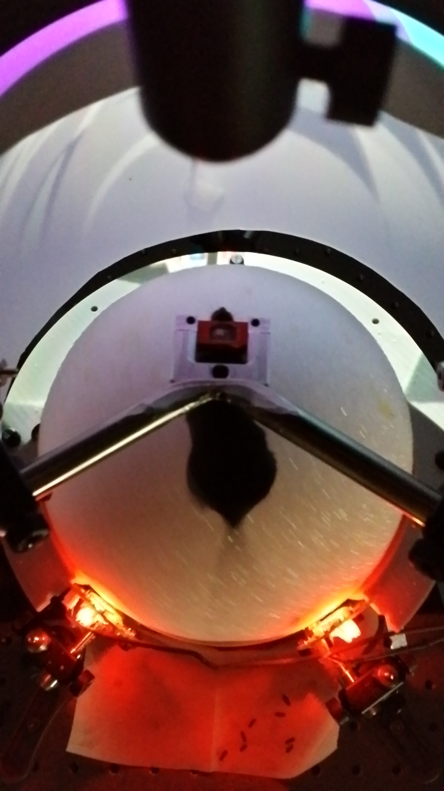
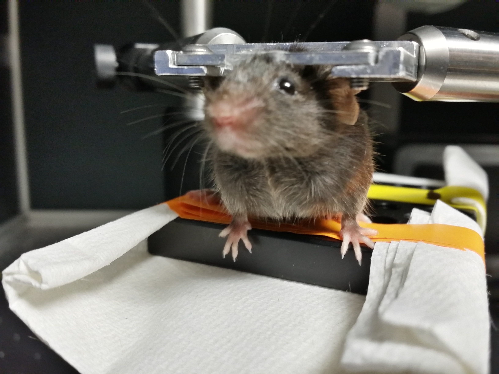
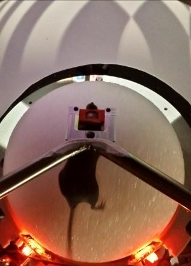
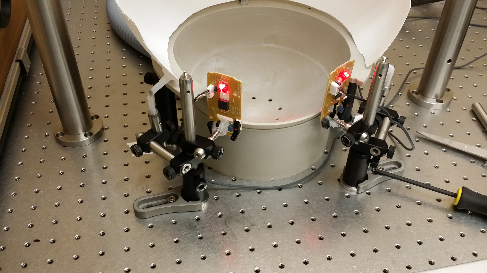

## Spherical Treadmill & Virtual-Reality

<!-- ## Spherical Treadmill -->

A virtual reality system was assembled, adopting methods from the Harvey lab lab [@harvey_intracellular_2009]. This system allows placement of a head-restrained mouse on an 8-inch diameter polystyrene foam ball supported by a cushion of compressed air, surrounded by a toroidal projection screen. Ball rotation is tracked with two optical computer mice placed orthogonal to each other. Movement vectors are fed into a virtual-reality engine that updates the image projected onto a toroidal screen surrounding the ball, simulating movement through any arbitrary virtual world. Movement vectors are recorded as an arbitrarily scaled translation in the mouse-relative X and Y axes and rotation around the Z axis, at approximately 30 ms intervals. This behavioral apparatus has the advantage of allowing trivial measurement of the mouse’s movement ability while the mouse is head-fixed. The disadvantage is the time and potential confounds involved with training individual mice to use the system.

#### Figure: {#spherical-treadmill}









{width=50%}
.jpg)

Caption: this treadmill supports behavior ...


### Water Delivery

<!-- {#fig:treadmill-waterport height="2in"} -->

#### Figure: {#water-delivery}


Caption: waterport


### Motion Sensors


#### Generic USB Computer Mouse with Minimal Linux

Run "mouse_relay.py" on any computer running linux to send xy-data from 2 USB optical computer mice to another computer over an RS-232 serial-port connection. The receiving computer (in this implementation) uses MATLAB to read the values and translate the xy-values from 2 mice on the surface of a sphere into 3 values corresponding to rotation of that sphere around 3 orthogonal axes (XYZ) with their origin at the sphere's center.

RECEIVING FUNCTIONS: The MATLAB class that receives the serial input (xy-values from both mice) is called "VrMovementInterface"

The MATLAB function that translates the double-stream of xy-values from the sphere's surface into rotation around its center is called "moveBucklin.m" and is located in the VIRMEN "movements" folder.

SERIAL FORMAT: XY-Values are transmitted in 'packets' using an ascii formatted string terminated by a newline. Each packet contains the Sensor Number (s) that the reading is coming from, followed by the X-Value (dx), then the Y-Value (dy). The python code looks like the following:

```python
> datastring = s + 'x'+dx + 'y'+dy + '\n'
```

For example:

```csv
> s1x34y-3
```

#### Navigation Sensor Chip with Arduino

Works with ADNS library (Mark Bucklin) to pass \[dx,dy\] measurements from two ADNS-9800 laser mouse sensors (placed 45-degrees apart on surface of styrofoam ball).


#### Figure: {#Motion Sensors}




Caption: Motion Sensors for tracking ball movement. can be used to control and record speed and direction of mouse movement within the VR world.
