# List of Figures {.unnumbered}

\listoffigures

# Introduction: Background and Literature Review

# Neural Interface Construction: Fabrication, programming, and assembly of of an automated system to open the channel to your mouses mind.

## Animal Tracking

### Behavior Box

{ width=50% }

### Mouse in a Bowl

{ width=30% }
{ width=30%}
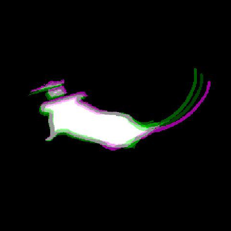{ width=30%}

{ width=20% }
{ width=20% }
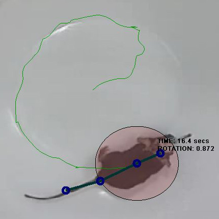{ width=20% }
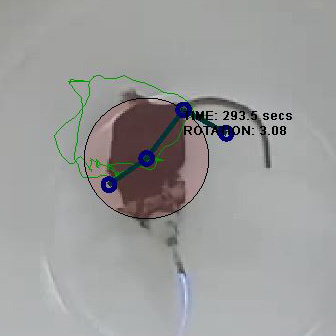{ width=20% }

Automated animal Tracking for "Mouse in a bowl" type experiments

### Spherical Treadmill

{ width=30% }
{ width=30% }
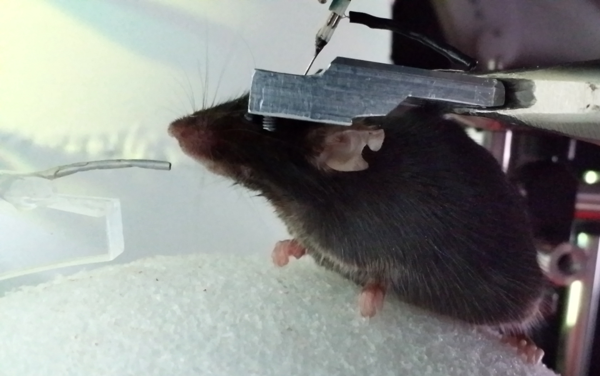{ width=30% }

Spherical treadmill

### Headplate Holder

{ width=30%}
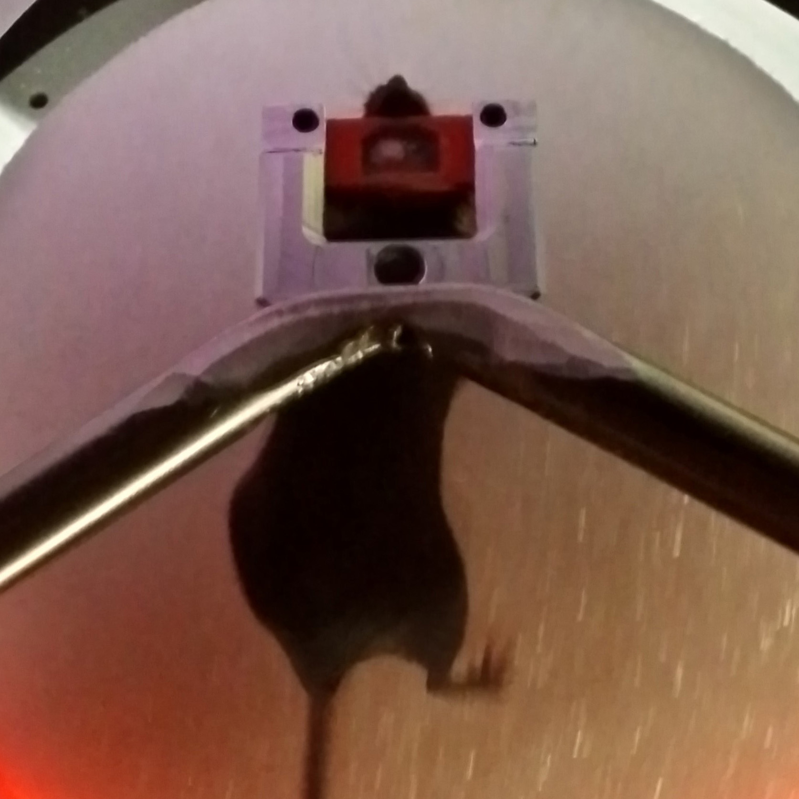{ width=30%}
{ width=30%}

Headplate holder

### Motion Sensors

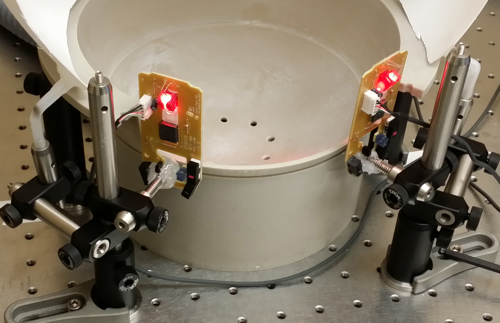{ width=30% }
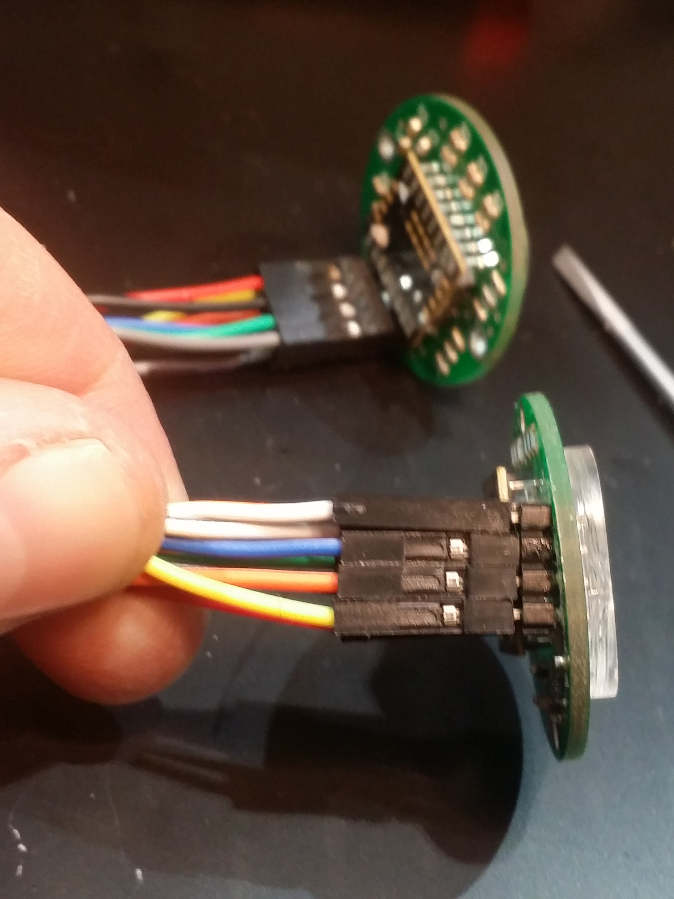{ width=30% }
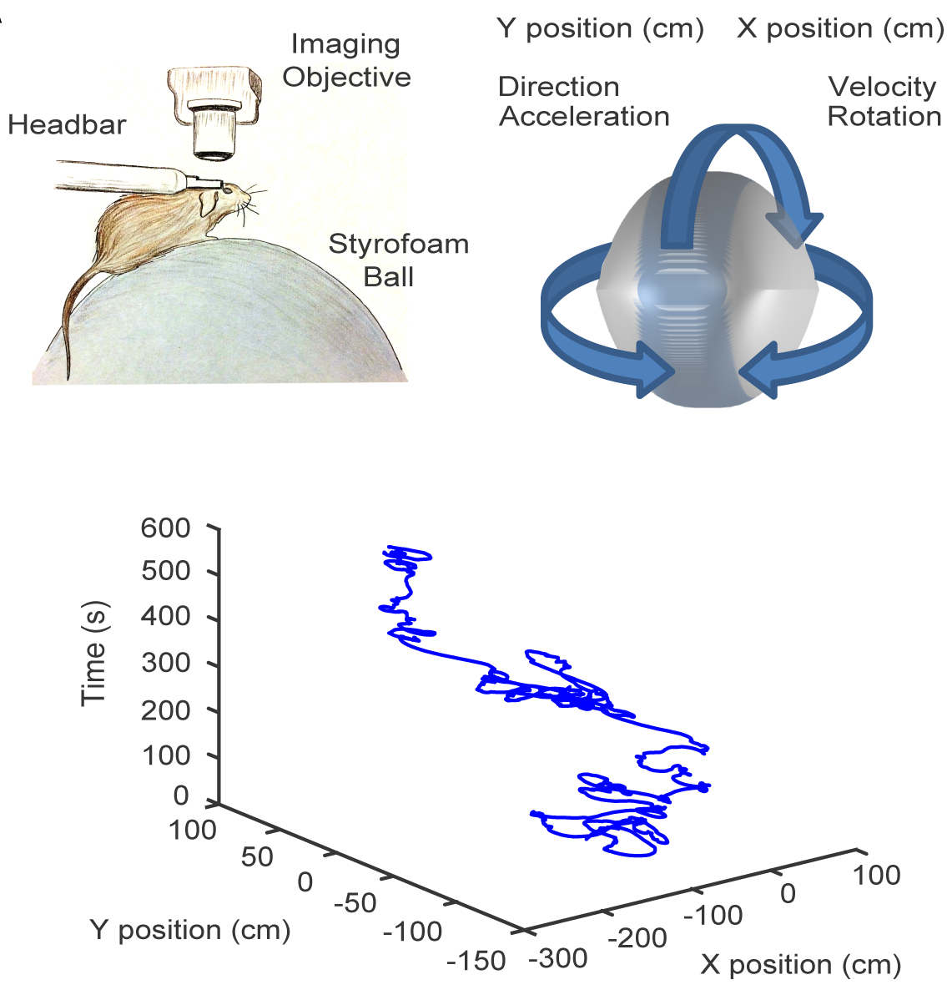{ width=30% }

Motion sensors

## Microscopes

### Microscope Construction

{ width=50% }

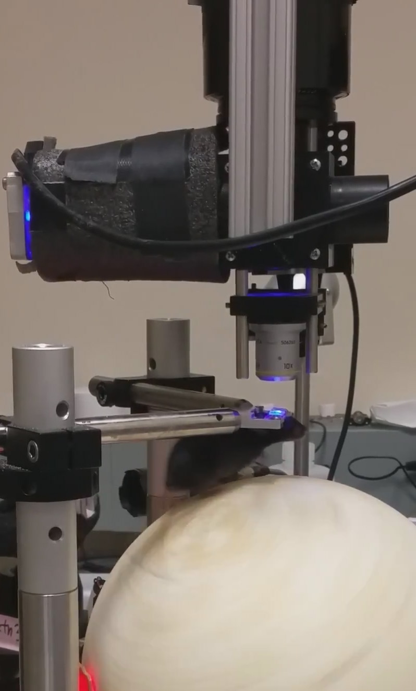{ width=40% }
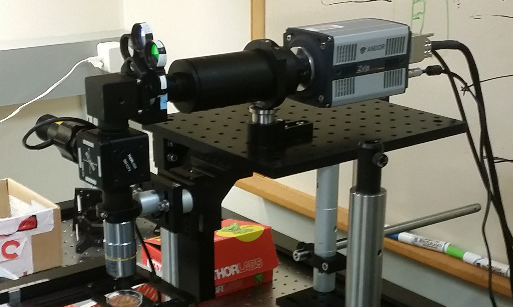{ width=40% }

{ width=30% }
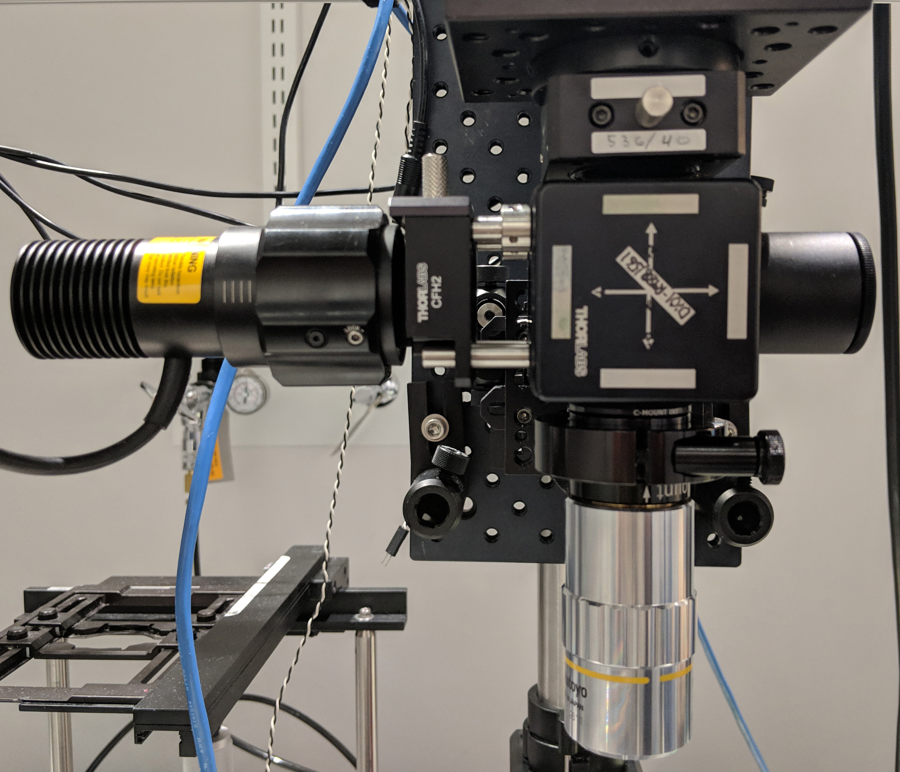{ width=30% }
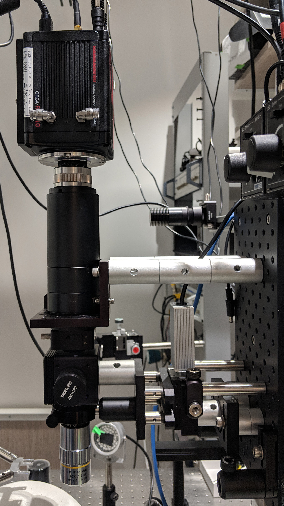{ width=30% }

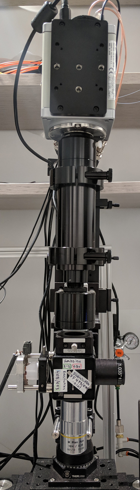{ width=30% }
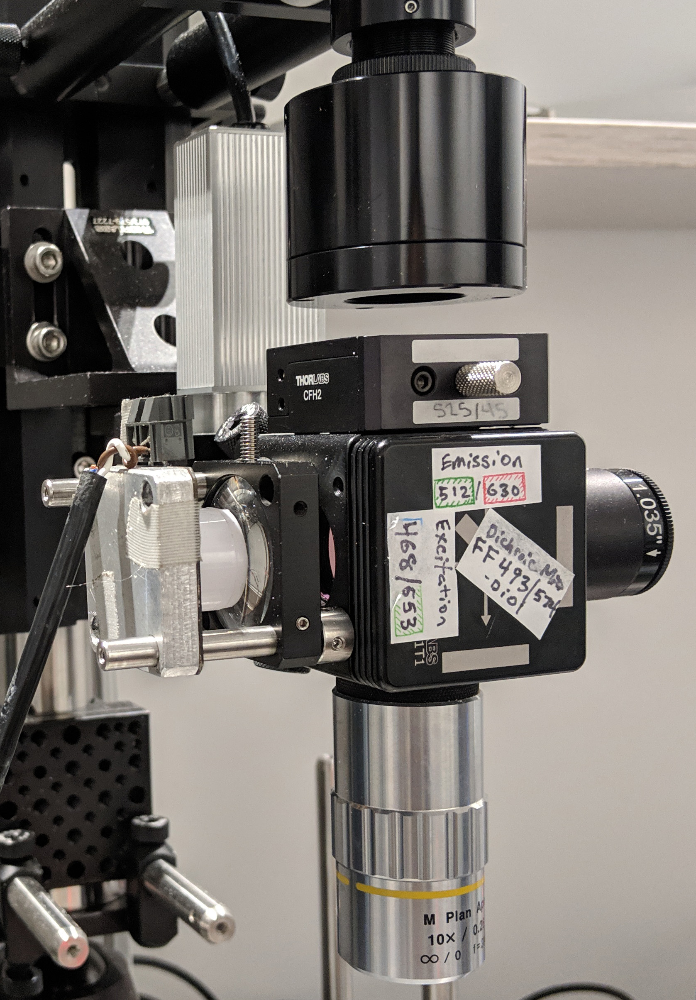{ width=30% }
{ width=30% }

Widefield fluorescence microscope

# Neural Analytics: Computational considerations and approaches to manage the continuous flow of neural imaging data... and if not making sense of it, perhaps making use of it.

## Image Processing

### Image Processing: Tonemapping and Filtering
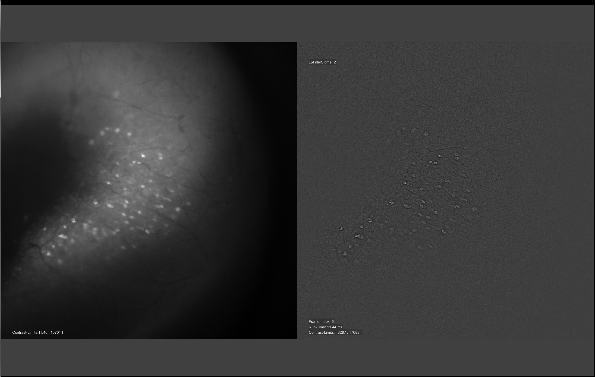{ width=50% }

{ width=50% }

{ width=50% }

{ width=50% }

{ width=50% }

{ width=50% }

{ width=50% }

{ width=50% }

{ width=50% }

# Discussion: Broader considerations for clinicians, engineers, and research scientists preparing to make use of an increasingly hyper-connected future

# Appendix {.unnumbered}
