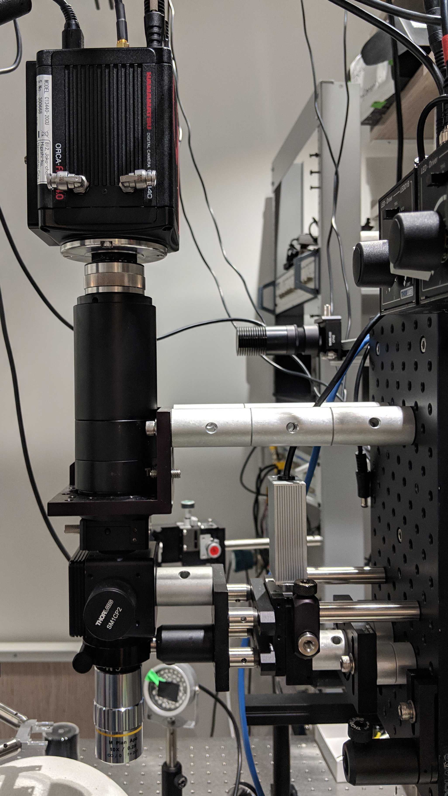

# Introduction and Background
# Forward {.unnumbered}

I have structured this document to roughly coincide with a chronological account of 6 years spent in a neuro-oriented biomedical engineering lab. My role in the lab was centered around exploratory device design and development, mostly targeting application in neuroscience research, with intended users being neuroscientist colleagues. One of the lab's most remarkable assets is the breadth and diversity of its constituents in terms of their skills and experience, both within and between the engineering/development and the science/medical sides of the lab. All efforts stood to benefit from the close proximity to skilled colleagues, most notably for the complementary guide and provide roles that assisted the development process of new devices and the experiments they were intended for.

My initial experience in optoelectronic device development was as an undergrad at Columbia University where I was advised by Elizabeth Hillman, and developed a device that combined thermography and near-infrared spectroscopy in a portable and inexpensive device intended to provide early detection of adverse neoplastic changes through at-home daily monitoring, particularly targeting use by patients with high-risk for breast cancer. I then went to the Das Lab where I developed macroscopic imaging systems used for intrinsic imaging in the visual cortex of awake primates. As a MD/PhD student, I attempt to maintain a potential to adapt the end-products of each development for clinical applicability. The story presented here is rather unusual in that success precedes failure. The volume of tangible presentable results is greatest toward the beginning stages of the work described here. This unusual inversion is what make this story worth hearing, however. Thank you for taking the time to read this. I hope that at least the technical information provided herein, if not the procedural insight, is valuable in your current or future endeavors.

<!-- Every day my colleagues and I are surprised and amazed by the bizarre twists and turns we observe.  -->
<!-- Occasionally left bewildered, not quite capable --- or perhaps unwilling to recall --- the motivational catch phrase that is stamped and stamped again, the meat of the intro, and stamped again to bring discussion to an end... -->

# Introduction

## Optical Imaging of Neural Activity

Optical techniques for observing neural activity have advanced recently owing to both an evolution of digital imaging technology, and the development of engineered proteins that act as fluorescent indicators of neural activity. Image sensors, like those found in scientific-CMOS (sCMOS) cameras are larger, faster, and more sensitive than what was previously available in science-grade cameras. Meanwhile, the latest generation of Genetically Encoded Calcium Indicators (GECIs), collectively called GCaMP6, reports fluctuations in neural activation with extremely high fidelity. This combination of developments enables neuroscientists to open a wider channel to the brain than previously possible -- using conventional epifluorescence microscopy techniques -- enabling simultaneous recording from hundreds to thousands of neurons. Expanding the fraction of the observable neurons in an interconnected network may provide insight into mechanistic properties of neural disease, or may lead to a better understanding of neural coding. Additionally, feeding a large set of neural response information to a machine learning algorithm in a neuroprosthetic application may provide improved predictive performance, even if the exact mechanism of prediction remains difficult to discern. However, a few major challenges currently prevent realization of the potential benefits that these new technologies offer:

1.  The increased size of raw data from a single imaging session can easily overwhelm the computational resources typically used to process similar but smaller sets of data.

2.  The accumulation of raw data on disk over multiple imaging sessions quickly exceeds the data-storage capacity of most lab-scale servers, forcing researchers to halt data collection to process and delete, a nightmare scenario for some.

3.  The experimental design and data analysis procedures that neuroscientists are familiar with applying for network activity data when there are 5 to 10 cells will produce highly biased spurious results, unless provided with many more stimulus-response repetitions, i.e. trials. The number of repeated trials sufficient for producing an accurate description of the neural response to any stimulus is on the order of 2^N^, where N is the number of neurons being measured.

The objective of this project is to establish procedures that can address these challenges, then use these procedures to evaluate the effect that expanding available neural response input has on performance of a closed-loop encoder. This closed-loop encoder will attempt to predict changes in motor state of a mouse running on a ball, using sensors on the ball to train the encoder. It will then use the predicted motor state to modulate motor state in another mouse using opsins. This can be thought of as a model neuroprosthetic whos function is to overcome dysfunction caused by pathologically disconnected brain areas, such as exists in Parkinson's disease (PD). The goal will be to increase synchronization of mice beyond chance, such that they tend to run together and rest together.

Below I provide some background on the general procedure for offline video processing. I also discuss some of the issues with carrying out these procedures on a large dataset, and the variety of approaches that I and others have attempted for dealing with the issue. I then introduce the streaming approach (i.e. Aim 2), which is capable of processing video during acquisition and extracting signals directly, saving relevant signals only and discarding or compressing the raw video. This approach relies on GPU programming, so I also provide some background on the application of graphics cards for computationally demanding tasks. Using a graphics card for programming in the MATLAB environment is also discussed.

<!-- Aim 1: Build a library of adaptable software that enables neuroscientists to acquire, process, analyze, and visualize large volumes of fluorescence imaging data from awake behaving animals. -->
Capturing wide-field fluorescence images at high spatial and temporal resolution enables us to measure functional dynamic changes in many cells within a large interconnected network. Extracting a measure for each cell in a way that preserves spatial and temporal continuity with uniform/unbiased sampling of the observed signal is achievable, but implementing a procedure to accomplish the task can be made difficult by a number of factors. One class of computer-vision procedure commonly applied to this task is image-segmentation (cell-segmentation in histology applications), a procedure that seeks to represent distinct objects in an image by association of each image pixel with one of any number of abstract objects, or with the background. A variety of algorithms exist for performing this operation efficiently on single images. Most methods can be extended to operate in a 3^rd^ dimension, applied to stacks of image frames to enable tracking cells at multiple depths, or equivalently over time.

However, motion induced by physiologic changes and animal movement necessitates alignment of all frames in the sequence. Moreover, the massive fluctuations in signal intensity from individual and spatially overlapping cells can breed unstable solutions for alignment and radically complicate cell identification routines by disrupting temporal continuity. Implementing a reliable procedure for identifying and tracking the same cells in each frame throughout the sequence thus becomes non-trivial.

## Procedures for Calcium Imaging

The general goal of processing image data from functional fluorescence imaging experiments is to restructure raw image data in a way that maps pixels in each image frame to distinct individual cells or subcellular components, called 'Regions-Of-Interest' (ROI). Pixel-intensity values from mapped pixels are typically then reduced by combination to single dimensional 'trace' time-series. These traces indicates the fluorescence intensity of an individual neuron over time, and the collection approximates the distinct activity of each and every neuron in the microscope's field of view. However, this task is made difficult by motion of the brain throughout the experiment, and also by the apparent overlap of cells in the image plane captured from the camera's 2-dimensional perspective. These issues can be partially mitigated with a few image pre-processing steps -- alignment of images to correct for motion being the most critical. These options are described in the Methods & Approaches section below. Most software packages geared specifically toward functional imaging implement either of two basic classes of pixel-&gt;cell mapping algorithms. One approach is to use image-segmentation routines for computer vision, which seeks to combine adjacent pixels into distinct spatially segregated regions representing objects in the image.

The other common approach is to perform an eigenvalue decomposition on the covariance matrix from a stack of image frames (also called spectral decomposition, or Principal Component Analysis, PCA), resulting in an assembly of basis vectors defining the weighting coefficients for each pixel. Multiplying the basis-vectors (i.e. "components") with all frames produces a one-dimensional trace for each component. The linear combination is similar to the weighted image-segmentation method in that it assigns fractional coefficients to pixels. However the procedure for computing the covariance matrix employed by PCA operates on as many pixels as are in the image, multiplying each with every other pixel -- a problem with *np^2^* complexity, where *p* is the number of pixels in the image. I mention these issues inherent to PCA not because this project will attempt to address them, but because this project was initiated following tremendous difficulty attempting to use PCA-based cell sorting methods with large datasets.

## Computer Software Environments for Image Processing

The widespread usage of MATLAB in neuroscience communities lends potential for greater usability and easier adaptation to software developed in this environment. While software development environments with a focus on "ease-of-use" have traditionally presumed crippling sacrifices to computational performance, this assumption is getting to be less accurate.

Standard programs include ImageJ, the built-in routines in MATLAB's Image Processing Toolbox, Mosaic from Inscopix, which is merely a compiled version of MATLAB routines which uses the MATLAB engine, Sci-Kits Image for Python, and a remarkable diversity of other applications. MATLAB is a commercial software development platform which is geared toward fast production and prototyping of data processing routines in a high-level programming language. It implements several core libraries (LINPACK, BLAS, etc.) that make multithreaded operations on matrix type data highly efficient. While MATLAB has traditionally been a considered the standard across neuroscience research labs, it was also well recognized that its performance was lacking for routines that aren't "vectorized", when compared to applications developed using lower-level languages like FORTRAN, C, and C++. Nevertheless, it remained in common use, and recent releases have added features that can drastically mitigate its performance issues, particularly through the development of a "Just-In-Time" compiler that automatically optimizes the deployment of computation accelerator resources for standard MATLAB functions. This feature enables code that performs repeated operations using for-loops or while-loops nearly as fast as equivalent code written in C. Additionally, code can be compiled into executable format using the Matlab Compiler toolbox, or used to generate equivalent C or C++ code using Matlab Coder.

## Computational Resources for Processing Large Data Sets

Routines for extracting the activity in each cell from a collection of raw imaging data rely on an ability to simultaneous access many pixels separated over space and time (and consequently separated on disk). For long recording sessions, however, the size of the collection of stored image data grows dramatically. This substantial increase in the size of data easily exceeds the capacity of system memory in the typical workstation computer available to researchers. Thus, performing the necessary processing routines using standard programs is often unfeasible.

Another popular approach to this challenge is the migration of processing routines to a cluster-based system. In this way image data can be distributed across many interconnected computer nodes capable of performing all locally restricted image processing procedures in parallel, then passing data to other nodes in the cluster for tasks that rely on comparisons made across time. Access to clusters capable of performing in this way has historically been restricted to those working in large universities or other large organization, and the diversity of cluster types is sizeable, with clusters often having very particular configuration requirements for implementing data processing jobs efficiently. These issues would pose some difficulty to the use and shared development of software libraries for image processing routines, although the growth of "cloud computing" services such as Amazon's EC2 and the Google Compute Engine, and also collaborative computing facilities like the  [Massachusetts Green High-Performance Computing Center](http://www.mghpcc.org) mitigate many of these issues. Additionally, efforts to produce a standardized interface for accessing and distributing data, and for managing computing resources across diverse computing environments have seen appreciable success. Apache's release of the open-source cluster computing framework, Hadoop, and a companion data-processing engine called [Spark](http://spark.apache.org/), has encouraged a massive growth in collaborative development projects, a consequently increased the availability of robust shared libraries for data processing in a variety of applications. The Spark API can be accessed using the open-source programming Python, and also using other languages like Java, Scala, or R. One project specifically geared for image processing of neural imaging data is the Thunder library, a Spark package released by the Freeman lab and developed in collaboration with a number of other groups at Janelia farm and elsewhere.

Many applications will find the recent improvements in accessibility and standardization make cluster computing an attractive and worthwhile option for processing a very large set of reusable data. However, this strategy would impose harsh limitations for a neuroscientist with a project that is continuously generating new data, as the time required to transfer entire imaging data sets across the internet may be prohibitive. Unfortunately, storage on the cloud is not so unlimited that it can manage an accumulated collection of imaging data generated at anything near the rate that sCMOS cameras are capable of producing. This rate imbalance is a central motivating issue for Aim 2 this project, and is discussed in more detail below.

<!-- Aim 2: Extend the software for continuous real-time processing on a GPU.  -->
<!-- TODO:repeated later (video-procesing section) -->
The current generation of sCMOS cameras can capture full-frame resolution video at either 30 fps or 100 fps, depending on the data interface between camera and computer (USB3.0 or CameraLink). At 16-bits per pixel and 2048x2048 pixels, the maximum data rate for the USB3.0 camera is 240 MB/s. Imaging sessions typically last 30-minutes or less. However, pixels are typically binned down 2x2, and frame rate often reduced; processing speed and storage constraints are the primary motivation for doing so. The effect of doubling resolution on processing time when using the graphics card is nearly negligible, however. By identifying ROIs online and extracting the traces of neural activity allows us to discard acquired images and instead store the traces only, or feed them into an encoder for online analysis.

Graphics Processing Units were traditionally developed for the consumer gaming market. They are optimized for the process which involves translating a continuous stream of information into a two-dimensional image format for transfer to a computer monitor. In the context of gaming, the stream of information received by a GPU describes the state of objects in a dynamic virtual environment, and is typically produced by a video game engine. These processors are highly optimized for this task. However, they are equally efficient at performing the same type of procedure in reverse -- reducing a stream of images to structured streams of information about dynamic objects in the image -- and thus are popular for video processing and computer vision applications.

Any GPU architecture will consist of a hierarchy of parallel processing elements. NVIDIA's CUDA architecture refers to the lowest level processing element as "CUDA Cores" and the highest level as "Symmetric Multiprocessors." Typically data is distributed across cores and multiprocessors by specifying a layout in C-code using different terminology, "threads" and "blocks." Blocks are then said to be organized in a "grid." Adapting traditional image processing or computer vision algorithms to run quickly on a GPU involves finding a way to distribute threads efficiently, ideally minimizimg communication between blocks.

MATLAB makes processing data using the GPU seemingly trivial by overloading a large number of built in functions. Performance varies, however, and often the fastest way to implement a routine is by writing a kernel-type subfunction -- written as if it operates on single (scalar) elements only -- that can be called on all pixels at once, or all pixel-subscripts, which the function can then use to retrieve the pixel value at the given subscript. The kernel-type function is compiled into a CUDA kernel the first time it's called, then repeated calls call the kernel directly, having minimal overhead. Calls go through the *arrayfun()* function.

Data transfers between system memory and graphics memory is often the major bottle-neck. Therefore, this operation is best performed only once. However, once data is on the GPU, many complex operations can be performed to extract information from the image, all while staying under the processing-time limit imposed by the frame-rate of the camera sending the images.

<!-- Aim 3: Detect motor states from extracted neural activity and apply to closed-loop neuromodulation. -->
The function of the brain is to translate/encode sensory input into neural output that actuates an effect that promotes survival of the organism or propagates to promote the survival of offspring (generation of a response). It does this by communicating input through interconnected neurons via converging and diverging connections which comprise the neural network. One way we study the brain is by testing and observing the properties of individual neurons and the response to changing conditions at the direct connections they form with others. Another way is by observing a collection of neurons and to measure their response to variable conditions in their external environment, either by recording or stimulating variations in sensory input, or measuring an organisms physical/behavioral response.

One might presume that the expansion of information provided by being able to measure activity from a larger proportion of cells in a network would make it easier to analyze stimulus-response type experiments and gain insight about underlying functional mechanisms. Unfortunately, the correlation and information theoretic procedures traditionally used to make these associations suffer from a systematic bias that grows exponentially with the number responses considered for each stimulus (i.e. the number of cells included). The number of trials necessary for overcoming this bias gets exponentially large, though methods do exist for bias correction, such as through shuffling/resampling tests.

A systems neuroscience experiment will benefit from online feedback in one or both of two ways:

1.  For an experiment that seeks to learn the neural response/pattern associated with a *specific* *stimulus*, it can inform the user whether the current number of trials -- i.e. repeated presentations of the stimulus -- will be sufficient for overcoming *limited sampling bias*. This could be done by testing pattern hypotheses online to subsets of the collected data and assessing their stability.

2.  If the intention of the experiment is to study neural coding in general, for which it's sufficient to have an *arbitrary stimulus*, then online pattern recognition feedback can aid in maximizing the information in the response about that stimulus, either by directing modification of the stimulus, or directing modification of the field-of-view.

Streaming processing addresses the issues of processing and storing for sufficient learning from large networks possible. Additionally, I propose a strategy in the methods section by which incorporating this online processing stream into stimulus-response-type experiments could help correct *limited sampling bias*, enabling neural coding analysis in large populations of neurons [@ince_presence_2009].

Overall, however, the third goal of this project will focus on the ability to use the expanded information made available by the first two project components to train an encoder that predicts intended motor states from one healthy mouse, and uses the predictions to direct neuromodulatory control of another mouse. This setup will simulate pathologic disconnection in a brain, and will test the ability to distinguish intention to start or stop running, and apply that in a way that performance is easily measureable.

<!-- MDFIGINCLUDE(monkey-related) -->
<div id="fig:monkey-related">

{#fig:monkey-related_brain-cranial-window width=33% }
{#fig:monkey-related_withLight width=33% }
{#fig:monkey-related_withoutLight width=33% }

{{ figcaption(monkey-related) }}
</div>
<!-- /MDFIGINCLUDE(monkey-related) -->

<!-- MDFIGINCLUDE(neuromodulation-implant) -->
<div id="fig:neuromodulation-implant">

{#fig:neuromodulation-implant_bottom-thorough width=24% }
{#fig:neuromodulation-implant_bottom width=24% }
{#fig:neuromodulation-implant_front-thorough width=24% }
{#fig:neuromodulation-implant_front width=24% }

{#fig:neuromodulation-implant_side-thorough width=24% }
{#fig:neuromodulation-implant_side width=24% }
{#fig:neuromodulation-implant_top-thorough width=24% }
{#fig:neuromodulation-implant_top width=24% }

{{ figcaption(neuromodulation-implant) }}
</div>
<!-- /MDFIGINCLUDE(neuromodulation-implant) -->

<!-- MDFIGINCLUDE(neuromodulation-pcb) -->
<div id="fig:neuromodulation-pcb">

{#fig:neuromodulation-pcb_01pcb_bottom width=20% }
{#fig:neuromodulation-pcb_02pcb_top width=20% }
{#fig:neuromodulation-pcb_03pcb_combined width=20% }
{#fig:neuromodulation-pcb_04pcb_bottom-photo width=20% }
{#fig:neuromodulation-pcb_05pcb-top-photo width=20% }

{{ figcaption(neuromodulation-pcb) }}
</div>
<!-- /MDFIGINCLUDE(neuromodulation-pcb) -->


# See and Hear
# Project Prologue {#sec:project-prologue}
This chapter describes several projects that were started early during my graduate studies. Each project is similar in that they are outside the realm of optical imaging of neural activity, which is the focus of the rest of this dissertation. Nevertheless, they are included here because the issues they bring up will later inform the approach I take in the work described in later chapters. The projects described in the following sections are also tied together by a common goal: to enable research in the neurosciences with translation potential for clinical applications.

## Neuroscience Technology Development Background {#sec:neuroscience-technology-development-background}

-   Electrophysiology, Histology, Functional brain imaging
    -   pros/cons of each
    -   very little compromise in tradeoffs
-   Filling the gaps between these three approaches

## Behavior Box {#sec:behavior-box}

I built an experiment apparatus for mice to enable a study being run by Jia-Min Zhuo. The goal of the study wasto elucidate the role of adult-born neurons on mouse behavior, specifically their performance in discrimination tasks. We called the apparatus the "Behavior Box" and modeled it after a commercially available but grossly over-priced box that itself came from other labs [@clelland2009, @creer2010].

The chamber was constructed with black plastic walls, extruded aluminum framing, and a perforated metal mesh floor 1 cm above a plastic waste tray. A 10-inch infrared touchscreen (ITouch Systems) was mounted over a 10-inch LCD monitor forming one wall of the chamber. An opaque mask with seven windows was placed over the screeen to limit where the mouse could touch. A water pump with infrared detector was located at teh other end of the chamber to provide reward for the water-deprived mice in the study. A white LED strip encircled the chamber from the top, and multiple speakers positioned outside to deliver sound cues. A web camera was fixed above the chamber to record and monitor mouse activity. My contribution to this project was the program for interact with all the system components. This program controlled and recorded experiment progress. I developed the program in MATLAB, and the main components of its function are described below.


### IR Touchscreen {#sec:ir-touchscreen}

The IR touchscreen provided a robust measure of the location of any contact with the animal's paws or nose. The screen was more reliable than either _resistive_ or _capacitive_ touchscreens, which are much more common in devices like POS systems and mobile phones respectively.

Files in this folder are used to run our "BehaviorBox" system, which features easily customizable control of experiments involving an infrared touchscreen and LCD display along with speakers, water-ports, lights, essentially anything that can be controlled electronically.

COGENT 2000 The graphics/visual-stimulation package used is missing from this folder due to size, but can be downloaded from the [source](http://www.vislab.ucl.ac.uk/cogent_2000.php)


### FrameSynx Toolbox {#sec:framesynx-toolbox}

The FrameSynx toolbox for MATLAB was built to synchronize continuous image acquisition with experiments conducted in the neuroscience laboratory setting. While the experiments are conducted in separate software (and potentially on a different computer), FrameSynx listens for messages to start/stop the experiment, start a trial, etc. and responds accordingly by controlling one or multiple cameras and illumination devices, and synchronizing this information with the data acquired. The major contribution to the "Behavior Box" package, and also to later image processing packages is the procedure for definition and storage and of experimental data files, which will be touched on briefly in [@sec:data-file]

### Data File {#sec:data-file}

## Animal Tracking {#sec:animal-tracking}


### Using Computer Vision to track Position and Orientation {#sec:using-computer-vision-to-track-position-and-orientation}
A webcam-based motion tracking box constructed to analyze the movement of our unilaterally lesioned PD mouse model. Video is recorded at 15 frames per second and processed on-line or off-line using a function written in MATLAB. Briefly, this function converts each frame to a black and white image (logical matrix), uses morphological filtering functions to isolate the mouse (remove mouse excrement) and identify its body (remove the tail), then finds the center of mass in cartesian coordinates (maximum center of projection on x- and y-axes), and the rostral-caudal orientation measured in degrees off the x-axis. Orientation is determined by the index of maximum of a radon transform of the binary image. Processing is accomplished at a rate of 15-16 fps, using a single core, or 64 fps using parallel processing on a quad-core processor with multi-threading enabled. The advantage of this apparatus over the virtual-reality system is that it allows free movement of an untrained mouse, with real-time movement metrics at nearly the same rate as the spherical treadmill.


<!--  for pandoc-crossref syntax use the following
<div id="fig:animal-tracking-bowl">

</div>
 -->
<!--  Science.md
{#fig:label}
 -->


<!-- <div id="fig:animal-tracking-bowl">
{#fig:animal-tracking-bowl-raw}
{#fig:animal-tracking-bowl-black-and-white}
{#fig:animal-tracking-bowl-twoframes}
{#fig:animal-tracking-bowl-tail_ID}
{#fig:animal-tracking-bowl-mousedata1}
{#fig:animal-tracking-bowl-mousedata1close}
{#fig:animal-tracking-bowl-mousedata2}
{#fig:animal-tracking-bowl-mousedata1fiberon1}
<!-- Caption: Processing steps for automated rotation counting procedure used in hemiparkinsonian mouse study -->
</div> -->

## Spherical Treadmill & Virtual-Reality

<!-- H Spherical Treadmill -->

A virtual reality system was assembled, adopting methods from the Harvey lab lab [@harvey_intracellular_2009]. This system allows placement of a head-restrained mouse on an 8-inch diameter polystyrene foam ball supported by a cushion of compressed air, surrounded by a toroidal projection screen. Ball rotation is tracked with two optical computer mice placed orthogonal to each other. Movement vectors are fed into a virtual-reality engine that updates the image projected onto a toroidal screen surrounding the ball, simulating movement through any arbitrary virtual world. Movement vectors are recorded as an arbitrarily scaled translation in the mouse-relative X and Y axes and rotation around the Z axis, at approximately 30 ms intervals. This behavioral apparatus has the advantage of allowing trivial measurement of the mouse’s movement ability while the mouse is head-fixed. The disadvantage is the time and potential confounds involved with training individual mice to use the system.

### Treadmill contstruction

<!-- H Figure: {#spherical-treadmill}
{#spherical-treadmill-VR1-treadmill-mouse-running}
{#spherical-treadmill-VR2-treadmill-front}
{#spherical-treadmill-V03-treadmill-top}
Caption: this treadmill supports behavior. -->


### Water Delivery


<!-- H Figure: {#water-delivery}
{#spherical-treadmill-water-deliver01-water-port}
{#spherical-treadmill-water-delivery2-water-delivery}
{#spherical-treadmill-water-delivery3-water-delivery-zoom}
Caption: waterport -->


### Motion Sensors
Motion sensing was implemented using a linux computer and standard mice at first, and later using precision laser navigation sensors for "gaming" mice and custom firmware written to work with any arduino-compatible microcontroller.
<!-- todo -->

#### Generic USB Computer Mouse with Minimal Linux

Run "mouse_relay.py" on any computer running linux to send xy-data from 2 USB optical computer mice to another computer over an RS-232 serial-port connection. The receiving computer (in this implementation) uses MATLAB to read the values and translate the xy-values from 2 mice on the surface of a sphere into 3 values corresponding to rotation of that sphere around 3 orthogonal axes (XYZ) with their origin at the sphere's center.

RECEIVING FUNCTIONS: The MATLAB class that receives the serial input (xy-values from both mice) is called "VrMovementInterface"

The MATLAB function that translates the double-stream of xy-values from the sphere's surface into rotation around its center is called "moveBucklin.m" and is located in the VIRMEN "movements" folder.

SERIAL FORMAT: XY-Values are transmitted in 'packets' using an ascii formatted string terminated by a newline. Each packet contains the Sensor Number (s) that the reading is coming from, followed by the X-Value (dx), then the Y-Value (dy). The python code looks like the following:

```python
> datastring = s + 'x'+dx + 'y'+dy + '\n'
```

For example:

```csv
> s1x34y-3
```

#### Navigation Sensor Chip with Arduino

Works with ADNS library (Mark Bucklin) to pass \[dx,dy\] measurements from two ADNS-9800 laser mouse sensors (placed 45-degrees apart on surface of styrofoam ball).


<!-- H Figure: {#motion-sensors}
{#spherical-treadmill-motion-sensors-motion-sensors-installed}
{#spherical-treadmill-motion-sensors-motion-sensors}
Caption: Motion Sensors for tracking ball movement. can be used to control and record speed and direction of mouse movement within the VR world. -->

## Closed-Loop Diffuse Optogenetic Neuromodulation

<!-- carbon fiber electrode & LED -->
<!-- (Deep-Target Carbon-Fiber Electrode Array and Bilateral Illumination) -->

Chronic implant for long-term multi-site recording and optogenetic neuromodulation. The implant is fixed to a mouse’s skull with dental cement, and sits on top of bilateral 5 mm craniotomies. Electrodes are driven through 32 guiding-tunnels along pre-determined trajectories to bilateral targets in thalamus, striatum, prefrontal cortex, motor cortex and auditory cortex. 2 High-intensity LEDs are coupled to optical fibers driven to mediodorsal and centromedial thalamic nuclei. Electrode trajectories are computed in stereotaxic coordinates and imported into CAD model to construct guiding-tunnel features that facilitate correct placement of electrode tips in brain targets and connection to a circuit board. A-C) CAD model of implant. D) Circuit board for electrode termination and LED power.

<!-- from submitted NRSA/F31 Application -->

Brain disease, often accompanied by enormous personal and economic costs, continues to emerge as among the most pressing contributors to the global disease burden. Unprecedented advances in biotechnology and in portable electronics support tremendous opportunity to conduct research with excellent potential for advanced understanding, improved treatments, and one day cures for these devastating diseases, disorders and conditions. The aim of this project was to would leverage technology from the fast-moving forefronts of electronics and biomedical research to build a next-generation neuroprosthetic.

### Background

Deep Brain Stimulation (DBS) has been used clinically since the early 1990’s, and is currently approved by the FDA for treatment of Parkinson’s disease (PD) and essential tremor, with Humanitarian Device Exemptions for OCD and dystonia. In 1987 a French neurosurgeon observed during a thalamotomy procedure - where stimulation was applied for localization of ventralis intermedius - that high-frequency stimulation was able to suppress an extrapyramidal tremor (@benabid_combined_1987; @liker_deep_2008). Subsequent studies in a non-human primate Parkinson’s model suggested high-frequency stimulation (\~100-200 Hz) of the Subthalamic Nucleus (STN) was as effective as a lesion, in that it“jammed” neural activity at the tip of the electrode, yet it was tunable and reversible (@eusebio_does_2012). Long term efficacy is around 50% using a standard clinical scale (UPDRS III)(@beuter_delayed_2009); DBS can provide symptomatic improvement in tremor, rigidity, and bradykinesia, and can also facilitate a substantial reduction in levodopa dosage and consequent reduction in its major side-effects, i.e. dyskinesia (@eusebio_does_2012). While DBS has substantially improved our ability to treat PD and other movement disorders, the therapeutic effect remains insufficient and unpredictable.

The mechanism by which DBS suppresses parkinsonian symptoms is still uncertain. However, there are growing evidence to suggest that increases in synchronized oscillatory activity in basal ganglia and thalamo-cortical circuits – so-called _Beta-frequency_ oscillations – represents a pathologic and moreover _symptomatic_ state in PD, the disruption of which is accomplished by high-frequency stimulation (@wilson_chaotic_2011). Meanwhile, synchronized activity in the beta range is also involved in many normal cognitive functions, and abnormal synchronization is likewise a mechanism for numerous other neurologic and psychiatric disorders (@velazquez_biophysical_2012),(@andrews_neuromodulation_2010). Consequently DBS has potential to become an effective treatment for epilepsy (@ii_dynamic_2013),  OCD(@bourne_mechanisms_2012), depression ( @mayberg_deep_2005, @mayberg_targeted_2009), Alien Hand Syndrome and Tourette’s  (@krack_deep_2010), obesity  (@taghva_obesity_2012), alcoholism  (@heldmann_deep_2012), addiction (@luigjes_deep_2012), autism  (@sturm_dbs_2013), Alzheimer’s disease  (@laxton_deep_nodate), and schizophrenia (@white_dysregulated_2013). There are a large number of case-reports describing off-label DBS treatments, and a few small clinical trials  (@kennedy_deep_2011-1; @sarem-aslani_industrial_2011). In 2009 Medtronic received a Humanitarian Device Exemption  (HDE) to market a DBS device for OCD, called _Reclaim_ (“Reclaim^TM^ Deep Brain Stimulation for Obsessive Compulsive Disorder  (OCD) Therapy - H050003”2013). While closed-loop DBS might be even better suited for the complex dynamics of psychiatric disorders, most investigators have stuck with movement and seizure disorders  (@sarem-aslani_industrial_2011), presumably feeling more comfortable with well-established animal models and FDA-approved applications; or perhaps feeling _less_ comfortable with the ethical questions inherent to treating of behavior.

### Project Plan

Deep brain stimulation  (DBS) has revolutionized the treatment of neurological and psychiatric diseases over the past couple decades. A DBS device is essentially a cardiac pacemaker reconfigured to stimulate a small region of brain near the tip of an electrode with high-frequency pulses of electrical current; despite this simplicity, DBS has been used widely for treating movement disorders, such as Parkinson’s disease  (PD) and dystonia. The impressive performance of DBS on alleviating movement deficits associated with PD and dystonia has motivated a number of ongoing clinical trials on assessing its use in treating other brain disorders, such as obsessive compulsive disorder and depression. However, benefits of DBS treatment are unpredictable and show varying degrees and patterns of symptom suppression across patients. Unfortunately, this technology in its current iteration has been unable to overcome these limitations. This is likely due in part to a need for neural implant devices that are capable of more numerous and specific stimulation contact areas. Additionally, the DBS mechanism of action remains unknown and this further limits its ability to become wholly sufficient treatment. The central goal of this project is to develop a novel adaptive neuromodulation platform with increased neural contacts and their specificity as well as to examine the therapeutic mechanisms of DBS. My hypothesis was that aberrant neural network dynamics underlie the behavioral symptoms of brain disorders, and DBS therapeutic effect is through scrambling pathological neural network patterns. While I would primarily focus on PD here, the principles discovered through this study should be easily generalized to design novel therapies for other neurological and psychiatric disorders.

#### Design a novel adaptive neuromodulation platform for closed loop control of neural activities {#sec:f31-aim1}

Functional neural systems underlying brain disorders are likely complex, impacting interconnected brain areas. To reliably distinguish normal and pathologic neural network states, such as the “on/off” states in PD, it would be advantageous to simultaneously measure neural activities in multiple relevant brain areas. The platform proposed here consists of a bidirectional neural interface with penetrating silicon electrodes capable of simultaneously recording from multiple sites interspersed with LED-coupled optical-fibers for multi-point optogenetic neuromodulation. I would use the commercially available multicontact silicon electrodes, known as Michigan probes, that are 5um thick and capable of recording up to hundreds of locations simultaneously. To perform neuromodulation with high spatiotemporal precision, I would use optogenetic methods to activate or silence specific neurons expressing rhodopsins in mice using certain colors of light. Even though this system is designed for mice in this study, the principles demonstrated here have a clear translational path to humans.


#### Implement a library of closed loop modulation protocols with machine-learning algorithms {#sec:f31-aim2}

To efficiently determine the neural network states responsible for a specific disease condition, I would use machine-learning algorithms to implement a library of optimized strategies. Specifically, this system consists of two parts: The first is a closed-loop control system responsible for gathering and analyzing streams of neural and behavioral data in real-time to estimate a neurobehavioral state, and then applying a state-specific optogenetic control with patterned light into the brain. The second component is a slower and more complex routine that records and analyzes the streams of neural and behavioral data, and assesses the performance of state-estimates and controls applied by the real-time component. State-response strategy updates would be periodically fed from the thoughtful controller  (2^nd^ component) to the real-time decision maker  (1^st^ component) using variations of traditional machine-learning algorithms to generate successively optimized strategies.

#### Systematically evaluate the neural circuit mechanisms underlying DBS therapeutic effect on PD {#sec:f31-aim3}

Even though the precise therapeutic mechanism of DBS is unclear, DBS has revealed tremendous information about the brain’s functionings and dysfunctionings. For example, pathological beta oscillations, oscillations around 20Hz, have been widely observed in the cortical-basal gangion circuits in PD patients implanted with DBS electrodes. As the causal role of beta oscillations is yet to be established, it is likely that the neural network states identified in Aim 2 would conform and converge into distinct archetypes, such as beta oscillations within the cortical-basal gangion circuits relevant to PD. I hypothesize that neuromodulation outside of the classical PD neural circuit would be therapeutic, in so far as such neuromodulation is capable of scrambling pathological network dynamics. Once proven correct, the proposed therapeutic mechanisms of DBS through altering neural network pathological representationswould provide a basis for a new generation of neural circuit based neuromodulation therapies.

### Significance

This proposal focuses on developing a novel closed-loop neuromodulation system using optogenetics and an intelligent control algorithm. This approach enables automation of a search for individual-optimized stimulation patterns, and adaptation of these patterns over time in response to fluctuating symptoms.

#### Justification for This Approach

The novel closed-loop neuromodulation system as presented here has far reaching implications. These include improved patient symptoms, fewer surgical procedures  ( for battery replacement) and broader application in terms of patient population and disease profiles. The increase in number and range of stimulation sites and rapid real-time response rate of the proposed mechanism would yield such results  (Lozano and Lipsman 2013). Furthermore, the information on DBS mechanism gleamed from this study would have immediate effects on the current technology

#### Shortcomings

Any device that relies on optogenetics to deliver stimulation to neurons inherently shares the same hurdles to clinical translation, the requirement for gene-therapy and its associated risks. Several early trials of viral transfection of cells had adverse effects including a greatly increased risk of carcinoma. In these early studies, the DNA insertion location was uncontrolled leaving important regions of DNA tumor suppressor genes exposed to damage. New methods that improve the safety of gene therapy have been developed. Several of the more recent methods utilize adeno-associated virus  (AAV) and show greater control regarding DNA insertion and decreased DNA damage. These more recent methods suggest a possibility that with continuing research, such a method may be developed without the potential for malignancy.

Working on a project that requires a technology that does not as of yet exist, represents one of the greatest educational benefits of this project. That leap of faith into a future that does not exist requires us to depend on each other as a team of collaborators, as each of our work depends on the others’ success. In order to succeed, we must do so together; and without eachother, our therapeutics would never reach their ultimate goal, the patient. As such, we would share each success and setback in the same way whether such events occur within our own labs or labs across the country.

### Research Design and Methods

The initial stages of this project were focused designing the physical components of the bi-directional neural interface – and the peripheral aspects of aim 2 – development of an automated behavioral assay for our prototypic animal model of Parkinson’s disease.

#### Neural Interface

A _chronic neural implant_ is required for this project, as the machine-learning component of this closed-loop system would require time and signal stability to function effectively. While our lab currently employs chronically implanted drivable tetrode arrays, this project would benefit from dropping this complexity in favor of _static_ electrodes that are set to their prescribed position during the initial surgery, and never thereafter.


Sustained penetration of brain tissue with large  (15 microns) diameter electrodes provokes a chonic inflammatory reaction to the foreign body eventually encapsulates the electrode in a “glial scar” and inhibits regeneration of neural process in the vicinity  (@polikov_response_2005). The chronic implant designed for this project would use silicon electrodes to record from deep brain targets, and for shallow targets would employ _carbon fiber electrodes_  (4-10 microns) using methods developed in a nearby collaborating lab  (@guitchounts_carbon-fiber_2013). Carbon fiber is cheaply available with a range of electrical properties, but the common properties of high modulus and small diameter – 5-10 micron vs. 30-50 microns for typical commercial microwire arrays  (@ward_toward_2009) – allows carbon fiber to penetrate brain tissue without deforming, and to remain long-term without provoking an inflammatory reaction  (@kozai_ultrasmall_2012).

#### LEDs

High-intensity LEDs would be incorporated into the implant in favor of a traditional fiber-coupled laser primarily for their ability to _diffusely_ illuminate neurons over a _large area_ and their _scalability_, which would be vital for _multi-site_ and _chronic_ modulation. LEDs do not couple efficiently to optical fibers of small diameter  (\~200 microns is typical in optogenetics labs), but they can provide a far greater _luminous intensity_ in a greater variety of wavelengths than lasers, at a fraction of the cost. The proposed project would incorporate LEDs built into the implant, with their emitting surfaces _closely coupled to the_ _brain surface_.

LED arrays, and Digital Micromirror Devices  (DMDs) and Liquid Crystal on Silicon (LcoS) chips have been considered as a means of greater spatial control of light intensity; any of these would be incorporated if the technology improves during the lifetime of the project, but the current state of technology places heavy restrictions on space and/or power requirements to merit incorporation into the implant. Incorporating multiple LEDs (4 to 8) would enable semi-independent activation of neurons in widely-separated brain regions, the proposed project would need to _overlap_ this diffuse control with more precise targeted delivery of opsins (@packer_targeting_2013).


#### Figure: PCB schematic for head-mounted carbon fiber electrode array {#pcb-top}
{#pcb-top1 height="1.0in"}
{#pcb-top2   height="1.0in"}
{#pcb-top3  height="1.0in"}
Caption: Circuit Board for connection to carbon-fiber electrodes and LEDs


Here I describe the design strategy for the physical implant outlined above that would provide pathways to and from the mouse brain for the the electrodes and LEDs described above, as well as the circuit board that sits within this implant and consolidates all _input/output_ signals for connection with a computer. This project would strive to ensure the bidirectional chronic neural implant is _resilient_ to the abuse it would surely endure over the weeks to months of service _affixed to the cranium_ of a laboratory mouse. The outcome we wish to avoid is _movement_ of the penetrating electrodes within the brain tissue when external forces act on the implant, or when internal forces cause the animals brain to move relative to its skull. Moreover, if the electrode is unable to move with the brain there is substantial risk of electrode breakage.

We are designing the implant to address this potential issue from two directions: the first strategy is to make the implant as _tolerable_ for the animal as possible by minimizing its weight, rounding all edges, and fabricating with a bioinert material such as polymethylmethacrylate (PMMA), polyetheretherketone (PEEK), and silicone elastomer. Elastomer or functionally similar material would be used to encase the printed circuit board (PCB) once electrodes are driven to their prescribed depth and electrical connections made. The encasement would cover the entirety of the board with the exception of two connectors for electrophysiology readout and LED power, and a heatsink connector for each LED . Heatsinks for the LEDs would either be copper tube or carbon fiber. The second strategy for minimizing electrode movement involves _floating_ the connection between the electrodes and the PCB. The goal of this procedure is to allow the electrode – with one end in the brain and the other in a plated through-hole – to move vertically and laterally relative to the PCB while maintaining electrical contact with the pad. The method for accomplishing this is still being developed; fortunately its success is not critical to the project, but merely an improvement.

#### Electrophysiology

The neural interface proposed in this document would record 32 signals simultaneously. To minimize the risk that poor trajectory planning could have on the results described in [@sec:f31-aim3], we would specify targets redundantly. Thus, for each round of testing with our Parkinson’s mouse model we would select 8 brain areas to record from redundantly and bilaterally. 7 of the 8 would be selected from a set of brain areas for which claims have been made in the literature suggesting functional relevance to Parkinson’s disease; as a _control_ for each round, the 8^th^ would be selected from a set of areas for which no connection with PD has ever been reported. Each round would begin with a modified CAD model of the implant (for modified electrode trajectories), which would be 3D printed or fabricated on a 4-axis CNC-mill in the lab.

#### Front-end Digitization

Recording would be accomplished with the RHD2132 digital electrophysiology interface chip produced and made freely available by Intan (“RHD2000 Amplifier Chips | Intan Technologies” 2013). The chip accomplishes as much as a traditional electrophysiology system at a price that is orders of magnitude less, and a package that takes up much less space.

#### Signal Filtering, LFP and MUA

Electrophysiology data would be digitally filtered on the Intan chip using parameters selected by the machine-learning routine. The only hard limits on bandwidth would be dictated by the requirements of the analog to digital converter (ADC), i.e. a high-pass filter to remove drifting DC offsets and a low-pass filter to prevent aliasing. These limits would vary depending on electrode impedance and sampling frequency, but would have cutoff frequencies or roughly 0.1 Hz and 10 KHz respectively. While there is much published in regard to the spatial extent and information content in common named frequency bands, the algorithm that selects filtering parameters would not incorporate any of these assumptions.

That being said, we expect the learning algorithm would find more _reliably relevant_ features in the classic Local Field Potential (LFP) range, which is typically low-pass filtered with a cut-off around 300 Hz. It’s thought that LFP represents a sum of neural activity from cells within a 50-250 micron radius of the electrode tip, or more if activity is highly correlated (Lindén et al. 2011). This spatial scale allows for variability in electrode position across subjects, and for small movements of the electrode over time (Andersen, Musallam, and Pesaran 2004).

<!-- Aim 2 – Optimization of closed-loop stimulation pattern with machine-learning algorithms:
----------------------------------------------------------------------------------------- -->

Closed-loop input/output would be handled at three levels by multiple computers.

#### Input/Output

The lowest level – implemented on the Intan RHD2132 amplifier chip and RHD2000 evaluation board – handles analog-to-digital conversion and filtering of electrophysiology data. Also at this level – but implemented on a different computer – are the movement tracking functions described above.

#### Closed-loop State Estimation and Adaptive Neuromodulation

Streams of electrophysiology and behavior/movement data are sent to the second level, a _real-time_ computer system encapsulating all the _closed-loop_ functions of the platform. This computer would use the _Real-time eXperiment Interface_ (RTXI; www.rtxi.org), an open-source Linux-based operating system supported by the NIH (Lin et al. 2010). This system provides modules for data acquisition, storage, synchronization of output, and more. RTXI would be installed on an ARM-based embedded system such as the open-source _Puggle_, or a similar embedded processor from Texas Instruments. What is _Puggle_? _“Puggle is ARM-based, real-time data acquisition and processing tool. It is designed to sense, process, and react to both analog and digital input signals in hard real-time. Puggle is designed for closed-loop electrophysiology applications…_ (<http://www.puggleboard.com)>._”_ The closed-loop routine running at this level would analyze neural and behavioral data using parameters from the next higher level. The analysis step would conclude with two estimates for _neural_ and _behavioral state_, with this combination _mapped_ to an output routine with parameters that are also passed down by the higher level. The specifics of the output routine would be handled by a connected microcontroller, would be interrupt-driven, and would ultimately control the power of optical output from each LED over time.

#### Generation and Evaluation of Stimulus Paradigm

The highest level of processing would be implemented in a _non-real-time_ environment, MATLAB on Windows. Raw data and activity logs from the closed-loop routine would be written to disk continuously. A machine-learning routine would analyze these data and send updated parameters to the closed-loop computer as described below. All parameter updates would also be written to disk in synchrony with acquisition for retrospective analysis as described by [@sec:f31-aim3].

#### Machine-Learning & Optimization

The process for selecting exactly how to stimulate a brain follows a common routine both in the clinic and research laboratory. After having spatially localized an electrode in the intended position, physicians (and neuroscientists) would begin stimulation with a temporal pattern that is fully defined with two or three parameters (e.g. a binary pulse-sequence with constant amplitude, frequency, and duty-cycle). Effects of stimulation are often immediately apparent. The physician or neuroscientist – let’s just call this person the “_decision-maker_” – would evaluate the subjects behavior and compare this evaluation to the desired _target_ behavior. In the example case of PD the deviations from this “target behavior” include akinesia, gait-inbalances, and postural instability, but might also include iatrogenic responses such as dyskinesias or diplopia. The decision-maker then draws on their experience to estimate which parameters should be adjusted, and with what magnitude in order to shift behavior towards the intended target. In the absence of experience, the decision-maker relies on _education_ (many years of it in either the physician or scientist’s case). The first adjustment is applied, and the effect on behavior is evaluated once again. The inexperienced decision-maker learns something new, and can use this new information in combination (or perhaps even _in contrast!)_ with their prior education to estimate the effect of adjustments in any or all available parameters, and make a decision that begins the cycle again.

Humans are excellent learners – undoubtedly better than any other species on Earth. Computers are not; they are painfully literal and would not flip a bit without being told to. Their persistence, however, is their saving grace, and is the aspect that makes machine learning possible, given creatively designed seeds of human thought and recursive and inversive instructions for expanding this seed. The process of cyclic evaluation and decision-making described above would be used as a model for a machine-learning algorithm with two goals: optimizing the identification of _disease-relevant neural states_, and optimizing a neuromodulation routine for _disease-related symptom reduction_.

#### Identification of Neural State

The algorithm used to optimize closed-loop identification of neural neural state would be developed from a set of common _pattern-recognition_ algorithms and _semi-supervised learning_ models, including support vector machines (SVMs), logistic, polynomial, or linear regression, principal component regression (PCR), Kalman filtering, and hidden Markov models (HMM). These algorithms would be applied to recorded data and _selected for implementation_ in the closed-loop routine based on measures of performance (discussed below) and ability to meet computation-time specifications (&lt;\~250 ms).

#### Stimulus Sequence Generation

Each neural state would be mapped to a neuromodulation routine that is applied continuously (with _sub-millisecond_ response time) until the next state-estimate and routine update. Each stimulation sequence would initially be defined by random selection from a set of sequence _archetypes_, and further specification by random selection of _archetype-specific-parameters_. The real-time process would handle application of the state-mapped sequence, but the sequence formation routines would be run in the non-real-time process. Both open-loop (for control/comparison) and closed-loop stimulation archetypes would be generated from three sources, with generic examples from each source in the table below:

1.  Common achetypes reported in literature, e.g. DBS-style constant pulse generation.

2.  Novel archetypes generated in creative thinking and discussion sessions with colleagues.

3.  Concocted archetypes from chaotic-generation algorithm

_Constant DBS-type square wave_ with parameters for amplitude, frequency, and pulse-width/duty-cycle (open-loop) LED power (stimulation) in each area of control proportional to _arctangent of phase difference_ between two areas. Chaotically generate functions by recombining elements from the novel and common archetypes, and also by applying every function available in MATLAB (use _what_ and _lookfor_ functions applied in _try…catch…_ blocks to find statements that work with given data) _Triggered impulse response_ with parameters defining a threshold or feature from any channel that triggers stimulation of some shape that initiates at some delay (Rosin et al. 2011) (closed-loop) Stimulation is continuously proportional a _ratio of band-pass filtered signal magnitude_ from arbitrarily selected channels.\
_Phase Cancellation_ of filtered signal from any defined channel (Brittain et al. 2013) (closed-loop) Signal from one channel is used to construct _wavelet_ then convolved with other channels with output determining pulse-shape

The number of possible archetypes used by sourcing in these ways would be extensive, so much so that trying them manually would be unmanageable. This is where the automated machine-learning algorithm which selects, applies, evaluates, and optimizes each routine for several hours every day becomes absolutely necessary.

#### Stimulus Optimization

As the real-time component runs its state-response cycle and logs data, the non-real-time machine-learning component would evaluate its performance and update parameters in an attempt to optimize _symptom suppression_. This evaluation process would identify “hot” parameters (those with large effect), and continue sending parameter updates until symptom suppression cannot be optimized further. This process would be slow to allow observation of subtle effects of stimulation in noisy data. If manipulation of all available parameters yields no changes in behavior, a new stimulation archetype would be tried.

This type of process is sometimes referred to as a _Genetic_ _Algorithm_, where the parameters for a particular archetype would be viewed as the _genes_ that define a species. The _fitness_ of each individual combination genes (i.e. parameters) determines survival and consequent ability to pass genes to the next generation. In our implementation, we’d be running multiple species (i.e. archetypes) as well, with the expectation that many would be quickly declared extinct.

### Systematic evaluation of potential DBS targets and mechanisms in PD mouse model:

To that end we are currently inducing a quantifiable PD-like state in mice with a unilateral injection of the neurotoxin 6-hydroxydopamine (6-OHDA) into the striatum, and subsequent administration of apomorphine to provoke side-biased motor deficits (Iancu et al. 2005) . Side-biased“turning” behavior is quantified autonomously on two distinct platforms, a computer-vision system that allows free movement, and a virtual-reality spherical treadmill platform that simulates free movement.

#### Metrics of Behavior

Two testing platforms would be used to assess changes in behavior over time. Behavior is analyzed and quantified in real-time, and would be synchronized with electrophysiology and made available as another stream of input for the closed-loop routine. The quantification routine creates a signal that is representative of symptom severity. For our unilaterally lesioned mouse model of PD the most readily observable impairment is the inability to walk straight; mice would turn in circles contralateral to the lesion when given intraperitoneal apomorphine. The behavioral apparati are described below.


## CNC Mini-Mill


### Project Summary

Deep Brain Stimulation (DBS) has been used clinically since the early 1990’s, and is currently approved by the FDA for treatment of Parkinson’s disease (PD) and essential tremor, with Humanitarian Device Exemptions for OCD and dystonia. However, benefits of DBS treatment are unpredictable and show varying degrees and patterns of symptom suppression across patients. This is likely partly due to a need for neural implant devices capable of more numerous and specific stimulation contact areas, as well as a lack of knowledge regarding DBS mechanism of action. There is growing evidence, that suggests that increases in synchronized oscillatory activity in certain brain circuits represent a pathologic and moreover symptomatic state in PD, the disruption of which is believed to yield the beneficial effects of DBS. Likewise, this abnormal synchronization is a mechanism for numerous other common neurologic and psychiatric disorders that include epilepsy, obsessive compulsive disorder and depression. The central goal of this project is to develop a novel adaptive neuromodulation platform that increases both the number of neural contacts and the specificity of their location as compared with DBS in order to create a more effective and targeted treatment alternative, and in the process to examine DBS therapeutic mechanisms. Development of such an alternative has far reaching implications including improved patient symptoms, fewer surgical procedures and broader application across patient populations. To reach Aim 1, a bidirectional neural interface with penetrating silicon electrodes capable of simultaneously recording from multiple sites of the Parkinson’s mouse model intracranially. Such a device would be developed and interspersed with LED-coupled optical-fibers for multi-point optogenetic neuromodulation. To perform neuromodulation with high spatiotemporal precision, optogenetic methods would be used to activate or silence specific neurons expressing rhodopsins in mice using certain colors of light. For Aim 2, machine-learning algorithms would implement a library of optimized strategies to efficiently determine the neural network states responsible for a specific disease condition using a closed-loop control system and a second slower, more complex routine routine that records and analyzes the streams of neural and behavioral data, and assesses the performance of state-estimates and controls applied by the real-time component. The neural network states identified in Aim 2 are expected to conform and converge into distinct archetypes, such as beta oscillations, within the cortical-basal gangion circuits outside of the classical PD neural circuit. Once proven correct, the proposed therapeutic mechanisms of DBS through altering neural network pathological representations would provide a basis for a new generation of neural circuit based neuromodulation therapies.


## Photo Absorption and Thermal Dissipation in Brain Tissue Optogenetics

<!-- Thermal Modeling of laser light delivery to brain through fixed fiber optic -->
This was a modeling project. <!-- TODO -->

# Microscopy 1

This section describes the background in microscopy in the neurosciences, and also how it relates to imaging in healthcare and electrophysiology in neuroscience. It will also describe the basic elements necessary for the construction of a microscope in a laboratory where calcium imaging in an animal is available. It will also refer to later sections which cover the design and construction of mechanical elements for animal handling and optical access (i.e. the headplate and a chronic optical window).

<!-- from the frontiers paper -->
Optical imaging has traditionally involved wide-field imaging or two photon imaging, each with their own distinctive advantages and disadvantages

In recent years, two photon microscopy has been a preeminent choice for imaging in tissue, because of its high spatial resolution, and tissue penetrating features

Two photon calcium imaging has been broadly applied to individual cells or subcellular components of neurons including spines and axons

Because two photon microscopy uses a scanning mechanism, the signal to noise ratio is influenced by the time spent imaging each point, and the spatial resolution is determined by the number of points scanned to obtain each image. As a result, the size of the imaging field is inversely correlated with the overall temporal resolution while maintaining a relatively high signal-to-noise ratio, thus, two photon calcium imaging is often performed on a small area or on a sparse network of cells, when dynamic responses with high temporal fidelity is necessary.

Wide-field, or single photon imaging has been in use for several decades and was first used to characterize the functional architecture and hemodynamic responses in brain tissue

However, this technique has seen a renaissance recently due to its simple instrumentation, relatively inexpensive cost, and the improvements in neural signal indicators. Optical imaging and two photon microscopy have traditionally been performed in head-fixed preparations, but recent advances have also made it possible to perform wide-field calcium imaging in freely moving animals, through miniaturized and wearable microendoscope systems

While wide-field imaging lacks the spatial resolution to resolve fine subcellular structure or the penetrating properties available with two-photon, it is possible to obtain clear neurites and somatic features, including spike detection

Because a single photon microscope does not rely on scanning features, it can be used to sample a larger field of view without sacrificing sampling rates. Additionally, recording sessions may be less sensitive to fluorophore bleaching than other techniques, which makes it possible to perform sustained illumination and subsequent imaging for an extended period of time - a desired feature for analyzing neural networks during some behavior paradigms (*e.g.,* repeated trial learning paradigms). Thus, wide-field imaging offers an advantage if the objective is to simultaneously recording hundreds of neurons in the brain of a living and behaving animal with high temporal fidelity.

<!-- from the frontiers paper -->
## Background: Brain Imaging and Microscopy in Neuroscience

## Fluorescent Proteins Background

-   GCamP
    -   vs dyes


### Fluorescence Microscope Types Background

-   2p, confocal, wide-field
    -   tissue scattering
        -   depth comparison
    -   cost & complexity
    -   (address scalability later)

### Widefield Microscope COnfiguration

-   historical trend/shift from *finite* to *infinite* conjugate type
    -   infinite type uses *infinity corrected lenses*

### Filters

-   excitation
-   emission
-   for epifluourescent microscope configuration: dichroic beamsplitter

### Lenses

The simplest configuration of infinite wide-field microscope requires an excitation

### Excitation

### Emission

### Emitted Light Collection and Image Formation (emission/collection)

-   Lens selection
    -   objectives
    -   SLR
        -   spectral coating characteristics \#\#\# Mechanics

### Microscopy and Functional Imaging Two core innovations in available

-   technology 1. Synthetic bio (i.e. GCaMP) 2. Cameras
-   scientific CMOS

## Brain Imaging Awake Animals

## Brain Regions

-hippocampus, cortex, striatum - cell types - cell sparsity

## Analysis
# # 
## Cameras for Widefield Microscopy

Traditional widefield microscope or macroscope builds incorporate 'scientific grade' cameras. Compared to cameras built for other markets (e.g. consumer, industrial, studio, etc.), these cameras are often well tested and certified to offer low or well-characterised noise at moderate speeds, and a linear photo-response profile. Unlike consumer or studio cameras which are invaribaly configured for RGB color, they are preferably configured with 'monochrome' sensors - essentially identical to the analagous color sensor, without the bayer filter. Of much greater importance, one must consider the unique connectivity and control interface that scientific cameras come with. Standards exist, but are typically unique to this segment of the industry, with poorly defined specifications for translation to other electronic communication and connection interface standards, such as those used in studio and broadcast video, or those used with consumer cameras. The trait that is the most worthy of consideration, however, is the cost. See @discussion-cost-consumer for details.

The in-vivo instrinsic-signal or fluorescent-dye imaging camera of 1 decade ago had a 0.5"-1" monochrome CCD sensor with 0.1-1 MegaPixels, a large well-depth, and moderately low noise at speeds around 30 to 60 fps. Connection was often LVDS, with custom electrial connectors unique to each camera. A particularly popular and long-running model was the Dalsa 1M30, followed by the 1M60 in later years [@takahashi_vivo_2006].

### Accelerated Sensor improvement


#### Sensor Size


#### Read noise and Speed


#### Interfaces: Connection

#### Interfaces: Protocol


***

## Computer Workstation

Go to [Puget Systems](http://www.pugetsystems.com) to find a computer configuration that is well tested and uses commercially available components to deliver high performance. If you don't feel like putting a computer together yourself, you could order directly from them.

### Part Selection and Assembly


Motherboard: | Processing | Expansion Slots: | Memory: | Connections
------------|----------------|-------|--------|
ASUS WS C621E SAGE | Socket: 3647 | | |

<!-- CPU: Purley
Form Factor: SSI EEB
Chipset: Intel C620 -->
<!--
12 slots DDR4 ECC Registered 2666 MHz
(Max per Slot: 64 GB)
Max Supported: 768 GB


Rear USB 2.0: 2
Rear USB 3.0: 4
 -->

### Configuration
Must configure bios to optimize for high-throughput writes to disk.

### Package Managment
- Package Management & Binary Distribution Sites
- Bintools/JFrog
- Conan.io
- NPM
- Nuget
- VCPkg
- Chocolatey (win)
- Apt/yum (linux)
- Pacman (msys/mingw)
- Pact (babun/cygwin)
- scoop
- NPackd
- Pypi

### Development Environment
- Version-Control
    - Github
    - Bitbucket
    - Gitlab
    - Sourceforge
    -
    - [Comparison on Wikipedia](https://en.wikipedia.org/wiki/Comparison_of_source_code_hosting_facilities)
- Code Repositories
    - Matlab File Exchange
    - stack overflow
    - ~~(Google Code)[code.google.com]~~
- Research Entity Web Sites
    - From Laboratory Manifest
        - Janelia
        - INRIA
        - Schartz Center for Computational Neuroscience (SCCN)
            - (SCCN Homepage)[https://sccn.ucsd.edu/wiki/SCCN_Software]
            - (SCCN Github)[https://github.com/sccn]
            - EEGLAB, BCILAB,Lab-Streaming-Layer
        - Cohen Lab
            - LeverJS
    - NIH
    - NASA
- Binary Utilities
    - gtools
    - exetools
    - nirsoft
    - sysinternals
    - unxutils
    - x64tools
    - BU EngIT (butools)
- OSS Foundations
    - Apache
- Citations in Literature
    - from Biblio-Manifest
- SCC or Grid Utilities

## Head-Fixation Apparatus for Mice

Whether using a microscope or electrophysiology apparatus with the spherical treadmill, the requirements for a rigid connection to the animal's cranium are critical.


<!-- INCLUDE FILE NOT FOUND: /mnt/ssd/projects/thesis/content/body/02_hw1/05_optical-window.md -->
<!-- MDFIGINCLUDE(animal-tracking) -->
<div id="fig:animal-tracking">

{#fig:animal-tracking_01raw width=10% }
{#fig:animal-tracking_02black-and-white width=10% }
{#fig:animal-tracking_03twoframes width=10% }
{#fig:animal-tracking_04from_set_of_reference_images_after_processing width=10% }
{#fig:animal-tracking_05tail_ID width=10% }
{#fig:animal-tracking_06mousedata1 width=10% }
{#fig:animal-tracking_07mousedata1close width=10% }
{#fig:animal-tracking_08mousedata2 width=10% }
{#fig:animal-tracking_09mousedata1fiberon1 width=10% }
{#fig:animal-tracking_10rotation_viewer width=10% }

{{ figcaption(animal-tracking) }}
</div>
<!-- /MDFIGINCLUDE(animal-tracking) -->

<!-- MDFIGINCLUDE(behavior-box) -->
<div id="fig:behavior-box">

{#fig:behavior-box_01elife-fig2crop width=100% }

{{ figcaption(behavior-box) }}
</div>
<!-- /MDFIGINCLUDE(behavior-box) -->

<!-- MDFIGINCLUDE(beveled-fiber-bundle) -->
<div id="fig:beveled-fiber-bundle">

{#fig:beveled-fiber-bundle_fullfield_bundle_overlay width=16% }
.png){#fig:beveled-fiber-bundle_heightMap_Substack_(1-250) width=16% }
{#fig:beveled-fiber-bundle_microspheres-1080um width=16% }
{#fig:beveled-fiber-bundle_microspheres-1102um width=16% }
{#fig:beveled-fiber-bundle_microspheres-1351um width=16% }
.png){#fig:beveled-fiber-bundle_raw_Substack_(1-250) width=16% }

{{ figcaption(beveled-fiber-bundle) }}
</div>
<!-- /MDFIGINCLUDE(beveled-fiber-bundle) -->

<!-- MDFIGINCLUDE(headplate-holder) -->
<div id="fig:headplate-holder">

{#fig:headplate-holder_drawing-v2 width=14% }
{#fig:headplate-holder_HeadplateHolder2_V2 width=14% }
{#fig:headplate-holder_HeadplateHolder_V2 width=14% }
{#fig:headplate-holder_photo-bottom width=14% }
{#fig:headplate-holder_photo-front width=14% }
{#fig:headplate-holder_photo width=14% }
{#fig:headplate-holder_photo-top width=14% }

{{ figcaption(headplate-holder) }}
</div>
<!-- /MDFIGINCLUDE(headplate-holder) -->

<!-- MDFIGINCLUDE(microscope) -->
<div id="fig:microscope">

{#fig:microscope_50-14-nai-KEN_0053-big width=8% }
{#fig:microscope_7564_CFH2-F_SGL width=8% }
{#fig:microscope_setup1 width=8% }
{#fig:microscope_setup1-Striatum_Figure1 width=8% }
{#fig:microscope_setup2 width=8% }
{#fig:microscope_setup3-closeup width=8% }
{#fig:microscope_setup3-front width=8% }
{#fig:microscope_setup3-side width=8% }
{#fig:microscope_setup4-closeup width=8% }
{#fig:microscope_setup4-front width=8% }
{#fig:microscope_setup4-side width=8% }
{#fig:microscope_widefield_microscope_diagram width=8% }

{{ figcaption(microscope) }}
</div>
<!-- /MDFIGINCLUDE(microscope) -->

<!-- MDFIGINCLUDE(spherical-treadmill-extended) -->
<div id="fig:spherical-treadmill-extended">

{#fig:spherical-treadmill-extended_lightson_withsusie width=100% }

{{ figcaption(spherical-treadmill-extended) }}
</div>
<!-- /MDFIGINCLUDE(spherical-treadmill-extended) -->

<!-- MDFIGINCLUDE(spherical-treadmill-motion-sensors) -->
<div id="fig:spherical-treadmill-motion-sensors">

{#fig:spherical-treadmill-motion-sensors_01-motion-sensors-installed width=25% }
{#fig:spherical-treadmill-motion-sensors_02-motion-sensors width=25% }
{#fig:spherical-treadmill-motion-sensors_02-teensy width=25% }
{#fig:spherical-treadmill-motion-sensors_Striatum_Figure2 width=25% }

{{ figcaption(spherical-treadmill-motion-sensors) }}
</div>
<!-- /MDFIGINCLUDE(spherical-treadmill-motion-sensors) -->

<!-- MDFIGINCLUDE(spherical-treadmill-VR) -->
<div id="fig:spherical-treadmill-VR">

{#fig:spherical-treadmill-VR_01-treadmill-mouse-running width=25% }
{#fig:spherical-treadmill-VR_02-treadmill-front width=25% }
{#fig:spherical-treadmill-VR_03-treadmill-top width=25% }
{#fig:spherical-treadmill-VR_04-VR width=25% }

{{ figcaption(spherical-treadmill-VR) }}
</div>
<!-- /MDFIGINCLUDE(spherical-treadmill-VR) -->

<!-- MDFIGINCLUDE(spherical-treadmill-water-delivery) -->
<div id="fig:spherical-treadmill-water-delivery">

{#fig:spherical-treadmill-water-delivery_01-water-port width=33% }
{#fig:spherical-treadmill-water-delivery_02-water-delivery width=33% }
{#fig:spherical-treadmill-water-delivery_03-water-delivery-zoom width=33% }

{{ figcaption(spherical-treadmill-water-delivery) }}
</div>
<!-- /MDFIGINCLUDE(spherical-treadmill-water-delivery) -->

<!-- MDFIGINCLUDE(cranial-window) -->
<div id="fig:cranial-window">

{#fig:cranial-window_FigureCW1 width=12% }
{#fig:cranial-window_FigureCW2_pt2 width=12% }
{#fig:cranial-window_FigureCW3 width=12% }
{#fig:cranial-window_FigureCW4 width=12% }
{#fig:cranial-window_FigureCW5 width=12% }
.png){#fig:cranial-window_FigureSS1(2) width=12% }
{#fig:cranial-window_FigureSS1 width=12% }
{#fig:cranial-window_FiguresSCI1 width=12% }

{{ figcaption(cranial-window) }}
</div>
<!-- /MDFIGINCLUDE(cranial-window) -->


# Listen and Examine
# Pipeline overview


## phases

### preprocessing
Image filtering operations
Normalization
Motion estimation and compensation
Layer classification
  foreground/background
  Cell/neuropil/vessel


#### time series analysis
Prediction and factorization of temporal components/contaminants
Model:
  Unidirectional trend (sources...)
  Oscillatory ("seasonal")
  Unpredictable


#### spatial signal deconvolution (unmixing)

### signal localization and extraction
Segmentation of cells
Overlap and "disconnected" regions
Initial vs incremental cell identification

### active signal analysis
Signal statistics
  Shape and stability of probabilistic distribution
Pixel level vs cell level

#### independent cellular activity measures
Quality
Complexity
Spatial
Temporal

#### network analysis

## Computing cost:
  boundary analysis for iOS and config

## Storage cost:
  compression and imposed boundaries

# Image Processing

This section borrows from AIM-1 and AIM-2 of the prospectus.

<!-- H Introduction
# Procedures for Calcium Imaging
# Computer Software Environments for Image Processing
# Computational Resources for Processing Large Data Sets
# Method and Approach
# Image Pre-processing: Contrast Enhancement and Motion Correction
# Region of Interest (ROI) identification & segmentation:
# Region of Interest (ROI) merging:
# Visualization
# Predicting Activation State & Assessing Network Activity
# Parallel Processing
# Managing Continuity -->

## Procedures for Calcium Imaging

The general goal of processing image data from functional fluorescence imaging experiments is to restructure raw image data in a way that maps pixels in each image frame to distinct individual cells or subcellular components, called 'Regions-Of-Interest' (ROI). Pixel-intensity values from mapped pixels are typically then reduced by combination to single dimensional 'trace' time-series. These traces indicate the fluorescence intensity of an individual neuron over time, and the collection approximates the distinct activity of each and every neuron in the microscope's field of view. However, this task is made difficult by motion of the brain throughout the experiment, and also by the apparent overlap of cells in the image plane captured from the camera's 2-dimensional perspective. These issues can be partially mitigated with a few image pre-processing steps -- alignment of images to correct for motion being the most critical. These options are described in the Methods & Approaches section below. Most software packages geared specifically toward functional imaging implement either of two basic classes of pixel-&gt;cell mapping algorithms. One approach is to use image-segmentation routines for computer vision, which seeks to combine adjacent pixels into distinct spatially segregated regions representing objects in the image.

The other common approach is to perform an eigenvalue decomposition on the covariance matrix from a stack of image frames (also called spectral decomposition, or Principal Component Analysis, PCA), resulting in an assembly of basis vectors defining the weighting coefficients for each pixel. Multiplying the basis-vectors (i.e. "components") with all frames produces a one-dimensional trace for each component. The linear combination is similar to the weighted image-segmentation method in that it assigns fractional coefficients to pixels. However the procedure for computing the covariance matrix employed by PCA operates on as many pixels as are in the image, multiplying each with every other pixel -- a problem with np2 complexity, where p is the number of pixels in the image. I mention these issues inherent to PCA not because this project will attempt to address them, but because this project was initiated following tremendous difficulty attempting to use PCA-based cell sorting methods with large datasets.

### Computer Software Environments for Image Processing

The widespread usage of MATLAB in neuroscience communities lends potential for greater usability and easier adaptation to software developed in this environment. While software development environments with a focus on "ease-of-use" have traditionally presumed crippling sacrifices to computational performance, this assumption is getting to be less accurate.

Standard programs include ImageJ, the built-in routines in MATLAB's Image Processing Toolbox, Mosaic from Inscopix, which is merely a compiled version of MATLAB routines which uses the MATLAB engine, Sci-Kits Image for Python, and a remarkable diversity of other applications. MATLAB is a commercial software development platform which is geared toward fast production and prototyping of data processing routines in a high-level programming language. It implements several core libraries (LINPACK, BLAS, etc.) that make multithreaded operations on matrix type data highly efficient. While MATLAB has traditionally been a considered the standard across neuroscience research labs, it was also well recognized that its performance was lacking for routines that aren't "vectorized", when compared to applications developed using lower-level languages like FORTRAN, C, and C++. Nevertheless, it remained in common use, and recent releases have added features that can drastically mitigate its performance issues, particularly through the development of a "Just-In-Time" compiler that automatically optimizes the deployment of computation accelerator resources for standard MATLAB functions. This feature enables code that performs repeated operations using for-loops or while-loops nearly as fast as equivalent code written in C. Additionally, code can be compiled into executable format using the Matlab Compiler toolbox, or used to generate equivalent C or C++ code using Matlab Coder.

### Computational Resources for Processing Large Data Sets

Routines for extracting the activity in each cell from a collection of raw imaging data rely on an ability to simultaneous access many pixels separated over space and time (and consequently separated on disk). For long recording sessions, however, the size of the collection of stored image data grows dramatically. This substantial increase in the size of data easily exceeds the capacity of system memory in the typical workstation computer available to researchers. Thus, performing the necessary processing routines using standard programs is often unfeasible.

Another popular approach to this challenge is the migration of processing routines to a cluster-based system. In this way image data can be distributed across many interconnected computer nodes capable of performing all locally restricted image processing procedures in parallel, then passing data to other nodes in the cluster for tasks that rely on comparisons made across time. Access to clusters capable of performing in this way has historically been restricted to those working in large universities or other large organization, and the diversity of cluster types is sizeable, with clusters often having very particular configuration requirements for implementing data processing jobs efficiently. These issues would pose some difficulty to the use and shared development of software libraries for image processing routines, although the growth of "cloud computing" services such as Amazon's EC2 and the Google Compute Engine, and also collaborative computing facilities like the Massachusetts Green High-Performance Computing Center (http://www.mghpcc.org) mitigate many of these issues. Additionally, efforts to produce a standardized interface for accessing and distributing data, and for managing computing resources across diverse computing environments have seen appreciable success. Apache's release of the open-source cluster computing framework, Hadoop, and a companion data-processing engine called Spark (http://spark.apache.org/), has encouraged a massive growth in collaborative development projects, a consequently increased the availability of robust shared libraries for data processing in a variety of applications. The Spark API can be accessed using the open-source programming Python, and also using other languages like Java, Scala, or R. One project specifically geared for image processing of neural imaging data is the Thunder library, a Spark package released by the Freeman lab and developed in collaboration with a number of other groups at Janelia farm and elsewhere.

Many applications will find the recent improvements in accessibility and standardization make cluster computing an attractive and worthwhile option for processing a very large set of reusable data. However, this strategy would impose harsh limitations for a neuroscientist with a project that is continuously generating new data, as the time required to transfer entire imaging data sets across the internet may be prohibitive. Unfortunately, storage on the cloud is not so unlimited that it can manage an accumulated collection of imaging data generated at anything near the rate that sCMOS cameras are capable of producing. This rate imbalance is a central motivating issue for Aim 2 this project, and is discussed in more detail below.

## Methods and Approach

Image processing is performed offline using MATLAB software. The goal of this procedure is to reduce the raw image sequence to a collection of one-dimensional traces, where each trace indicates the fluorescence intensity of an individual neuron over time, and the collection approximates the distinct activity of each and every neuron in the microscope's field of view. We implement the process in 3 distinct stages as described below. The main novel contribution of this work is the efficient extension of segmented ROIs into the third dimension by clustering features of ROIs segmented separately in two dimensions. Online processing uses a similar approach, and the differences are explained in the next section.

### Image Pre-processing: Contrast Enhancement and Motion Correction

Alignment of each frame in the image sequence with all other frames is essential to the methods we use in subsequent steps for identifying and tracking cells over time. Thus, the goal of the first stage is to correct for any misalignment caused by movement of the brain relative to the microscope and camera.

Many algorithms for estimating and correcting image displacement exist and are well described in the medical imaging literature. We elected to use phase-correlation to estimate the induced motion in each frame, as we found this method to be highly stable, moderately accurate, and (most importantly) fast, especially when implemented in the frequency domain and using a decent graphics card.

Phase-correlation estimates the mean translational displacement between two frames, one being the template or "fixed" frame, and the other being the uncorrected or "moving" frame. In the spatial domain this is accomplished by computing the normalized cross-correlation, which implies a 2-dimensional convolution of large matrices. The equivalent operation in the frequency domain is a simple scalar dot-product of the discrete Fourier transforms of each image normalized by the square of the template, followed by the inverse Fourier transform. The intermediate result is the cross-correlation (or phase-correlation) matrix, which should have a peak in its center for correctly aligned images, or a peak near the center, the offset of which indicates the mean offset between the two images. This peak can be found with subpixel precision by interpolation to give a more accurate alignment, although at some moderate expense in computation time.

For the template image we used a moving average of previously aligned frames when processing frames sequentially, or alternatively a fixed mean of randomly sampled and sequentially aligned images from the entire set when processing files in parallel. The simplest way to perform this operation is to use the built-in MATLAB function normxcorr2, which makes optimization decisions based on image size and available hardware automatically. However, performance can be improved by tailoring the operation to your particular hardware and image size, i.e. using fft2 and ifft2 for large images and a good graphics card.

### Region of Interest (ROI) identification & segmentation

The ROI detection process used an adaptive threshold on the z-score of pixel intensity to reduce each frame to binary 1's and 0's (logical true or false). These binary frames were then processed using morphological operations to find and label connected components within each frame. For example, beginning with a z-score threshold of 1.5, all pixels that were more than 1.5 standard deviations above their mean were reduced to 1 (true), and all others reduced to 0 (false). Pixels reduced to 1 were often pixels overlying a cell that was significantly brighter during that frame due to activation of GCaMP. This initial threshold was adjusted up or down based on the number of non-zero pixels detected with each threshold. This was done to prevent spurious motion-induced shifts of the image frame from producing ROIs along high contrast borders. All morphological operations were performed using built-in MATLAB functions from the Image Processing Toolbox, which have fast parallel versions if the operation is run on a graphics card (e.g. imclose, imopen, etc.). Furthermore, the connected-component labeling and region formation operations were run using built-in MATLAB functions bwconncomp, and regionprops. Connected components were stored in a custom class and termed "single-frame ROIs," and these were then passed to the 3rd stage of processing, which merges them into a "multi-frame ROI" that represents the location and spatial distribution of each cell identified over the entire video.

### Region of Interest (ROI) merging

The standard structure of region properties output by the MATLAB function regionprops (Area, BoundingBox, Centroid, etc.) are mimicked in a custom class called RegionOfInterest, where each field of the structure becomes a property of the custom class. We add additional properties for storing state information and data associated with each ROI, along with a number of methods for comparing, merging, manipulating, and visualizing the single-frame and multi-frame ROIs. The single-frame to multi-frame ROI merging procedure is essentially a clustering process that merges single-frame ROIs together using such criteria as the proximity of their centroids, as well as proximity of their bounding-box (upper-left and lower-right corners). Performing this operation quickly was highly dependent on pre-grouping ROIs based on centroid location in overlapping blocks of the image frame, as well as grouping by size. This enabled the clustering to be performed in parallel (across CPU cores) followed by a second iteration of clustering to deal with redundancy in overlapping regions.

### Visualization

Once ROIs are established, all video data is reloaded and passed to a method in the _RegionOfInterest_ class that extracts the 1-dimensional trace for each ROI representing the fluorescence intensity in that region over time. The ROIs and their traces can then be interactively visualized using another method in the _RegionOfInterest_ class.

The _RegionOfInterest_ class defines methods for rapid spatial comparison operations which can typically be viewed as an adjacency matrix using built-in image viewing commands. Visualization of the segmented cell overlay and 1D traces can be manipulated by assigning colors, removing ROIs, hiding ROIs, and more.

### Predicting Activation State & Assessing Network Activity

The continuous signal intensity signals can be reduced to binary indicators of activity for each frame. This enables simplified and fast calculation of information theory measures, such as activation probability, joint and conditional probabilities, response entropy, mutual information, etc. The conversion from continuous to binary uses several abstractions of the signal applied to a Gaussian Mixture Model (GMM). The abstractions are calculated from the following:

1.  Linear least-squares fits to moving windows with variable size to find slope of the line surrounding each point.

2.  Skewness and Kurtosis of finite windows surrounding each data point.

3.  Temporal difference of fluorescence intensity.

The gaussian mixture model employs all measures to infer periods of reliable distinct activation of neurons.

### Parallel Processing

Many built-in MATLAB functions are implemented using efficient multi-threaded procedures, and these are used to the extent that they can be. However, for procedures that must operate on data in irregular formats (i.e. any format other than N-dimensional arrays of primitive data types), one also has the option of performing explicitly defined parallel operations by distributing data across multiple parallel processes, each with their own memory space. Below I give examples of how implementing in a multi-threaded fashion can substantially boost performance, and also an example of a situation where multi-threaded operations aren't possible without explicit calls for parallel distribution.

Standard elementwise operators like _plus_ (+) and _times_ (.\*), as well as comparison operators like _equals_ (==) and _less-than_ (&lt;) will be performed efficiently using as many processing cores as available when applied to large n-dimensional arrays of the same size. However, when operand sizes differ a simple call to the built-in operation will not work. For example, if we wish to subtract the average from each pixel over time from all frames in the series we can accomplish this with a call to MATLAB's _bsxfun_ function, which stands for Binary-Singleton-eXpansion-FUNction, as shown below:

```matlab

      Fmeansub = bsxfun( @minus, F, mean(F,3) );

```

This operation passes a function handle as the first argument (denoted by the '@' symbol) indicating the operation to perform. It then passes the entire \[IxJxK\] array of image data as the second argument, and it's temporal mean with size \[IxJx1\] is calculated once and passed as the third. The function efficiently expands the mean argument as needed for fast distribution across parallel threads.

### Managing Continuity

Data such as baseline frames and frames for alignment must be passed between parallel processors to maintain continuity between data divided temporally between processors. However, the efficient application of this approach was limited by the system memory and number of cores available, and was meant to be applied in a cluster environment.

Building the set of functions for offline processing enabled application to data already gathered, and also served as a framework that informed the necessary procedures to be included in the online extension of this toolbox.


#### Computing Power and Connectivity

- Remote Clusters (AWS)
- Graphics Processing Units (NVIDIA GTX)
- Embedded Units (NVIDIA Tegra X2) 2. Well developed libraries
- ImageJ (so so)
- OpenCV (uses OpenCL)
- GStreamer (much better)
- OpenGL
- Shader

#### Image Processing

- Motion Correction
- Image Enhancement

#### Motion Correction Two approaches to find displacement

#### Spatially Homogeneous phase correlation

- aka normalized cross correlation - Feature Matching
- Detect features (i.e. corners) - Triangulate best

#### Image Enhancement

1.  Contrast - Linear Scaling - Lookup Tables
2.  Spatial and Temporal Filtering
3.  Feature images - Gradients

#### Feature Extraction

1.  Feature images (temporally independent)

- Gradients - Surface Curvature 2. Long Term Memory - Statistics
  - changes (single pixel)
- Mutual information changes (inter-pixel)

#### Acceleration and Optimization Procedures for Online Video Processing

#### Incremental Update of Statistics

##### central moments

```matlab
      function [m1,m2,m3,m4,fmin,fmax] = updateStatistics(x,m1,m2,m3,m4))
            n = n + 1;

            % GET PIXEL SAMPLE
            f = F(rowIdx,colIdx,k);

            % PRECOMPUTE & CACHE SOME VALUES FOR SPEED
            d = single(f) - m1;
            dk = d/n;
            dk2 = dk^2;
            s = d*dk*(n-1);

            % UPDATE CENTRAL MOMENTS
            m1 = m1 + dk;
            m4 = m4 + s*dk2*(n.^2-3*n+3) + 6*dk2*m2 - 4*dk*m3;
            m3 = m3 + s*dk*(n-2) - 3*dk*m2;
            m2 = m2 + s;

            % UPDATE MIN & MAX
            fmin = min(fmin, f);
            fmax = max(fmax, f);
      end
```

##### Extract Features

```matlab

      function [dm1,dm2,dm3,dm4] = getStatisticUpdate(x,m1,m2,m3,m4)
            % COMPUTE DIFFERENTIAL UPDATE TO CENTRAL MOMENTS
            dm1 = dk;
            m1 = m1 + dm1;
            dm4 = s*dk2*(n^2-3*n+3) + 6*dk2*m2 - 4*dk*m3;
            dm3 = s*dk*(n-2) - 3*dk*m2;
            dm2 = s;
            m2 = m2 + dm2;
            % NORMALIZE BY VARIANCE & SAMPLE NUMBER -> CONVERSION TO dVar, dSkew, dKurt
            dm2 = dm2/max(1,n-1);
            dm3 = dm3*sqrt(max(1,n))/(m2^1.5);
            dm4 = dm4*n/(m2^2);
      end
```

#### Simple Processing on GPU

```matlab
      [dm1,dm2,dm3,dm4] = arrayfun(@getStatisticUpdate(x,m1,m2,m3,m4)
      [dm1,dm2,dm3,dm4] = arrayfun(@getStatisticUpdate(rowidx,colidx)
```

##### Alternative Libraries

- [NVIDIA Performance Primitives](https://developer.nvidia.com/npp)
- [OpenCV](https://developer.nvidia.com/opencv)
- [VLFeat](http://www.vlfeat.org/)
- OpenGL
- OpenCL
- OpenVX
- CLosedDoesNotExist (...?)
- Shader Languages
- GLSL
- HLSL
- WebGL
- Halide
- - FFmpeg

- GStreamer

### Choice of Interface

#### Procedural Framework: Pipes, Streams, & Graphs

##### Concurrency: Parallel = Performance?

Not always, no. While concurrent processing of independent tasks or sequentially arriving data elements will almost always increase performance, this is not always the case. At a lower instruction-level than we typically program, synchronous operations can often be optimized in ways that asynchronous operations cannot, typically through strategic register allocation, or by taking cache-hit performance). "Globally Asynchronous Locally Synchronous"

##### Scheduling

##### Adaptive

#### Choice of Operations

- What is the goal?
- Is it effective?
- Is the computation cost worth the result?
- Are there side-effects or artifacts?
- Can they be reliably controlled or accounted for?

#### Motion Correction

In our application, the goal of a motion correction operation is to artificially suppress translation of the brain tissue parallel to the image plane. _Phase-Correlation_ (also referred to as _normalized cross-correlation_) has consistent performance across a range of image sources with varying spatial noise characteristics. However, a large non-uniform change from reference frames - such as occurs when cells with low baseline fluourescence are first activated - can cause drastic errors that must be recognized and corrected by a supervisory procedure. This can induce an undesirable, unpredicatable, and specifically inopportune latency Unfortunately in all the whole pipeline.

Unfortunately, "Globally Asynchronous Locally Synchronous"

as it's In some experimental setups,

The phase correlation method of Motion Estimation - cost: 2-10 ms/frame - Frequently unstable (depending on video content)

##### Motion Compensation & Interpolation

- cost: 400-800 us/frame
- Requires infill with nearby or prior pixel values if frame size is to be maintained

# Microscopy 2

## Construction

### Standards

## Multispectral Imaging

### Filter Selection

### Lenses

### Mechanics and Positioning

-   Configuration
    -   gantry
    -   XY table with split Z
    -   AB axial rotation mounts
        -   center of rotation bi-coaxial with image plan
-   Bearings
    -   ball bearing slides vs crossed roller
    -   flexures
    -   air bearings
        -   hybrid vacuum and compressed air
        -   magnet and compressed air
    -   simple teflon slip

## Electronics

### Photosensors

## Cameras

This section details the evolution of cameras sensors and other sensors that provide bio-relevant data. Emphasis is on

### Scientific CMOS (sCMOS)

-   Correlated double sampling
-   HDR
-   On-sensor Fusion
-   Commercial availability

### Data-Transfer (Camera Interfaces)

-   USB
-   CameraLink
-   COaXPress
-   PCIe
    -   gen2, gen3
    -   x4, x8
    -   copper, fiber

## Image Acquisition

-   Libraries
-   Camera configuration
-   Windows vs. Linux
-   Setup and programming <!-- matrix vision has an amazing manual -->

## Image Data Management

-   Storage format
-   storage location
-   provenance

## Sensors


Development boards

## 3D-Printing for end-use part fabrication

Processes include

- Fused deposition
- extrusion
- Polymer ...
- Direct Metal Laser Sintering (DMLS) or Select Laser Melting (SLM)
- Multi-Jet-Fusion (MJF)

### Material comparison [@i-materialise]

| ---                             | Titanium                     | Stainless Steel ("high-detail")           | Stainless Steel (standard) | Aluminum                  |
| ------------------------------- | ---------------------------- | ----------------------------------------- | -------------------------- | ------------------------- |
| Process                         | DMLS                         | MJF, oven sintering                       | SLM                        | DMLS + heat-treatment     |
| Minimum Wall Thickness (mm)     | 0.5 - 1                      | 0.3                                       | 0.5                        | 1                         |
| Minimum Details (mm)            | 0.25                         | 0.1                                       | 0.5                        | 0.25                      |
| Accuracy                        | ±0.2% (lower limit ±200µ)    | N/A                                       | ±0.2% (lower limit ±200µ)  | ±0.2% (lower limit ±200µ) |
| Maximum Size (mm)               | 220 x 220 x 250              | 45 x 45 x 45                              | 440 x 220 x 320            | 440 x 220 x 320           |
| Clearance                       | N/A                          | N/A                                       | N/A                        | N/A                       |
| Interlocking or Enclosed Parts? | No                           | no                                        | no                         | no                        |
| Pricing model                   | volume, box, surface, finish | 3D extent (i.e. imaginary box LxWxH=mm^3) | no                         | volume, box, surface      |

: Direct Metal Laser Sintering (DMLS)
[#i-materialise]:[i.materialise](https://i.materialise.com/en/3d-printing-materials)

<!-- MDFIGINCLUDE(FluoPro) -->
<div id="fig:FluoPro">

{#fig:FluoPro_cap1 width=5% }
{#fig:FluoPro_cap2 width=5% }
{#fig:FluoPro_cap3 width=5% }
{#fig:FluoPro_diffdemon_motion-corrected_frame_low_correlation_but_fixed_nonetheless_2_ width=5% }
{#fig:FluoPro_diffdemon_motion-corrected_frame_low_correlation_but_fixed_nonetheless width=5% }
{#fig:FluoPro_diffdemon_snip_1 width=5% }
.png){#fig:FluoPro_Foreground_Detection(1) width=5% }
.png){#fig:FluoPro_Foreground_Detection(2) width=5% }
{#fig:FluoPro_homomorphic_filter_before-after_in_falsecolor width=5% }
{#fig:FluoPro_homomorphic_filter_before-after_sidebyside width=5% }
{#fig:FluoPro_motion_correction_sample width=5% }
{#fig:FluoPro_motion_correction_unstable_1 width=5% }
{#fig:FluoPro_RoiGenerator_snip1 width=5% }
{#fig:FluoPro_RoiGenerator_snip2 width=5% }
{#fig:FluoPro_RoiGenerator_snip3 width=5% }
{#fig:FluoPro_RoiGenerator_snip4 width=5% }
,_Overlayed_with_Absolute_X_(RED)_and_Y_(GREEN)_Gradients_Ali26.png){#fig:FluoPro_Semi-Processed_Image_(BLUE),_Overlayed_with_Absolute_X_(RED)_and_Y_(GREEN)_Gradients_Ali26 width=5% }

{{ figcaption(FluoPro) }}
</div>
<!-- /MDFIGINCLUDE(FluoPro) -->

<!-- MDFIGINCLUDE(Pipeline) -->
<div id="fig:Pipeline">

{#fig:Pipeline_pstep_illumcorrect width=20% }
{#fig:Pipeline_pstep_normalizedbasesub width=20% }
{#fig:Pipeline_pstep_raw width=20% }
{#fig:Pipeline_pstep_segmentedALLroi width=20% }
{#fig:Pipeline_pstep_spatialfilter width=20% }

{{ figcaption(Pipeline) }}
</div>
<!-- /MDFIGINCLUDE(Pipeline) -->

<!-- MDFIGINCLUDE(Scicadelic) -->
<div id="fig:Scicadelic">

_vs._Minimum_Estimate_(BLUE).jpg){#fig:Scicadelic_Absolute_Minimum_Pixel_Value_(RED)_vs._Minimum_Estimate_(BLUE) width=6% }
.png){#fig:Scicadelic_Average_Pixel_Displacement_over_Time_(from_MOTION_CORRECTION) width=6% }
_Label_Initialization_(first_8_frames).jpg){#fig:Scicadelic_Cell_and_Vessel_(composite)_Label_Initialization_(first_8_frames) width=6% }
{#fig:Scicadelic_differential_kurtosis1 width=6% }
{#fig:Scicadelic_differential_kurtosis2 width=6% }
{#fig:Scicadelic_differential_kurtosis3 width=6% }
{#fig:Scicadelic_differential_skewness.2jpg width=6% }
{#fig:Scicadelic_differential_skewness width=6% }
{#fig:Scicadelic_F_segmented_using_2-pUnstable width=6% }
{#fig:Scicadelic_Hybrid-Median-Filter_vs._MATLAB_Built-In_medfilt2_2015Aug12_1252AM width=6% }
{#fig:Scicadelic_Hybrid-Median-Filter_vs._MATLAB_Built-In_medfilt2_2015Aug12_1256AM width=6% }
{#fig:Scicadelic_log1p_of_stat-M2_after_2nd_Chunk_2015Aug12_139AM width=6% }
{#fig:Scicadelic_Motion-induced_BLURRING_of_ROI_with_max-min-mean width=6% }
.jpg){#fig:Scicadelic_pUnstable_(mean_gradients_of_fSplit) width=6% }
{#fig:Scicadelic_statistics_of_128_frames_contrast_enhanced width=6% }
{#fig:Scicadelic_stat-M3_after_2nd_Chunk_2015Aug12_140AM width=6% }

{{ figcaption(Scicadelic) }}
</div>
<!-- /MDFIGINCLUDE(Scicadelic) -->

<!-- MDFIGINCLUDE(sfn-poster) -->
<div id="fig:sfn-poster">

{#fig:sfn-poster_hc-image306 width=5% }
{#fig:sfn-poster_hc-image332 width=5% }
{#fig:sfn-poster_hc-image3341 width=5% }
{#fig:sfn-poster_hc-image336 width=5% }
{#fig:sfn-poster_hc-image342 width=5% }
{#fig:sfn-poster_hc-image345 width=5% }
{#fig:sfn-poster_hc-image348 width=5% }
{#fig:sfn-poster_hc-image363 width=5% }
{#fig:sfn-poster_hc-image366 width=5% }
{#fig:sfn-poster_hc-image375 width=5% }
{#fig:sfn-poster_image338 width=5% }
{#fig:sfn-poster_image341 width=5% }
{#fig:sfn-poster_image378 width=5% }
{#fig:sfn-poster_image381 width=5% }
{#fig:sfn-poster_image3851 width=5% }
{#fig:sfn-poster_image387 width=5% }
{#fig:sfn-poster_image3881 width=5% }
{#fig:sfn-poster_image390 width=5% }

{{ figcaption(sfn-poster) }}
</div>
<!-- /MDFIGINCLUDE(sfn-poster) -->

<!-- MDFIGINCLUDE(SW-2015-09-image-processing-refinement) -->
<div id="fig:SW-2015-09-image-processing-refinement">

{#fig:SW-2015-09-image-processing-refinement_After_Layer_EDGE_Refinement_2015Sep02_201AM width=20% }
{#fig:SW-2015-09-image-processing-refinement_After_Layer_PEAK_Refinement_2015Sep02_201AM width=20% }
_2015Sep02_210AM.jpg){#fig:SW-2015-09-image-processing-refinement_After_Layer_PEAK_Refinement_(squaring)_2015Sep02_210AM width=20% }
_2015Sep02_209AM.jpg){#fig:SW-2015-09-image-processing-refinement_After_Layer_PEAK_Refinement_(using_sign)_2015Sep02_209AM width=20% }
{#fig:SW-2015-09-image-processing-refinement_Before_Layer_Refinement_2015Sep02_201AM width=20% }

{{ figcaption(SW-2015-09-image-processing-refinement) }}
</div>
<!-- /MDFIGINCLUDE(SW-2015-09-image-processing-refinement) -->

<!-- MDFIGINCLUDE(SW-2015-11-batch05-image-processing) -->
<div id="fig:SW-2015-11-batch05-image-processing">

{#fig:SW-2015-11-batch05-image-processing_spatially-adaptive-vs-temporally-adaptive-filter-frame1208 width=33% }
{#fig:SW-2015-11-batch05-image-processing_spatially-adaptive-vs-temporally-adaptive-filter-frame1213 width=33% }
{#fig:SW-2015-11-batch05-image-processing_spatially-adaptive-vs-temporally-adaptive-filter-frame1218 width=33% }

{{ figcaption(SW-2015-11-batch05-image-processing) }}
</div>
<!-- /MDFIGINCLUDE(SW-2015-11-batch05-image-processing) -->

<!-- MDFIGINCLUDE(SW-2016-01-batch12-image-processing) -->
<div id="fig:SW-2016-01-batch12-image-processing">

{#fig:SW-2016-01-batch12-image-processing_distance-from-bounding-box-corners width=7% }
{#fig:SW-2016-01-batch12-image-processing_max-area-log1pabs width=7% }
{#fig:SW-2016-01-batch12-image-processing_max-area-sqrttabs width=7% }
{#fig:SW-2016-01-batch12-image-processing_max-relative-centroid-distance width=7% }
{#fig:SW-2016-01-batch12-image-processing_max-relative-centroid width=7% }
{#fig:SW-2016-01-batch12-image-processing_mean-area width=7% }
{#fig:SW-2016-01-batch12-image-processing_mean-centroid-distance-meanBoundaryDistance-meanArea width=7% }
{#fig:SW-2016-01-batch12-image-processing_mean-centroid-distance-real-and-imaginary width=7% }
{#fig:SW-2016-01-batch12-image-processing_min-aera width=7% }
{#fig:SW-2016-01-batch12-image-processing_min-area-log1pads-inf-removed width=7% }
{#fig:SW-2016-01-batch12-image-processing_min-extent-both-distance-corners width=7% }
{#fig:SW-2016-01-batch12-image-processing_min-extent-distance-lowerRight width=7% }
{#fig:SW-2016-01-batch12-image-processing_min-extent-distance-upperLeft width=7% }

{{ figcaption(SW-2016-01-batch12-image-processing) }}
</div>
<!-- /MDFIGINCLUDE(SW-2016-01-batch12-image-processing) -->

<!-- MDFIGINCLUDE(SW-2017-08-roi05) -->
<div id="fig:SW-2017-08-roi05">

{#fig:SW-2017-08-roi05_Screenshot_20170815001718 width=33% }
{#fig:SW-2017-08-roi05_Screenshot_20170816233739 width=33% }
{#fig:SW-2017-08-roi05_Screenshot_20170816234331 width=33% }

{{ figcaption(SW-2017-08-roi05) }}
</div>
<!-- /MDFIGINCLUDE(SW-2017-08-roi05) -->

<!-- MDFIGINCLUDE(SW-2018-08-batch02-image-processing) -->
<div id="fig:SW-2018-08-batch02-image-processing">

{#fig:SW-2018-08-batch02-image-processing_Screenshot_from_2018-08-04_15-25-55 width=16% }
{#fig:SW-2018-08-batch02-image-processing_Screenshot_from_2018-08-04_15-26-30 width=16% }
{#fig:SW-2018-08-batch02-image-processing_Screenshot_from_2018-08-04_17-10-24 width=16% }
{#fig:SW-2018-08-batch02-image-processing_Screenshot_from_2018-08-04_17-48-26 width=16% }
{#fig:SW-2018-08-batch02-image-processing_Screenshot_from_2018-08-06_04-07-50 width=16% }
{#fig:SW-2018-08-batch02-image-processing_Screenshot_from_2018-08-06_04-32-01 width=16% }

{{ figcaption(SW-2018-08-batch02-image-processing) }}
</div>
<!-- /MDFIGINCLUDE(SW-2018-08-batch02-image-processing) -->


# Discussion
# Figures

## Figure 1 Design, assembly and installation of the polymeric optical window. 

\(a) Schematic of the window system assembled and installed to the animal. Cross section shows the placement of the window as the bottom plane contacts the brain as it extends below the surface of the skull. Side view shows the adjustable height between the window and the headplate to compensate the cavity from skull removal. (b) Top and side view of the polymer window and the headplate. The window frame and the headplate are made of aluminum, and the window is molded in PDMS. Exploded view shows how the two pieces can be assembled. Front side of the headplate includes a feature that avoids hitting the eyes of the animal. (c) Top and (d) side view of the parts. (f) Parts assembled and installed to the animal.

## Figure 2 Flexible experimental timeline for surgery, injection and imaging. 

Two-part assembly allows flexible timeline to separate the procedure of headplate installation and craniotomy from injection which helps with optical clarity during the early period imaging. On Day -2 which can extend upto Day -7, headplate installation and craniotomy is performed. Step 1 shows the placement of the headplate above the intended craniotomy region (before) and the fixation to the skull using opaque Metabond (after). After at least 48 hours of recovery period, injection and window installation is performed on Day 0. Step 3 shows injection using a micropipette filled with Evans Blue dye for demonstration only. Step 4 shows window installed above headplate using dental cement. Any cavity between the two pieces are filled with sterile 0.5% agarose. Lastly, imaging session can start from Day 4. Step 5 shows a mouse freely running on a treadmill during a imaging session while its head movement is restrained. The microscope is installed above the animal. Step 6 shows after window removal (before) that allows full tissue access, and a new window installed (after) that allows continuation of imaging over the same region.

## Figure 3 Extended optical clarity by biocompatible design of the system. 

\(a) The space between the window and the skull filled with agarose is progressively replaced by granulation tissue over time. At 6 month, granulation tissue surrounds the polymer window and vasculature formation is visible resembling a wound healing process. By 1 year, the intermediate space is filled with tissue embedded with vasculatures. The figures are from different animal that represent the corresponding time-point from the initially window installation - the window was installed using opaque Metabond on the samples for Day 0 and 1 year and semi-clear Metabond on the sample for 6 month. (b) Snapshots with the field-of-view of 1.3 x 1.3 mm were taken over the same regions on both hemispheres using the major blood vessels as landmarks (circled same regions). The optical clarity maintains over time to detect cellular dynamics of individual cells. Some GCaMP6f labeled cells are visible. In the left hemisphere, vascular remodelings are notable during the early period.

# Introduction

In vivo optical imaging provides a means to visualize the structural features and functional dynamics of brain tissue, and to measure how these change over time^1--3^.
Optical techniques for observing neural activity have advanced due to evolving digital imaging technology, and the development of increasingly effective functional indicators such as the genetically encoded fluorescent calcium sensor GCaMP6f^4^.

The ability to observe and record from the same brain region for extended periods is critical for longitudinal experiments tracking long term changes^5--8^.
This ability relies heavily on maintaining a clear optical light path by forming a stable non-scattering interface with neural tissue overlying the targeted brain region.
Using a wide-field fluorescence microscope with a scientific-CMOS camera, we can record activity in hundreds of distinct neurons in the hippocampus and other subcortical brain regions of awake behaving mice^9^.
The method used to create an optical window in subsurface regions allows the quality of optical access to remain stable for several months.
The approach is not without drawbacks, however; stable optical access is delayed by pooling and coagulation of blood on the window surface resulting from unavoidable vascular damage inherent to the implantation procedure^5^.
The period of delay post implantation can range from 3-8 weeks before tissue repair and phagocytic debris removal processes subside to yield optical access to targeted brain tissue with stable imaging quality.

Attempts to image neocortical regions on the surface of mouse brain typically use a small glass disc fixed to the cranial surface to seal and protect the craniotomy, and to provide optical access to the brain^10,11^.
This approach, however, is often challenged by progressive deterioration in image quality.
Consequently, the reliability and average duration of optical access has been insufficient for long-term studies.
The degradation is observed as a cloudy layer that gradually covers the imaging field, and is thought to arise from the natural inflammatory response that follows a craniotomy^10--15^.
As granulation tissue grows, its inhomogeneous structure scatters light at the interface between brain tissue and optical window, which consequently degrades image quality and blurs fluorescence signals.
Image quality in wide-field microscopy is more sensitive to scattering along the light path than scanning microscopes like two-photon or confocal, and is therefore particularly susceptible to this degradation^1,16^.

While glass is c­­hemically inert and comes in many shapes and sizes, cementing glass to the top of the skull leaves a fluid filled gap between the window and brain surface which is quickly filled by granulation tissue.
This process, thought to be a mechanism for dura and bone regrowth, eventually disrupts the high optical clarity for chronic imaging^12^, and hence is a common target for efforts to extend image quality through a cranial window^7,12^.

Efforts to overcome this problem by adding purely mechanical features to the cranial window have involved attaching spacers made of agarose^11,17^, silicone^18,19^ and glass^7^ to the window's brain-facing surface that compensate for the thickness of removed bone.
These approaches report delaying tissue regrowth for up to a few months before optical quality deteriorates.
These modest results indicate a valid basis underlying this approach and suggest that extending this strategy by starting with a design and material not limited by the fixed form of flat glass optical windows could yield some improvement.
Additional elements of a chronic cranial imaging window intended to mitigate degradation by granulation tissue typically target the primary source stimulating the process, inflammation.
These include the aseptic design of seals and features, selective use of biocompatible materials, and perioperative administration of anti-inflammatory and antibiotic drugs^7,20,21^.

While these designs have improved longevity, they remain limited in terms of long-term access to the cortical tissue.
The ability to access and manipulate tissue during real-time imaging facilitates novel ability to characterize the dynamic processes in both physiological and pathological conditions^22^.
Several strategies have been reported to gain access to regions below glass cranial windows by incorporating features such as an access port sealed with elastomer^23^, infusion cannula^24^, or the use of microfluidic channels^17^.
Nonetheless, the approaches limit the tissue accessibility to a single designated site predetermined before an experiment begins and do not offer uniform access over the imaging area.

To address the relative restrictions using glass as cranial windows, a number of alternative efforts have highlighted the use of silicone elastomer for cranial windows^25--29^.
For example, polydimethylsiloxane (PDMS) is optically clear, non-toxic and chemically inert and can be molded to take any shape or exhibit any desired feature, not necessarily sacrificing the imaging field of the window.
These properties combine to offer a remarkably versatile material, particularly favorable for prototype development for projects with demanding specifications for biocompatibility and optical performance.
A well-known and widely used example is the artificial dura for in vivo optical imaging in nonhuman primates^25,26,30^.
This chronic implant device is placed in and covers a craniotomy and sits protected within a chronic cranial recording chamber.
It mitigates tissue regrowth, and interfaces with a cylindrical insert -- also made of PDMS -- for optical imaging of neocortex.
Additionally, the artificial dura is thin enough to enable access to underlying tissue for penetrating electrodes, which penetrate easily and leave a tight seal after withdrawal.
Yet the efforts for translating this design windows for small research animals using silicone elastomer have thus far been limited.
And a system with long-lasting high optical clarity and flexible tissue accessibility remains to be developed or explored for rodent models.

In this paper, we describe a design and demonstrate a cast silicone chronic cranial imaging window system, developed to facilitate longitudinal imaging experiments in mouse neocortex.
The primary capability requirements for this design are:

1. Long-term stability of an optically clear light-path to cortical surface
2. Intermittent physical access the to imaged region at any point in study

The system was designed considering biocompatibility and optical performance to facilitate integration in place of the removed bone flap enabling us to achieve sustained periods of optical clarity, extending beyond a year in some mice and allowing for both high spatial and temporal resolution using a wide-field microscope.
Additionally, the two-part system consisting of a fixed headplate with integrated neural access chamber and optical insert, allowed flexible access to the underlying tissue.
The utility of our design is demonstrated through chronic optical imaging of calcium dynamics in the cortex and acute interventions to the tissue upon detachment and replacement of the window from the headplate.
Adaptation

# Results

Here we report the design for a head-fixation and cranial window device, and the procedures for surgical attachment.
The sections below describe the features of each component, and also report the critical elements that contribute to the performance and capabilities of our optical imaging window system.
The following sections provide a detailed report of the system performance observed during evaluation.
<!-- TODO: adaptation -->

## Cranial Window System

Many design features, and procedures for implantation were introduced and developed to mitigate tissue growth for the sustained optical quality of the window.
Other features were included to enhance imaging performance in awake behaving animals, to facilitate repeatable localization of image fields across sessions and animal subjects.

The cranial implant system is composed of two parts: a headplate with an integrated chamber, and a silicone optical insert.
The headplate is bonded to the dorsal surface of the animal's bare skull.
The optical insert -- sometimes referred to as a "cranial window" -- seals the chamber and establishes an optical interface with the animal's brain through craniotomy sites in the chamber floor (Fig 1a).

### Headplate

The bottom surface of the headplate is curved to conform to the dorsal skull surface of a typical mouse.
This feature aids alignment during installation, and a large surface area enables a strong adhesive bond to the skull surface.
Adhesive cement is applied continuously along all points of contact to create a permanent bond along the entire perimeter.
The cement applied along this joint effectively seals the bottom of the aseptic chamber and is critical for its long-term integrity.

The wide area of skull-to-headplate attachment provides a mechanically stable coupling between the animal's skull and the headplate holder, which is fixed to the microscope table.
The headplate is bonded to all skull plates, which stiffens the skull tremendously.
Additional rigidity is provided by a central support structure that contacts the skull along the sagittal suture.
All these features combine to provide a very rigid attachment to the mouse cranium, which drastically reduces its motion relative to the imaging system (Fig 1b).
Remaining brain motion is then primarily movement relative to the skull, and may originate from physiological forces (i.e. cardiorespiratory) as much as behavioral forces from animal movement; suppressing this intracranial motion is addressed in the design of the silicone window insert described below.

### Chamber

The chamber in the headplate center facilitates physical access to neural tissue by protecting the craniotomy sites between interventions.
Once the headplate is bonded to the animal's skull, the floor of the chamber is formed by the central support structure that traverses and fuses the sagittal suture, the skull surface surrounding each craniotomy, and a flat ledge that extends laterally.
The joints between the skull surface edges of the central support, anterior and posterior walls, and the lateral ledge are sealed during the headplate attachment procedure.
This bottom seal is crucial for maintaining an aseptic environment for the protection of the exposed brain tissue.
When the dura mater is left intact during the craniotomy, the space within the chamber is continuous with the epidural space.

### Optical Insert

The insert has optically flat top and bottom rectangular surfaces.
The bottom brain-facing surfaces are positioned to form a flat interface with the intact dura through each craniotomy.
The body of the insert provides a clear light-path between top and bottom surfaces.
The walls of the body are tapered to increase the angle of unimpeded light collection/delivery at the image field.
This increases the numerical aperture for imaging through high power lenses, and also expands options for off-axis illumination.
The tapered body is extended to the brain surface via vertical-walled columns that traverse each craniotomy.
These columns fill the space made by removal of the bone flap during craniotomy, and their bottom surface gently flattens the brain tissue, positioning the cortex in a horizontal plane for convenient wide-field imaging.
Both the top and bottom surfaces are made optically clear by integrating microscope slides in the mold when casting.
The dimensions of the insert are depicted in figure 1-b.

Inserts are fabricated in batches using an optically transparent silicone elastomer.
We vacuum cast the part in a PTFE and glass mold with an aluminum frame inclusion that gets embedded near the upper surface.
This frame provides a site for attachment and sealing to the rim of the chamber, as well as structural reinforcement.
This helps to establish and maintain a flat optical surface at the top of the insert, parallel to the headplate (Fig 1b).
We constructed inserts with the bottom optical surface parallel to the top, which works well for imaging medial cortical regions.
For imaging lateral cortical regions (e.g. visual or auditory cortex) the mold can be adapted to produce inserts that form a flat image plane with consistent controllable angle relative to the headplate.
For any desired angle, this capability greatly simplifies recording from a consistent image plane across sessions and animals.
The medial cortical region imaged in the demonstration provided here was square in shape (2 mm X 2 mm), at a horizontal angle of 0 degrees, and extended from 0.83 mm to 2.83 mm symmetrically off the midline (Fig 1a).

## Installation and Usage

The surgical installation procedures for this multi-stage implant device were adapted from a combination of procedures in common use for attachment of headplates and cranial windows in mice, and similar devices used for optical imaging in primates.
The specific protocol evolved during 3 distinct trial runs, and the final protocol is summarized here and detailed in methods and materials below.
The 18 mice reported here received the same version of headplate and optical insert.
These mice were used for simultaneous development of other projects not described here.
Minor changes were made to the surgical procedures from one batch to the next, each with discernable effect; see the discussion for details.

Because this is a multi-stage implant, the procedure for installation can be separated into multiple distinct surgeries depending on experimental requirements.
The first stage includes headplate attachment to bare skull, centrally aligned along the AP axis with the bilateral sites over the cortical region of interest.
Once the headplate is securely bonded, bilateral craniotomy can be made through the skull in the base of the chamber.
If the second stage of installation is performed separately, the chamber is given a temporary silicone seal to protect the craniotomy.
We delayed the second stage of installation for at least 2 to 3 days to allow for mouse recovery.

The second stage involves installation of the optical window, and may be directly preceded by injection of virus, pharmaceutical compounds, exogenous cells, or any other substance of interest.
The optical window is installed in the chamber with the assistance of a stereotaxic holder, which enables fine height adjustment and holds the window's position while being secured in place.
The angle of the window's top surface is held parallel with that of the headplate.
The chamber is partially filled with sterile agarose to displace all air from the chamber when the optical insert is lowered into place.
The height is adjusted to provide full contact between the insert's bottom surface and the dura, which also places the insert's frame in close proximity to the rim of the chamber.
Dental cement is applied to form a joint between the headplate and the frame of the optical insert, fixing the insert in place and aseptically sealing the chamber.

The optical insert can be detached and reattached at any time to provide physical access to the neural tissue and/or for window replacement (i.e. for mid-experiment injections or window damage repair respectively).
Detachment is relatively easy, accomplished by etching away the joint between headplate and optical insert.
Window replacement uses the same procedure as the second-stage installation described above.

The replacement procedure was attempted 5 times, 4 of which were successful in preserving or restoring optical quality to "like-new" condition, without inflicting detectable tissue damage.
Three windows were removed and replaced following damage to the top surface of the optical insert, inflicted by feisty cage-mates with sharp incisors (at 91, 83, and 172 days post-installation; 91 days case unsuccessful).
The remaining two cranial windows were removed at 20 days post-installation to facilitate direct tissue access for a study requiring cellular graft to the imaged region.
We found that the removal needs to be performed slowly, taking great care to avoid capillary rupture in the exposed brain and surrounding granulation tissue.
During each of these procedures, we observed the pattern of granulation tissue growth into the peripheral area of the chambers.
Photos of the typical growth (as observable with window removed) at day 172 is shown in figure 3-d, and described in more detail below.

## Evaluation of System Performance

Throughout development we implanted several prototypes to test the effect of various features and conditions.
The cranial window design and surgical procedures described in this paper were attempted with 18 mice.
Cranial window condition was evaluated by direct observation and evaluation of fluorescence dynamics in processed video recorded during periodic 5-minute imaging sessions.
Direct (bright-field) observation with a stereoscopic microscope was useful for evaluating quality of the optical interface with brain tissue, as well as for tracking progression of granulation tissue growth in the surrounding space at the edges of the craniotomy.
Analysis of cell dynamics measures from processed fluorescence imaging video indicated actual usability of the window for longitudinal studies requiring activity metrics at a cellular level.

### Experimental Batches

The first batch served as a short trial-run for the prototype and procedures whose performance in early tests suggested strong potential for long-term reliability.
We ran the first batch for 4-6 weeks to get a better assessment of what we could expect for long-term viability.
With this design and minor modifications to the surgical procedure, we felt comfortable using the window in studies with long-term requirements that would also allow for continuous assessment of the window's performance in parallel.
The first batch of windows was installed in April-May 2017 (N = 7) and was evaluated 2-3 times/week for just over 1 month.
Several more were implanted for use in a long-term imaging study beginning with a second batch in June 2017 (N = 6), and a third in October 2017 (N = 5).
The results of these runs are reported below, summarized in figure 3-b.

### Sustained Optical Quality Extended over a Year

In the first batch of 7 mice, image quality provided by the window was more than sufficient to record cell dynamics across both image regions beginning 4 days after the window-installation and fluorophore-transfection procedure and was sustained for several weeks.
At 4-6 weeks post-implant this batch of mice was evaluated and 6 of the 7 mice were discontinued and the installation procedure was adjusted for the next batch.
The decision to discontinue in each case was based on observed deterioration in either the health of the mouse (4 out of the 6) or the optical quality of the window (2 out of the 6).
See the discussion section for the mechanisms we suspected to underlay and procedural adjustments made to address these issues.

We continued to observe and image the 7th mouse to this day.
Progression of the optical quality and fluorophore expression characteristics in bilateral image regions is depicted in figure 4 for this mouse.
Optical quality at the window-tissue interface has remained consistent for longer than 18 months at the time of this manuscript's preparation.
The structure of granulation tissue surrounding the window at 12 months is described in detail below and depicted for this mouse in figure 3-d.

Similar to the first batch, the second batch of 6 mice was observed and recorded for some time (3 -- 5 months) before discontinuing all except one most exceptional mouse.
This mouse received a window replacement at day 83, and was imaged periodically for 11 months before terminating due to a health concern unrelated to the surgical procedure.

The imaging period for the last batch was extended beyond what was required for the stem-cell study to more thoroughly test the longer-term limits of sustained optical quality.
Of 5 mice, 1 mouse did not recover as promptly as expected following the craniotomy procedure and was immediately discontinued.
We observed consistent performance on long-term optical sustainability, extending over 12 months on average among the 8 windows.
Half of these windows remain to be imaged to this day, and the rest were discontinued either followed by capillary rupture within image field or the deterioration of the health of the aged animals.

Figure 3-a presents transfected cells surrounding the initial virus injection site that can be identified throughout the field-of view of 1.3 mm x 1.3 mm.
In this data set, estimates of cell number ranged from XX to XX with a relatively small variation among few randomly selected days between XX and XX.
<!-- TODO: replace XX for figure 3 -->

### Direct Observation of Cranial Chamber

We periodically examined the imaging chamber condition in all implanted mice using a stereoscopic microscope.
Degradation of the optical interface was found frequently in prototypes/procedures that preceded the one mentioned here.
This was observed as progressive extension of a cloudy white inhomogeneous layer across the brain-facing surface of the optical insert.
Using the design and procedures reported in this paper, this type of degradation rarely occurred, limited to the cases reported above in Batch 1.

Remarkably, but not unexpectedly, tissue growth surrounding the insert was evident in all cases, regardless of window clarity.
The tissue appeared highly vascularized, and grew from the craniotomy edge outward along the chamber floor (figure 3-c).
This growth is a natural response to the tissue damage inflicted by any craniotomy procedure.
The difference observed here is only that the growth does not extend under the window.
Instead, it forms a non-adhesive interface with the vertical walls of the transcranial columns and diverges upward into the aseptic chamber, replacing the agarose filling between the optical insert and the adhesive cement covering the skull and chamber floor.
To further investigate the structure of granulation tissue growth into the peripheral chamber areas we detached the optical insert for unobstructed observation in several mice.
An especially gnarly example from a 6-month duration window is pictured in figure 3-d.

### In vivo Tracking of Transplanted Stem Cells over Long Term

The ability to separate the installation procedure into Stage 1 and 2 was critical to capture the integration process of transplanted stem cells from day 4 and day 563 (figure 4).
In addition to window installation, the experiment entails dissection of progenitor cells from E13.5 mouse embryos prior to transplantation which sequences require to be carried out in a timely manner.
Tailored to this specific application, we performed Stage 1 of the installation procedure two days in advance, allowing time for tissue dissection immediately before conducting Stage 2 on day 0 (figure 4-b).

Figure 4-a shows one of the exceptional mice transplanted with two distinct cellular sources of glutamatergic and GABAergic neurons in left and right hemispheres, respectively.
The optical interface of the cranial window sustained to

## Adaptability

We also report here an adaptation of the more thoroughly-tested headplate and cranial window design described above.
The most obvious difference in the newer design is a substantially larger window, which provides optical access to the entire dorsal cortex.
Additional features were added to aid window positioning, improve sealing performance, and to simplify fabrication.
Adding the additional design features was made possible by switching the headplate fabrication process from CNC machining to 3D printing, as discussed below.
Following is a summary of the major changes incorporated in the latest configuration, included here to demonstrate the adaptability of the basic design described above.

The height and width of the window frame and chamber were increased, and the window thickness decreased.
Protrusions were added to the bottom surface of the headplate which follow the lateral edges of the chamber.
These protrusions contact the mouse cranium along the squamosal suture to maintain a rigid skull-to-headplate attachment despite a reduction in attachment area and removal of a larger fraction of parietal and frontal bone.
A thin skirt was added to the bottom surface of the optical insert along its perimeter to help block tissue growth across the imaging area.
This is analagous to the vertical column of the prior design, which compensated for the skull thickness, but it accomodates the irregular curves of the endocranium surrounding the larger window.
Window attachment and height adjustment are improved by fixing small nuts into the headplate on either side of the chamber, and using fine-threaded screws to fasten the optical insert in place.
This method of window attachment provides a vast improvement over the dental cement method used with the prior design and facilitates fine adjustments to the window height.
A thin coat of silicone was added to the chamber's inner walls prior to attachment to help seal the upper rim of the chamber with the outer edge of the optical insert.
The tape that was used previously to protect the top surface of the implant was replaced with a solid flat magnetically-coupled cap.

# Discussion

The two-stage cranial implant device described here was developed to enable reliable long-term optical access and intermittent physical access to mouse neocortex.
Our particular application required bilateral cortical windows compatible with wide-field imaging through a fluorescence microscope, and physical access to the underlying tissue for virus-mediated gene delivery and injection of exogenous labeled cells.
Optical access was required as soon as possible post-installation, and to be sustained for several months.
The design focused on addressing the issue common to other window designs meant for rodents: progressive degradation of the optical light-path at the brain-to-window interface caused by highly scattering tissue growth.
The elastomer insert is molded to fit the chamber and craniotomy, blocking tissue growth and providing a reliable optical interface for up to one year.
Additionally, the core design can be rapidly adapted to improve performance or for varying applications.

## Critical Elements

In assessing the design presented here, we can point to a few critical elements that facilitate the maintenance of the long-term optical quality.
Refer to the methods section for the specifics of surgical procedures for headplate installation and insert attachment.
These procedures were established after testing the variable formulations in protocol.

First, the design of the silicone insert must incorporate a mechanical barrier that fits along the edges of the craniotomy.
The barrier must be continuous along the circumference, and extend as far as the inside surface of the skull to be effective.

Achieving this tight fit without agressively impinging on the brain requires some sort of fine height adjustment capability.
The silicone insert must be attached at the correct height during the installation procedure, or shortly thereafter.
The insert must be depressed very slightly until full contact is made across the entire window, but pressing beyond necessary will quickly exert an undesired increase in intracranial pressure, increasing inflammation and adverse outcomes.
The mechanism for fine adjustment can be designed into the system, as is demonstrated in the second design presented here, or incorporated into the installation procedure, as is done in the first design.

Of particular note, we found that administration of antibiotic and anti-inflammatory drugs in the days surrounding any major surgical procedure had a substantial impact on the viability of the optical interface.
We used both corticosteroid and non-steroidal anti-inflammatory drugs, and attempts to exclude either ended poorly more often than not.

Lastly, sealing the chamber is absolutely vital to the viability of the optical interface, as well as health of the animal.
Equally critical to the long-term health of the imaging chamber was the requirement to establish and maintain an air-tight seal between the chamber and the outside world.
This includes a permanent seal between the chamber and skull, and a reversible seal between the chamber rim and optical insert.
How this is accomplished will be specific to the system design, but it is absolutely essential.

In addition to establishing and maintaining an air-tight seal, it is necessary to eliminate any and all pockets of air within the chamber.
Any air pockets that remain after installation will be susceptible to bacteria growth and may disrupt normal intracranial and intermembrane pressures.
The system presented here used sterile agarose fill to displace all air within the chamber prior to sealing.
Dead space surrounding the silicone insert, including that temporarily filled with agarose, will fill with fluid and eventually be overtaken by granulation tissue.
This process is helpful to the maintenance of a sterile chamber environment, so care should be taken not to disrupt it.
However, an excess of dead space will delay this process, and thus should be minimized when adapting the design.

Many attempts to test variations from the described procedures indicated that all elements mentioned above are equally critical to achieving a reliable imaging window with sustained optical quality.
Implementing the procedures as described or something similar should mitigate the primary obstacle to long-term imaging in mice and other rodents.
The need to pre-terminate imaging experiments due to light-path disruption by tissue ingrowth should be substantially reduced.
This capability will drastically reduce wasted time and resources for experiments of any duration, and will facilitate previously infeasible studies requiring long-term observation such as for research in aging or the progression chronic neurological disorders.

## Staging Implant Installation & Tissue Access

Configuring the implant as described, so as to enable a staged installation of multiple parts enables surgical procedures to be spread across multiple days.
This capability offers a number of advantages.
It may save time and resources -- particularly during the prototype stages -- by allowing time to ensure each implanted animal fully recovers from the initial procedure.
Additionally, the delay between surgeries allows the heightened inflammation and other immune system response triggered by craniotomy to normalize before attempting a tissue intervention that is sensitive to these conditions (e.g. viral or cell injections).
Through this mechanism the system offers the capability to image the first tissue intervention from day 0.

Similarly, designing the system to be installable in multiple stages enables trivial and repeatable tissue access at later time points by simple reversal of procedure for insert attachment.
The process may be comparable to a previously reported method of removing the entire glass window to access the tissue.
<!-- TODO: ref -->
With this system, however, the methods used to detach and reattach are faster and simpler and carry less risk of tissue damage compared.
Additionallly, the described methods of facilitating tissue access can be advantageous over a fixed access port by providing full access without compromising the image field. <!-- TODO: ref -->

<!-- - the practicality of separating the installation operations of a complete system has yet been explored -->
<!-- - the example of a comprehensive recording of the integration process of transplanted stem cells reported in this paper particularly well demonstrates the advantages of the ability -->


## Design Adaptation

The specific designs described in this report work well and have much to offer; however, the greatest asset of the underlying system is its potential for fast and unrestricted adaptation.
Most users will find greater utility in adopting components of the design and fabrication process, customized to fit their exact needs.
The design can be rapidly transformed to accommodate various applications or to modify its performance in response to new technologies and demands.
This rapid adaptability was a primary goal of this project, and informed our design and engineering decisions throughout developement.
Anyone with access to common laboratory equipment and moderate engineering and fabrication skills can produce a system to fit their particular needs.
As an inherent aspect of any design process, the adaptation of the original design evolved over the course of prototyping and testing.
In presenting two designs in this report, our intention was to demonstrate the technical feasibility of continuous development of a future-proof system.
The original system was adapted to accomodate the continuous evolution of image sensor technology, particularly the growth in size and resolution, expanding the field of view and allowing simultaneous access to cellular interactions across multiple brain regions using wide-field imaging.

<!-- remove? -->
We found that very subtle dimensional changes, and the addition of miniscule features can have a large impact on the success of any design.
We also found that adjusting features to address one aspect of functionality may have unintended effects.
For example, the inclusion of a thin skirt extending below the optical insert, which was incorporated to provide protection against tissue growth within the image field, may also facilitate the brain to conform to the optical interface of the window over time resulting in a flat imaging plane, optimal for wide-field imaging, which was unachievable previously.
<!-- remove? -->

### Rapid Fabrication

The rapid iterative process used here was made possible by using widely available rapid prototyping procedures, 3D-printing and laser-cutting.
<!-- continuous integration?? -->
Major progress of manufacturing and its increased versatility, providing better quality, customization, lower cost and shorter production time.
In an effort to compare various manufacturing technologies, we explored manufacturing the finalized product design through a number of companies and advanced with 3D metal printing with overall satisfaction at i.materialise -- we had also developed the parts through other rapid prototyping companies including Shapeways and Sculpteo.

- additionally, various features and functions of the silicone insert were transformed and extended to conform to new design requirements, some requiring distinctively different design approaches
- we could benefit from the versatility of silicone elastomer to cover a spectrum of design strategies to optimize its configuration

- overall, the design principles established from the initial development are robust and can be applied to new developments or refinements while preserving all qualities of the original implant
- the CAD designs of the reported systems are accessible in open source and can be modified and extended accordingly to the evolving demands and technologies
- We, the authors, are calling for replication, adaptation, evaluation (i.e. continued open / shared development).

## Further improvements

- primarily explored the ability to mold precise and complex features using silicone elastomer to discover configurations to improve image performance
- encapsulate electrodes or optical guides.
- Replace with combination optical + integrated electrode window
- Imaging as well as optogenetics stimulation
- More significantly, the encapsulation of carbon, metal colloidal particles or quantum dots into polymer hydrogel networks will impart them with exclusive thermal, sonic, optical, electrical or magnetic properties
- the polymer interface may provide means to penetrate through directly ^Ref^ for electrophysiological recording or drug infusion allowing recording and/or manipulation during imaging session
- thickness of the window, chromatic aberration, wide-field and 2-photon imaging
- lenses
- embed/ Integrate electronic components, such as LEDs for illumination or stimulation, or sensors.
- embed markers to facilitate positioning
- kinematic headplate for repeatable positioning
- new materials for fabrication

## Conclusion

- additionally, we prove the system can be easily adaptable for different applications
- the develop of such device will eliminate the physical barrier we have to probe the complexity of the brain -- capability to facilitate longitudinal optical imaging experiment in mice
- we used silicone elastomer to develop the window which provides versatility to add functions:
[versatility of silicone elastomer]("http://npi-med.com/news/top-5-reasons-consider-sil>i>cone-molding-medical-device-project/")

# Materials and Methods

## Device development and fabrication

Components were designed using SolidWorks.
Prototypes were fabricated using CamBam to generate toolpaths in G-code for machining on a CNC mill.
The headplate and window frame were milled from aluminum plate.
The mold for casting PDMS-based windows was designed in three parts.
The middle component was milled from PTFE.
The outer components were made using a laser-cutter and acrylic sheet (Supplementary).
CAD files are shared on XXXXX(github?)XXXXX.

## Window casting procedure

The PDMS-based windows were fabricated through vacuum casting procedure.
Prior to casting, window frames and two glass coverslips (Corning, 2947-75x38), prepared in advance through plasma etching (30 sec, Power setting) and silanization using Trichlorosilane (Sigma-Aldrich, 448931-10G), were inserted into the mold.
The mold was then placed between two custom-made acrylic plates with silicone gaskets in between and was assembled using bolts around the perimeter.
The pressure control port (McMaster-Carr, 5454K61) was connected to the house vacuum line, and the fill port (McMaster-Carr, 2844K11) was connected to uncured PDMS polymer (Dow Corning Sylgard 184) (1:10 by weight), thoroughly mixed and degassed in advance.
The liquid-state polymer was then drawn into the mold filling the volume in between the two coverslips using vacuum.
Once polymer displaced all air, vacuum was released and positive pressure was applied through the pressure control port after plugging the fill port.
While maintaining positive pressure, the polymer was cured at 75ºC for 12 hours.
Finally, the windows were released from the mold and trimmed using scalpels.
Windows were handled so as to protect the top and bottom surfaces from damage or debris.
The completed window was sterilized in an autoclave before use.

## Surgical procedures

Animal care for surgical procedures is described below, and the details specific to each procedure are in the sections that follow.
All procedures were approved by the Institutional Animal Care and Use at Boston University.
Stereotaxic surgeries were performed on 6 to 8 weeks old female C57BL/6 mice (Charles River Laboratories).
Pre-operative care for the initial headplate and craniotomy procedure included subcutaneous administration of meloxicam (NSAID, 2.5 ug/g) and buprenorphine (opioid analgesics, 0.3 ug/g), and intramuscular injection of dexamethasone (corticosteroid, 5 ug/g) one hour before surgery.
Meloxicam and buprenorphine were continued postoperatively every 12 hours for 48 hours.
Meloxicam was also given before and after procedures where brain tissue was exposed, i.e. those for intracerebral injection and window replacement.
For all procedures described below, mice were placed under general anesthesia with isoflurane mixed with oxygen.

## Headplate installation and craniotomy

We shaved the top of the mouse's head and sterilized the skin using 70% alcohol and 7.5% Betadine.
We made a 1cm midline sagittal incision through the scalp using surgical scissors, and retracted laterally using a self-retaining retractor (WPI, 501968).
To prepare the cranial surface, we applied 3% hydrogen peroxide to oxidize and facilitate removal of periosteal tissue with cotton tip swabs.
The surface was then marked up before headplate installation followed by craniotomy.
We targeted laterally symmetric craniotomies with edge length 2.2 mm centered at coordinates ±1.83 mm lateral to sagittal suture and 1.00 mm anterior to bregma.
First, we used a surgical skin marker (FST, 18000-30) to roughly indicate the site of each craniotomy and enhance contrast of the edges to be etched.
We etched the corners and edges using a dental drill with a FG 1/4 round carbide burr (Fig.
2 Step 1(L)).
This way of marking the edges facilitates headplate placement and also aids recovery of the intended craniotomy position despite being covered by semi-transparent adhesive cement in the following steps.

We used a custom stereotaxic attachment (Supplementary) to position the headplate symmetrically aligned with the marked sites, and to hold it horizontal while bonding to skull.
The headplate was anchored directly to the skull using either opaque or semi-clear quick adhesive cement (Parkell, S380).
Subsequently, we began each craniotomy by drilling along the marked edges (Fig.
2 Step 2(L)).
We frequently stopped to flush debris from the site using sterile saline and an aspirator.
Once separated from the surrounding skull, the bone flap was carefully removed using a pair of sharp forceps (FST, 91150-20) and a 45º micro probe (FST, 10066-15) while keeping the dura intact (Fig.
2 Step 1(R)).
At this point, we either attached the optical window or sealed the area with a layer of non-toxic silicone adhesive (WPI, KWIK-SIL).

## Optical insert attachment

The optical insert attachment can be performed immediately following the craniotomy or deferred to the day of injection as described below (Fig.
2 Step 4).
First, we filled the headplate chamber with sterile 0.5% agarose solution, immersing the exposed brain.
Enough agarose was added so as to overflow the walls of the chamber as the window is inserted, ensuring no air gaps remain in the space between the walls of the chamber and the window, below the joint to be sealed.
Next, the window was placed in the chamber, directly over the craniotomy, in gentle contact with the exposed tissue.
We used a ttaxic apparatus to adjust the window height and secure its position during attachment.
This was aided by an attachment -- similar to that used for headplate installation -- which fixed the angle of the window's top surface parallel with that of the headplate.
The height adjustment required depressing the window until full contact was observed between the inner window surface and the dura.
The window was tacked in place by applying an accelerated light-cured composite (Pentron Clinic, Flow-It ALC) in at least three points, bonding the window frame to the anterior and posterior walls of the headplate.
At this point the guide was removed and the joint was prepped for sealing.
Excess agarose (polymerized overflow from the window insertion step) was aspirated away to expose and clean the headplate surface surrounding the window.
The chamber was sealed by filling the joint between headplate and optical insert with dental cement (Stoelting, 51458) using a P200 pipette.
The window surface was protected by applying a double layer adhesive strip made of gaffers tape over a transparent adhesive film dressing (3M: Tegaderm, 70200749201).

## Window detachment and replacement

The dental cement connecting the window and headplate was etched away using a dental drill.
Before removing the window, we thoroughly flushed debris from the surrounding surfaces with sterile saline.
Replacement windows were installed using the same procedures described above for initial attachment.
Localizing the replacement window to the same position was aided by the expansion of granulation tissue up to the walls of the prior window.

## Injection

The exposed brain was flushed with sterile saline before and after each injection.
Injections were made using pulled glass micropipettes with inner tip diameter ranging from 40 and 80 um (WPI, 504949).
The micropipette was initially back-filled with mineral oil, then secured onto a microprocessor controlled injector (WPI, NANOLITER2010).
The micropipette was then front-loaded with virus or cells using a controller (WPI, Sys-Micro4).
In general, an injection of 230 nL of cells labeled with AAV9.CAG.GCaMP6f (AV-9-PV3081, Penn Vector Core) at 10^6^ cells/uL, or 230 nL of AAV9.Syn.GCaMP6f (AV-9-PV2822, Penn Vector Core).
Injection was performed approximately 500 um deep into the cortex at the rate of 46 nL/min near the center of the imaging field, while avoiding blood vessels to maximize the observable cells around the injection site (Fig.
2 Step 3).
The micropipette was left to sit for an additional 2 min at the injection site before slow withdrawal.

## Wide-field in vivo imaging and microscope setup

Wide-field epifluorescence imaging was accomplished using a custom microscope equipped with a sCMOS camera (Hamamatsu, ORCA Flash 4.0XX), 470 nm LED (Thorlabs, M470L3), excitation and emission filters of XX and XX, a dichroic mirror (XX), and a 10x objective lens (Mitutoyo, 378-803-3).
Mice were positioned under the microscope for imaging using a custom headplate holder (Supplementary) and allowed to run on an air-supported spherical treadmill^18^ as pictured in Figure 2 Step 5.
The camera recorded a field-of-view of approximately 1.3 mm x 1.3 mm using an image resolution of 2048 x 2048 or more commonly 1024 x 1024.
Continuous image sequences were acquired at 40 to 60 frames-per-second for 5 to 7 minutes.
We selected the field to image within each site by roughly centering around the injection site.
To focus the microscope on labeled cells in the superficial layers of cortex, we focused on the surface vasculature to find a stable reference, then advanced the focal plane 50 to 150 um until multiple cells were distinguishable.
A reference image of the selected image was recorded for each site and used later to reacquire the same field across image sessions.
Alignment to this reference image relied primarily on using the major blood vessels as landmarks to guide microscope position in the XY plane.
Image sequences were stored for subsequent processing and analysis.

# Reference

# Video Processing

<!-- This section borrows from AIM-1 and AIM-2 from the prospectus. -->
## Continuous Online Video Processing

## Introduction

The current generation of sCMOS cameras can capture full-frame resolution video at either 30 fps or 100 fps, depending on the data interface between camera and computer (USB3.0 or CameraLink). At 16-bits per pixel and 2048x2048 pixels, the maximum data rate for the USB3.0 camera is 240 MB/s. Imaging sessions typically last 30-minutes or less. However, pixels are typically binned down 2x2, and frame rate often reduced; processing speed and storage constraints are the primary motivation for doing so. The effect of doubling resolution on processing time when using the graphics card is nearly negligible, however. By identifying ROIs online and extracting the traces of neural activity allows us to discard acquired images and instead store the traces only, or feed them into an encoder for online analysis.

Graphics Processing Units were traditionally developed for the consumer gaming market. They are optimized for the process which involves translating a continuous stream of information into a two-dimensional image format for transfer to a computer monitor. In the context of gaming, the stream of information received by a GPU describes the state of objects in a dynamic virtual environment, and is typically produced by a video game engine. These processors are highly optimized for this task. However, they are equally efficient at performing the same type of procedure in reverse -- reducing a stream of images to structured streams of information about dynamic objects in the image -- and thus are popular for video processing and computer vision applications.

Any GPU architecture will consist of a hierarchy of parallel processing elements. NVIDIA's CUDA architecture refers to the lowest level processing element as "CUDA Cores" and the highest level as "Symmetric Multiprocessors." Typically data is distributed across cores and multiprocessors by specifying a layout in C-code using different terminology, "threads" and "blocks." Blocks are then said to be organized in a "grid." Adapting traditional image processing or computer vision algorithms to run quickly on a GPU involves finding a way to distribute threads efficiently, ideally minimizing communication between blocks.

MATLAB makes processing data using the GPU seemingly trivial by overloading a large number of built in functions. Performance varies, however, and often the fastest way to implement a routine is by writing a kernel-type subfunction -- written as if it operates on single (scalar) elements only -- that can be called on all pixels at once, or all pixel-subscripts, which the function can then use to retrieve the pixel value at the given subscript. The kernel-type function is compiled into a CUDA kernel the first time it's called, then repeated calls call the kernel directly, having minimal overhead. Calls go through the arrayfun() function.

Data transfers between system memory and graphics memory is often the major bottle-neck. Therefore, this operation is best performed only once. However, once data is on the GPU, many complex operations can be performed to extract information from the image, all while staying under the processing-time limit imposed by the frame-rate of the camera sending the images.

## Method and Approach

The entire procedure for processing images and extracting cell signals can be performed in substantially less time than most commonly available tools using the approach described in Aim 1, particularly the methods for restricting the spatial extent of pixel-association operations, and distributing operations across parallel processing cores using a Single Program Multiple Data (SPMD) archetype. However, the total time still exceeds that of the acquisition session. Inefficiency arises from the overhead involved with distributing data and passing information between separate parallel processes. Graphics cards, however execute in what's called Single Instruction Multiple Data (SIMD) fashion, to distribute computation across the thousands of processing cores.

The processing components are implemented using the MATLAB System-Object framework, which allows for slightly faster performance through internal optimizations having to do with memory allocation. Most system objects, each representing one step in the serial processing and signal-extraction procedure, also have companion functions that implement the computation-heavy components of each algorithm using a pre-compiled CUDA kernel.

### Benchmarking & General Performance

Built-in MATLAB functions that execute on the GPU can be profiled with benchmarking functions like *gputimeit()*, or with the *tic/toc* functions. When execution isn't fast enough, they need to be replaced with custom functions. The custom functions typically achieve the speed up necessary by enabling the operation to carried out on several frames at once. This reduces the over-head costs inposed for each function call by spreading it over several frames. This solution is not ideal, as it increases the latency of solutions, however does not preclude implementation in real-time system if the procedures are adapted to run on a real-time hybrid system-on-module like NVIDIA's Tegra X1, which should involve minimal effort once a standard set of successful procedures is realized. The current implementation tests the processing time of each stage of the process to ensure that the sum is less than the acquisition time for each frame dictated by the inverse of the frame-rate (30-50 milliseconds).

### Buffered Operations

Combining frames for each operation can result in near linear speedup. For example, for the phase-correlation step required for motion correction, the FFT and IFFT are called on 16 image-frames at once, and the time take to accomplish is approximately the same as if the operation were called on 1 frame. This essentially leads to a 16x speedup, though the latency is also increased slightly. The best size to use is difficult to pre-determine, and typically must be measured for varying size 'chunks' using the benchmarking functions indicated above. The system objects manage the details necessary to allow buffered chunks of video to be passed to each stage without introducing artifacts at the temporal edges between chunks.

### Image Pre-Processing & Motion Correction

Pre-processing is implemented as with the offline procedure, with a few changes. Images are aligned in chunks, and they are aligned sequentially to two templates. One template is the most recent stable frame from the preceding chunk. The other is a recursively temporal-low-pass filtered image that mitigates slow drifts. Aligning to the first template is usually more stable as the brightness of cells in the recent image will be more similar to those in the current chunk than will be the brightness of cells in the slow-moving average.

The displacement of each frame is found to sub-pixel precision, then used with a custom bicubic resampling kernel that replaces any pixels at the edges with images from the moving average.

### Sequential Statistics

A number of statistics for each pixel are updated online and can be used for normalization and segmentation procedures later in the process. These include the minimum and maximum pixel intensity, and the first four central moments, which are easily converted to the mean, variance, skewness, and kurtosis. The formulas for making these calculations are given below, and are performed in a highly efficient manner as data are kept local to each processing core, and repeat computations are minimized.


```matlab
n = n + 1;
f = F(rowIdx,colIdx,k);
d = single(f) - m1;
dk = d/n;
dk2 = dk\^2;
s = d\*dk\*(n-1);

% UPDATE CENTRAL MOMENTS
m1 = m1 + dk;
m4 = m4 + s\*dk2\*(n.\^2-3\*n+3) + 6\*dk2\*m2 - 4\*dk\*m3;
m3 = m3 + s\*dk\*(n-2) - 3\*dk\*m2;
m2 = m2 + s;
% UPDATE MIN & MAX
fmin = min(fmin, f);
fmax = max(fmax, f);
```


Furthermore, the value used to update each central moment at each point in time can be used as a measure of change in the distribution of each pixel caused by the current pixel intensity, as explained next.

### Non-Stationarity & Differential Moments

Stationary refers to the property of a signal such that its statistics do not vary over time, i.e. its distribution is stable. Neural signals tend to specifically *not* have this property, in contrast to other measurable components such as those contributed by physiologic noise (heart-rate, respirations, etc.). Thus, by analyzing the evolution of statistical measures calculated for each pixel as frames are added in sequence gives a highly sensitive indicator of neural activity. This is done using a routine analogous to that for updating central moments given above, except the values returned are not only the updated moment, but also the updating component -- essentially the partial derivative with respect to time. This is illustrated below, including the normalization functions which convert the partial-moment values to their variance, skewness, and kurtosis analogues:

> % COMPUTE DIFFERENTIAL UPDATE TO CENTRAL MOMENTS
>
> dm1 = dk;
>
> m1 = m1 + dm1;
>
> dm4 = s\*dk2\*(n\^2-3\*n+3) + 6\*dk2\*m2 - 4\*dk\*m3;
>
> dm3 = s\*dk\*(n-2) - 3\*dk\*m2;
>
> dm2 = s;
>
> m2 = m2 + dm2;
>
> % NORMALIZE BY VARIANCE & SAMPLE NUMBER -&gt; CONVERSION TO dVar, dSkew, dKurt
>
> dm2 = dm2/max(1,n-1);
>
> dm3 = dm3\*sqrt(max(1,n))/(m2\^1.5);
>
> dm4 = dm4\*n/(m2\^2);

These functions run on images representing the image intensity, and also on images taken from sequential differences indicating the temporal derivative of image intensity. The combination of outputs from these operations indicate both when image intensities are significantly high relative to past distribution, and also when intensities are changing significantly faster than learned from their past distribution.

### Surface Classification: Peaks, Edges, Curvature

Edge-finding methods are employed for establishing boundaries between cells, and first and second-order gradients are used to compute local measures of curvature from an eigenvalue decomposition of the local Hessian matrix. I won't go into detail, as the utility of these procedure in the most recent implementation has been lost, but nevertheless, the operation is optimized and ready to be plugged back in when further development calls for better accuracy informing cell-segmentation, or when a faster or more accurate motion-correction algorithm is called for.

### Online Cell Segmentation & Tracking

Cells are segmented by first running sequential statistics on the properties of identifiable regions on a pixel-wise basis. That is, as regions are identified in a method similar to that used offline in Aim 1, the region-properties are calculated (Centroid, Bounding-Box, etc.) and statistics for these properties are updated at each pixel covered by a proposed region. After sufficient evidence has gathered, Seeds are generated by finding the local peak of a seed-probability function that optimizes each pixel's proximity to a region centroid, and distance from any boundary. Regions are grown from these seed regions, and registered in a hierarchy that allows for co-labeling of cellular and sub-cellular components. Newly identified regions occur as new seeds, where as seeds overlapping with old regions are used to identify sub-regions, or to track regions over time.

### Signal Extraction from Subcellular Compartments

I also have functions for the extraction of normalized Pointwise-Mutual-Information (nPMI), which can operate on a pixel-to-pixel basis or on a region-to-pixel basis. This operation accumulates mutually informative changes in all pixels in the maximal bounding-box (e.g. 64x64 pixels) surrounding each identified regions centroid. The weights given by this function can take on values between -1 and 1, and can be used to inform any reduction operations to follow. Additionally, spatial moments can indicate the subcellular distribution of activity across the identified region. In this context, the first spatial moment M~00~ indicates the mean signal intensity.

### User Interface for Parameter Tuning

Some system-objects also incorporate a user interface to aid in parameter selection for tuning.

## Compression: as a Tool, a Goal, as an Explanation

This section describes general compression algorithms as well as compression algorithms specifically tailored to application in video, accomplished by searching for both temporal and spatial redunancy.


***


## Data Management

Essential to the long-term success of any operation is an effective strategy for the management I've all data coming in and out of the system. Especially important is the insured facility for continued access and translation of data as systems evolve or as data is passed to other infrastructure. Strategies that meet the need of data generators and users often if it's somewhere on a spectrum of strictly defined data structures that minimize errors but are strict and difficult to evolve, versus those that require verbose documentation which hinders performance but are adaptable.

The new structures that scientists typically use are on the flexible and self-describing Spectrum and, these include two files for large image formats, fits files, cifs, Matlab structure definitions, which are an implementation of hdf5 file structures. And similarly standard JavaScript object notation in parentheses Json structures. At the other end exist Raw structures compression codex and other processing procedures, and cannot be accessed reliably without thorough knowledge of the source code for napi, or extensive packing and guessing. In the middle exist and number of serialization formats such as Google protobuf format, Thrift, Avril, Captain T, ND growing number of other formats that try to offer flexibility in evolution over time as well as variable levels of self-description and performance. These formats are often to find in simple files and are used by code generators 2 produce computational e efficient code for serialization and D serialization without losing cross platform compatibility or risking rapid deprecation as the needs for the format evolve with the needs of the users. Types can be added to provide new functionality without damaging backwards compatibility. Additionally this model is off in accompanied by a translator herbal component to JavaScript object notation which makes the format ultimately universal in the case of a desperate need for compatibility when performance no longer matters

Tags:
  data, directory, format, programming, serialization

## Data Scaling

This section describes the reality of how data scales as more and more sensors are added. Typically we humans think linearly, but the ramifications of increasing something like sensor size is often exponential. Furthermore, many operations we perform have costs that scale exponentially, and in my humble opinion are not even worth attempting if any such procedure must applied continuously on a data=stream.

## Distributed Dataflow and Streaming


### Language: Is MATLAB the best tool for this job?
- Standard language in many engineering programs
- Proprietary
- Performance
- Compatibility
- Need for a "SandBox"
- Lacks modularity
- 

### Alternatives Languages
- Python
- C/C++
- Java/Scala
- Javascript/Node
- GO, Haskell


### Databases


### Big Data 
- not exactly\... 
- disparate simple queries across

### Computational Models
- Dataflow Processing 
- Actors model
- Petri Nets 
- Graph Processing 
      - i.e. Tensorflow

      
***


# Information and Informativity

This section presents a background in information theory in the context of behavior sensors and video streams. I further elaborate on what types of information neuroscientists and healthcare providers would hope to extract from these data, focusing on a larger picture of connecting the process of extraction directly the ultimate application.

Whereas previous attempts to process data focus largely on putting it in an intermediate state that is workable with current limitations on computation, visualization, and developer interaction with the data-streams, we now have an opportunity to skip intermediate states and develop with applications in mind.

Transition into compression by showing that previous attempts were essentially compression algorithms developed specifically for the data and preconceived notions about results, but that we can also apply very well developed general compression algorithms, with slight modifications to extract features such as localized bitrate that quantify (in an unbiased way) information content in an selectable region of a video-frame as it changes over time.


***


# Discussion

## Points to Address

-   "Biomimicry" in Visual Processing
    -   This section describes how image and video processing in the computer relate to visual processing in the mammalian brain. The overall goal is to emphasize the advantage and importance of biomimetic development.
    -   Neuromorphic computing
        -   On chip image processing
            -   relation "edge computing"
        -   event-based image sensors
            -   "Artificial retina"
            -   tittto
            -   situations where event streams are advantageous
            -   asynchronous
            -   threshold-based
        -   convolutional neural-nets and deep learning for specific tasks
            -   similarities
            -   differences (substantial)
        -   genetic programming approaches to procedure optimization
            -   minimize latency
            -   maximize sensitivity and accuracy
            -   minimize computational cost
                -   minimize energy expenditure (metabolic efficiency)
    -   Visual stream processing
        -   feature extraction
        -   motion estimation and compensation
    -   Asymmetry of learning/training time and desired inference computation time
-   Common themes across projects
    -   finding common standards
        -   sticking to non-proprietary *open source* conventions
            -   optical parts (lens threads)
            -   file formats
            -   software libraries
            -   programming languages
        -   file transmission
            -   web-based
    -   Borrow from related sectors
        -   better developed in many cases
        -   surveillance
        -   media streaming for web/entertainment
        -   sports
        -   astronomy/telescopes
        -   medical imaging
        -   automotive
    -

### beveled fiber bundle notes
This experiment was performed in an effort to further characterize the beveled fiber bundle, and also to test the full-field limits of the new sCMOS camera. 

The mouse used was provided by KK. Transgenic EMX-Cre crossed with an Arch strain (EMX-Arch), thus all pyramidal neurons are expressing Archaerhodopsin along with GFP. This may be far from the sparse labeling we suspect would work with the beveled fiber bundle.

The mouse was sedated with ip injections of a ketamine/xylazine mix (8mg/ml & 1.5mg/ml) as needed (approximately .1ml/hr after loading dose of .2ml). headplated mouse fixed on the VR-ball, running prior to being sedated and skull opened. 

Dental cement removed with a pneumatic drill. Craniotomy between existing skull-screws, approx 1.5mm X 2.5mm. Bleeding was minimal, flushed with saline. Dura was examined and trimmed along edges of craniotomy.

Tried whole-field imaging first with 10x objective and was amazed with results. No fluorescence changes (as expected), but fluorescent background showed fantastic flow of RBCs through capillaries. Image sequences were taken in a single plane and while moving along z-axis (focusing with siskiyou motorized hackjob). Also tried whole-field imaging with 20x objective, with comparatively disappointing results.

Moved on to attempting to image through fiber bundle (fixed at focus of 20x objective lens). Unfortunately the fiber bundle is not sticking out far enough past the xy-cage-mount-translation stage that holds it. After penetrating just a few hundred microns the stage collided with the headplate-holder and began shifting with focus and also pushing the fiber bundle out of the center of the image. May try again. Or more likely will sacrifice this mouse and move on to the GCamP-expressing mouse, which might actually show dynamics.

# Discussion (draft)

This is a draft of the discussion dictated on my phone in a small notes program. The Thesis will have 2 discussion sections, the first following the initial microscope hardware and image processing software sections which are largely completed at this time, and II at the end of the document.

## Middle Discussion

### Assessment of Long-Term Viability of Current Approach


## Closing Discussion


### unintentionally neuromorphic

I wish to discuss a few other parallels that aren't as obvious for as relevant to the planning and approach of the software, which is why they have not been brought up before but included here because they're interesting regardless, especially from a neuroscience perspective.

<!-- INCLUDE FILE NOT FOUND: /mnt/ssd/projects/thesis/content/figures/body/_unassigned/f31-fig-captions.md -->
# High speed wide-field fluorescence imaging in awake behaving mice yields data from hundreds of individual neurons over millimeters of tissue with high temporal resolution.  #

## Keywords: ##  calcium imaging, GCaMP, in vivo, hippocampus, behavior

Ali Ibrahim Ali Mohammed^1^, Howard J Gritton^1^, Hua-an Tseng^1^, Mark
E Bucklin and Xue Han

*Boston University, Department of Biomedical Engineering, Boston, MA
02215*

## Scientific Reports: ## 

## Cover letter ## 

All submissions must be accompanied by a cover letter.

Scientific Reports sections and ordering of manuscripts

We recommend that your manuscript is structured as follows.

## Title ## 

The title must be no longer than 20 words.

Author list and affiliations

The corresponding author should be identified with an asterisk.

## Abstract (heading not used) ## 

The abstract must be no longer than 200 words, and must not have a
heading. The Abstract should serve both as a general introduction to the
topic and as a brief, non-technical summary of the main results and
their implications. Abstracts must not contain references or
subheadings.

## Main body ## 

Scientific Reports has no explicit requirements for section
organization. According to the authors\' preferences, the main body of
the text can be organized as best suits the research. In some cases, it
may be appropriate to combine relevant sections. As a guideline, we
recommend that your manuscript contains the following sections:

## Introduction ## 

The introduction section of the main text expands on the background of
the work (some overlap with the Abstract is acceptable). The background
should put your paper into context and must be clear so that readers are
able to understand the aims, purpose and significance of your research.

## Results ## 

With topical subheadings

## Discussion ## 

The Discussion should be succinct and may not contain subheadings.

## Methods ## 

Subheadings are recommended. We recommend that authors limit their
Methods section to 1,500 words

The recommended maximum length for the main body of your manuscript is
4,500 words.

## References ## 

We recommend that references are limited to 60. References should be
numbered sequentially, first throughout the text, then in tables,
followed by figures. Scientific Reports uses the standard Nature
referencing style, for example:

Abstract
========

Systems neuroscience has advanced rapidly over the last several decades
as techniques for studying neural function have improved. One such
technique that offers great promise for advancing our understanding is
optical imaging of neural tissue. Technical advancements in cameras and
data processing combined with advances in calcium and voltage sensors
are allowing optical imaging to sample the neural code on much larger
scales than has traditionally been achievable. The use of this technique
can span large distances, covering both pre- and post-synaptic neurons
across regions within the same field of view providing unmatched
potential to record from large networks of neurons simultaneously. In
this report we demonstrate the ability of wide-field imaging to capture
the concurrent dynamic activity of hundreds of neurons in the
hippocampus simultaneously. These recordings can be conducted for hours
at a time with limited loss of signal due to photo-bleaching.
Furthermore, the dynamics of individual neurons can be dissociated from
breathing or motion related artifacts and the use of high sampling rates
allows for the dissociation of neural responses recruited by discrete
task stimuli with millisecond precision in task performing animals.

Introduction
============

A goal of systems neuroscience is to understand how the individual
activity of neurons comes to encode, or represent, environmental stimuli
or a cognitive process. Traditionally, techniques such as unit
electrophysiology have focused on sampling from a small number of
neurons at once, either locally or regionally, while techniques such as
EEG, fMRI or PET have focused on global populations of neurons or
regions actively engaged during a sample period. One of the challenges
of systems neuroscience is to effectively understand the transformation
that occurs from individual units to large populations of neurons or
"networks." Particularly how do these networks come to encode
information and how do these populations communicate specifically as it
relates to information processing, decision making, and the execution of
behaviors?

Much of our understanding of systems neuroscience can be directly
attributed to discoveries from extracellular electrophysiology and the
measurements of individual and populations of neurons in task performing
subjects. Electrophysiology has given us important insights into the
temporal dynamics of neurons and has helped to determine the
contributions of distinct neuron types to stimulus encoding or
particular behaviors [O\'Keefe and Dostrovsky 1971](#_ENREF_28)[Gallese,
Fadiga et al. 1996](#_ENREF_7)[Schultz, Dayan et al.
1997](#_ENREF_33)[Hafting, Fyhn et al. 2005](#_ENREF_13)(; ; ; ).
Electrophysiology provides a distinct advantage to measuring the
temporal dynamics of neurons but may not be ideally suited for all
recording regions, or experimental directives. For example,
classification of individual neurons that are sparse in their firing or
particular types of neurons (*i.e.*, classes of GABAergic cells) that
are densely packed or share similar waveform properties are often
difficult to isolate or identify and may remain undefined or undetected
with traditional electrophysiology methods. In addition, recordings are
limited to capturing sparse populations of neurons in close proximity to
the recording site, leading to challenges in inferring network
computations in large populations systems. Sparseness can be overcome in
part by larger electrode arrays, but band-width limitations and
stability of chronic recordings over days or weeks remain major
technical challenges. Even if these factors can be addressed, issues of
size and weight of the recording array continue to be a concern,
particularly in small rodent model systems like mice, during awake
behavior.

Optical imaging techniques concurrent with real-time voltage sensors
[St-Pierre, Marshall et al. 2014](#_ENREF_35)() or calcium indicators
[Andermann, Kerlin et al. 2010](#_ENREF_1)[Huber, Gutnisky et al.
2012](#_ENREF_17)[Ziv, Burns et al. 2013](#_ENREF_40)(; ; ) offers a
potential alternative for recording the ongoing activity of neuronal
ensembles during longitudinal behavioral studies. The newest generation
of calcium sensors (GCaMPs and GCaMPf), for example, are sensitive
enough to characterize single action potential events both in vitro and
in behaving animals [Chen, Wardill et al. 2013](#_ENREF_4)[Sun, Badura
et al. 2013](#_ENREF_36)(; ).

Optical imaging has traditionally involved wide-field imaging or two
photon imaging, each with their own distinctive advantages and
disadvantages [Hamel, Grewe et al. 2015; see for recent comparative
review of the two techniques](#_ENREF_14)(). In recent years, two photon
microscopy has been a preeminent choice for imaging in tissue, because
of its high spatial resolution, and tissue penetrating features [Hamel,
Grewe et al. 2015](#_ENREF_14)(). Two photon calcium imaging has been
broadly applied to individual cells or subcellular components of neurons
including spines and axons [Petreanu, Gutnisky et al.
2012](#_ENREF_30)[Xu, Harnett et al. 2012](#_ENREF_39)[Chen, Wardill et
al. 2013](#_ENREF_4)[Glickfeld, Andermann et al. 2013](#_ENREF_9)(; ; ;
). Because two photon microscopy uses a scanning mechanism, the signal
to noise ratio is influenced by the time spent imaging each point, and
the spatial resolution is determined by the number of points scanned to
obtain each image. As a result, the size of the imaging field is
inversely correlated with the overall temporal resolution while
maintaining a relatively high signal-to-noise ratio, thus, two photon
calcium imaging is often performed on a small area or on a sparse
network of cells, when dynamic responses with high temporal fidelity is
necessary.

Wide-field, or single photon imaging has been in use for several decades
and was first used to characterize the functional architecture and
hemodynamic responses in brain tissue [Grinvald, Lieke et al.
1986](#_ENREF_11)(). However, this technique has seen a renaissance
recently due to its simple instrumentation, relatively inexpensive cost,
and the improvements in neural signal indicators. Optical imaging and
two photon microscopy have traditionally been performed in head-fixed
preparations, but recent advances have also made it possible to perform
wide-field calcium imaging in freely moving animals, through
miniaturized and wearable microendoscope systems [Ziv, Burns et al.
2013](#_ENREF_40)(). While wide-field imaging lacks the spatial
resolution to resolve fine subcellular structure or the penetrating
properties available with two-photon, it is possible to obtain clear
neurites and somatic features, including spike detection [Ghosh, Burns
et al. 2011](#_ENREF_8)(). Because a single photon microscope does not
rely on scanning features, it can be used to sample a larger field of
view without sacrificing sampling rates. Additionally, recording
sessions may be less sensitive to fluorophore bleaching than other
techniques [Patterson and Piston 2000](#_ENREF_29)[Hopt and Neher
2001](#_ENREF_16)(; ), which makes it possible to perform sustained
illumination and subsequent imaging for an extended period of time - a
desired feature for analyzing neural networks during some behavior
paradigms (*e.g.,* repeated trial learning paradigms). Thus, wide-field
imaging offers an advantage if the objective is to simultaneously
recording hundreds of neurons in the brain of a living and behaving
animal with high temporal fidelity.

In this report we have set out to illustrate how to assemble and
implement a low cost wide-field imaging system capable of recording the
activity of hundreds to thousands of neurons simultaneously in a
behaving animal. We also carefully address prominent issues in the field
not often discussed including image stabilization, and cell labeling or
ROI generation. We then utilize this system to record from the
hippocampal CA1 area of awake behaving mice during a well characterized
hippocampal dependent behavior task - trace eyeblink conditioning
[Solomon, Vander Schaaf et al. 1986](#_ENREF_34)[Moyer, Deyo et al.
1990](#_ENREF_25)[Tseng, Guan et al. 2004](#_ENREF_37)[Sakamoto,
Takatsuki et al. 2005](#_ENREF_32)[Gruart, Munoz et al.
2006](#_ENREF_12)(; ; ; ; ). We conclude by presenting data that
demonstrates wide-field imaging responses can be classified with high
temporal resolution to discrete elements of task behavior and offer our
perspective for the future of this technique, what challenges are left
to address, and where we believe emphasis ideally should be placed going
forward.

Results
=======

## Design: wide-field Ca2+ imaging of hippocampal CA1 neural network inawake behaving mice  ## 

To demonstrate the feasibility of imaging a large neural network using a
wide-field single-photon technique, we constructed a conventional
epifluorescence microscope using commercially available optical
components. This setup included a microscope objective, consumer camera
lenses, high-intensity LEDs, a filter set appropriate for imaging
GCaMP6f, and a Scientific CMOS (sCMOS) camera (Figure 1a). We then
employed this system to record from the hippocampal CA1 area of awake
behaving mice. The CA1 region has a thin and densely packed pyramidal
cell layer nestled between two thick and sparsely populated layers, the
stratum radiatum and the stratum oriens, making it ideally suited for
wide-field imaging as fluorescence signal from neurons situated in the
focal plane are less contaminated from somatic fluorescence sources
located above or below the pyramidal cell imaging layer (figure 1b).

Next, we selected a task which requires the hippocampal formation that
is easily adaptable for a head-fixed preparation and is supported by an
extensive literature. To this end, we chose a simple trace conditioning
behavioral paradigm. Trace condition depends on the association of two
events separated in time that are otherwise unrelated. The first event
-- the conditioned stimulus (CS) acts as a predictive cue that reliably
precedes the forthcoming unconditioned stimulus (US). Trace conditioning
depends on the intact hippocampus [Moyer, Deyo et al.
1990](#_ENREF_25)[Tseng, Guan et al. 2004](#_ENREF_37)(; ) and numerous
studies support CA1 pyramidal cells as playing a key role in the
encoding of relevant environmental conditioned stimuli [Modi, Dhawale et
al. 2014](#_ENREF_24)(). Figure 1c illustrates the task design used in
this experiment. The unconditioned stimulus is a 5psi air puff centered
on the animals right eye. The CS is shown in black and consisted of a
9500Hz pure tone delivered at 80dB SPL for 350ms. Sound termination was
followed by a 250ms stimulus free trace interval, concluded with a 100ms
air puff shown in red.

## Implantation, imaging, and data storage  ## 

21-28 days prior to training, mice were surgically injected with
AAV-synapsin-GCaMP6f virus into the CA1 pyramidal cell layer, and then
implanted with an imaging window and cannula (figure 1b; see methods).
Upon recovery, animals were habituated to the recording apparatus before
undergoing training. We performed calcium imaging through the
chronically implanted window using the epifluorescence microscope while
animals were trained on the trace eyeblink paradigm described earlier.
Fluorescence imaging was performed at 20Hz sampling rate and at a
spatial resolution of 1024x1024 pixels with each pixel corresponding to
1.312x1.312 μm^2^. A training session consisted of 40 tone-puff trials
delivered with a 35±5 second ITI and images were recorded continuously
throughout the training session that lasted approximately 25 minutes. We
acquired imaging data at 16 bits/pixel typically resulting in data sets
approaching 50GB for each recording session using these parameters.
Imaging data was stored as multi-page tag image file format (mpTIFF's)
and processed off line. All data presented below comes from the fourth
day of training and performance is indicative of a well-trained animal.

## Image processing: Movement Correction and ROI characterization ## 

We performed a series of image pre-processing steps -- namely contrast
enhancement and motion correction -- followed by an automated process
that generates of regions of interest with the spatial and temporal
characteristics we expect of hippocampal CA1 neurons labeled with
GCaMP6f as described below.

We acquired images from a 1343x1343 μm^2^ area (figure 2Ai: first frame;
figure 2Aii: z-stack projection of max value across all frames). Images
were first processed to remove motion artifact that is associated with
physiological processes that are primarily biological, and therefore
unavoidable. These influences can come from respiration, changes in
blood flow, or voluntary skeletal muscle movement that directly
influences the position of the brain. Because the brain is cushioned and
supported by cerebral spinal fluid within the skull, even subtle flexing
in skeletal plates or jaw movements from bones surrounded the brain can
produce micrometers of movement in the imaging plane. In order to
address this, images were referenced to stable global and local spatial
landmarks (*i.e.*, vasculature, sulci) and each image was matched in the
XY plane relative to the movement. This movement produces an index which
can be used to access the severity of motion artifact across each
recording session. We found that across animals, and across days, the
amount of motion correction of each image session remained relatively
constant for each animal (in average, 7.72±6.46 μm/frame for 36 image
sessions). The data set characterized below represents a data set with a
typical motion index (7.29±4.29 μm/frame).

After image movement correction, regions of interest were then
identified based on both the temporal profiles of individual pixels and
the spatial distribution of pixel clusters based on neuron morphology
(see methods). We subsequently identified 422 total regions of interest
across the entire imaging field (figure 2Aiii). A close examination of
densely labeled areas showed that the ROI selection process was able to
recognize the majority of the neurons within the imaging field (figure
2B, 131.2x131.2 μm^2^). The GCaMP6f fluorescent traces were then
extracted from the processed video for each ROI and normalized based on
the average and maximal values for each for all subsequent analysis (see
methods). These one dimensional traces were used to draw comparisons
across trials to itself and to other ROIs. Each ROI showed dynamic
features ranging from sparse activity to highly active (figure 2C,
colors indicate the corresponding ROIs shown above in figure 2B). For
some ROIs, their traces contained clear examples of summation of neural
activity over brief time intervals, matching the fluorescent signals in
the images (figure 2D). These responses also reveal that neurons in the
CA1 region of the hippocampus have highly interspersed temporal and
spatial patterns of activity even amongst neighboring neurons as has
been previously reported in electrophysiology studies [Redish, Battaglia
et al. 2001](#_ENREF_31)()

## Ca2+ signals in the hippocampus during eyeblink conditioning representtask related behavior ## 

Data from an animal at asymptotic performance (Day 4 of training, see
methods) was analyzed to determine if calcium responses in the
hippocampus could be classified and matched to discrete task stimuli as
has been described in electrophysiology experiments [Solomon, Vander
Schaaf et al. 1986](#_ENREF_34)[MacDonald, Carrow et al.
2013](#_ENREF_20)(; ). We found that a large number of neurons (n=207)
showed significant increases or decreases in calcium signal in the
period coincident with sound onset and extending several seconds
afterward relative to baseline activity. Figure 3A highlights a series
of traces from a group of randomly selected ROIs over a three trials
window. We found that for many of the ROIs, the onset of the calcium
signal coincided with the CS onset and that this was particularly robust
on correctly detected trials as described below.

Electrophysiology studies have shown that the hippocampal neural
activity codes for task stimuli, and that increased activity correlated
with the trace interval is enhanced on correct trials relative to
incorrect trials [Green and Arenos 2007](#_ENREF_10)(). We therefore
examined our dataset to determine if Ca^2+^ imaging revealed a similar
phenomenon. In order to do so, ROIs were sorted based on their mean
responses during the 0-2 second window following CS onset and separated
based on trial outcome - correct trials (figure 3B left) and incorrect
trials (figure 3B right). Correct trials occurred when the mouse
conditionally responded to the sound stimulus with an eyelid movement
that was significantly above that seen in the pre-sound period and prior
to the air puff (see methods). Based on this criterion this mouse
initiated an eyelid movement to the conditioned stimulus on 33 out of 40
of the training trials. This level of performance is consistent with
other aversive eyeblink performance studies in mice where animal reach
asymptotic performance in the range of 50-80% of trials [Tseng, Guan et
al. 2004](#_ENREF_37)[Kishimoto, Nakazawa et al. 2006](#_ENREF_18)[Green
and Arenos 2007](#_ENREF_10)[Hattori, Chen et al. 2015](#_ENREF_15)(; ;
; ). We found that neurons within the population demonstrate both
positive and negative modulation by the conditioned stimulus and that
the strength of this response can be modulated by trial outcome (*i.e.,*
whether the animal responded correctly or incorrectly). This is most
clearly demonstrated in the individual ROI traces shown in figure 3C.
For many ROIs, the increase in activity was particularly robust on
trials in which when the animal correctly responded to the CS as opposed
to failed trials (figure 3C, ROI 172 and 298, blue: correct trials, red:
incorrect trials). For other ROIs, activation was actually inhibited
(*i.e.,* less likely to respond during the CS or US relative to the
pre-stimulus or post-stimulus periods; figure 3C, ROI 266). This
demonstrates that information about the neural activity relevant to
behavioral outcome (both increases and decreases) can be extracted from
Ca^2+^ imaging.

We also were interested in addressing the question of how well we could
dissociate responses of individual neurons and relate them to different
periods of task stimuli. Electrophysiolgy has a unique advantage in
temporal precision being able to resolve the timing of action potentials
with millisecond precision. We wanted to determine the resolution with
which individual calcium transients could be resolved and relate them
back to discrete periods of task performance. We sorted the ROIs based
on their peak latencies during over a 10 second window (figure 4A, left:
correct trials, right: incorrect trials). Interestingly, the timing of
neural responses for a large portion of the population (159 out of 422
ROIs) reached their fluorescent peak within 0-2 seconds of CS onset
(figure 4B) and likely represent activity directly related to the
trace-conditioning behavior (*i.e.,* sound (CS), air puff (US), and/or
the trace interval) as described in previous electrophysiology studies
[Berger, Rinaldi et al. 1983](#_ENREF_3)[Weiss, Kronforst-Collins et al.
1996](#_ENREF_38)[McEchron and Disterhoft 1997](#_ENREF_21)[McEchron and
Disterhoft 1999](#_ENREF_22)[McEchron, Weible et al.
2001](#_ENREF_23)[Munera, Gruart et al. 2001](#_ENREF_26)[Green and
Arenos 2007](#_ENREF_10)[Hattori, Chen et al. 2015](#_ENREF_15)(; ; ; ;
; ; ; ). ROIs in this group also show distinct variations in their onset
profiles and the peak time of activity, which could reflect the
differences in individual firing patterns of that particular neuron
(figure 4C). Some ROIs showed rapid onset latencies (figure 5c, ROI 327)
while others increased at slower rates, covering a longer time period
(figure 5c, ROI 143 and 312). Many of these neurons showed peak activity
that corresponded to the time window between sound onset and puff and
may have a functional role of bringing the gap between the CS and the US
as has been proposed by others as a possible function of the hippocampus
during trace intervals [Solomon, Vander Schaaf et al.
1986](#_ENREF_34)[Levy, Sanyal et al. 2005](#_ENREF_19)(; ). This
indicates that calcium imaging using GCamp6f is sufficiently fast enough
to discriminate neural responses from neurons responding to discrete
elements of behavior with sub-second resolution.

We also identified a second group of neurons (146 out of 422 ROIs) that
had not shown a significant response in the two second window
characterized above, however, they did show a robust increases in
activity several seconds after the air puff was delivered (figure 4A).
This finding suggests that neural response profiles in the hippocampus
are not only dynamic, but can occur over wide temporal time scales and
that careful consideration of analysis windows is necessary. In this
case, a large number of task relevant signals emerged from a window that
could be deemed task inconsequential.

## Hippocampal neurons that respond to task-relevant stimuli have a
global distribution throughout the CA1 region and are not co-localized
## 

One of the benefits of using wide-field imaging is the ability to sample
over very large areas. In this data set we measured hippocampal activity
across 1.34x1.34 mm^2^ at the resolution of 1.312 μm/pixel. This
distance is large enough to capture the majority of the dorsal pole CA1
region in the hippocampus simultaneously. This allows us to address
questions which previously could not be answered including the spatial
and temporal topography of neurons recruited by the task employed here
over large distances. For example, it is possible that individual
neurons may be segregated into networks that are relatively localized
based their potential to receive coincident input as has been shown in
spatial hippocampal maps [Eichenbaum, Wiener et al. 1989](#_ENREF_6)().
This seems to be supported, at least in small networks, for trace
eyeblink conditioning by two-photon imaging results showing that neurons
that are more correlated with one another appear to be spatially
clustered [Modi, Dhawale et al. 2014](#_ENREF_24)(). In order to address
this question, we decided to sort neurons under two distinct criteria:
by averaged amplitude during the cue-response window (0-2 second) shown
in figure 3 and by response latency as shown in figure 4. We then mapped
those profiles to the ROI locations in the recording window (figure 5A
and figure 5B, respectively). We found that neurons with the largest
amplitude responses to task stimuli were largely interspersed throughout
the recording window, while neurons that were more largely inhibited
tended to cluster together (figure 5A). Previous electrophysiology
experiments have suggested that CA1 neurons responding to environmental
stimuli are largely heterogeneously intermixed [O\'Keefe
1979](#_ENREF_27)[Barnes, McNaughton et al. 1983](#_ENREF_2)[Redish,
Battaglia et al. 2001](#_ENREF_31)(; ; ) although there may be some
local organization [Eichenbaum, Wiener et al. 1989](#_ENREF_6)(). It is
interesting that in this data set, we found evidence for both spatial
and non-spatial organization, with neurons inhibited by task stimuli
being largely more clustered then those excited by task stimuli. We also
looked at whether neurons might cluster by the time course of their
activity (figure 5B). Based on our analysis, ROIs within this region of
hippocampus show no topographical organization based on their to their
response latencies relative to one another as has been previously
reported in CA1 pyramidal cells during spatial navigation [Dombeck,
Harvey et al. 2010](#_ENREF_5)[Modi, Dhawale et al. 2014](#_ENREF_24)(;
).

Discussion
==========

In this report we have outlined a simple and economical optical imaging
system that allows for recording the simultaneous activity of hundreds
of neurons over large areas in a task performing animal.

To demonstrate the functionality of this system and how to implement it,
we chose to record Ca^++^ signals in the hippocampal CA1 area, because
of its unique anatomical advantage. CA1 contains limited cell layers,
which allows us to avoid most out of focused light when imaged with
wide-field technique. In addition, several studies have explored the
contribution of hippocampal neurons based on electrophysiology data as
it relates to trace eye blink conditioning making this preparation an
ideal experiment for testing our configuration. We were able to directly
draw comparisons between what is known from the electrophysiology
studies and make comparisons to those of the signals recorded here.
Previously it has been reported that CA1 hippocampal neurons come to
represent the CS, US, or both as the association is well learned
[Berger, Rinaldi et al. 1983](#_ENREF_3)[Weiss, Kronforst-Collins et al.
1996](#_ENREF_38)[McEchron and Disterhoft 1997](#_ENREF_21)[McEchron and
Disterhoft 1999](#_ENREF_22)[McEchron, Weible et al.
2001](#_ENREF_23)[Munera, Gruart et al. 2001](#_ENREF_26)[Green and
Arenos 2007](#_ENREF_10)[Hattori, Chen et al. 2015](#_ENREF_15)(; ; ; ;
; ; ; ). Recent studies with two-photon imaging has also ascribed a role
for CA1 in this task although sampled over a smaller region where they
found that ROIs become more correlated in CA1 with increased training
over a single day of learning [Modi, Dhawale et al. 2014](#_ENREF_24)().
Data from our study presumably support this finding, although we are not
presenting data from the learning phase, we did observe that neurons
come to represent task relevant stimuli over several days of repeated
training.

We found that populations of ROI come to represent specific features of
task-relevant stimuli and that these representations are stable across
trials. In addition, these responses are distributed with responses to
sound being dissociable from responses to the aversive eye-puff as
illustrated in figure 4. This suggests that for a variety of tasks, wide
field imaging offers the potential to answer questions that other
techniques may not. Although GCaMP6f has the improved response time
among most Ca^2+^ indicators, its temporal resolution is limited to
resolving signals separated by several hundred milliseconds or more.
Electrophysiology has far better temporal resolution when it can be
applied but may not be suitable for all experimental conditions. Future
advances are likely to alleviate some of these concerns as larger and
less invasive recording arrays are developed with the technology to
enhance sampling bandwidth through digitizing head stages. As of now
though, if information from large populations or from specific cell
types is required, Ca^2+^ imaging provides a potential alternative.

Despite its high cost and limited field size, two-photon remains the
other viable option for imaging studies and offers an additional
advantage of better separating overlapping ROIs through scanning depth
control and the ability to have a more defined focal plane. Although,
two-photon is currently limited in terms of the number of neurons that
can be recorded simultaneously with high temporal resolution, it does
provide an advantage in resolving neurons that are overlapping in the
z-axis. Overlapping ROIs were an area of concern in ROI detection in our
data as we found several examples of ROIs overlapping in depth but
clearly belonging to separate units as they had uniquely different
temporal activity patterns. In our experiment we chose to exclude ROIs
that were highly overlapping and appearing at different depths, although
they clearly were dissociable to the naked eye. It is possible that
better dissociation may be achieved through sparser labeling and this
also has the added advantage of facilitating the ease and speed with
which an computational ROI selection analysis can be performed.

We found that although minor, motion artifacts are an omnipresent issue
inherent to recordings made in awake behaving animals. It is likely that
motion will remain an inherent problem in all imaging techniques as many
physiological processes (heart-rate, respiration) introduce micro
movements that need to be compensated for. We found that a rigid motion
correction based on topographical landmarks was sufficient to eliminate
the majority of movement artifact. We believe that imaging at speeds
greater than 20Hz will improve motion correction algorithms as motion
displacement between images will be minimized resulting in less blurring
artifact. Additionally, the use of a second label utilizing a Ca^2+^
insensitive fluorophore and multi-color imaging might offer the best fit
solution to motion correction. Our filter allowed for the emission
capture of 496-576nm wavelength signal but the potential to have a dual
spectrum filter to capture a non-dynamic and omnipresent neural marker
might allow for a more ideal template match for ROIs in these types of
studies. Another advantage of second label would be that it could
provide a better estimation regarding the number of neurons in the
recording field independent of neural activity. Generally, ROI detection
algorithms rely on identifying fluorescent changes caused by neural
activity and therefore are likely to weighted towards highly activate
neurons while overlooking cells with sparse activity.

An additional future challenges of recording from a large number of
neurons with high spatial and temporal resolution will be downstream
image processing and data analysis, particularly as better voltage and
calcium indicators are developed with finer temporal profiles. Our lab
is currently developing software to address these issues and the shared
contributions and collaborations across imaging labs is fundamental to
the advancement of this technique.

The latest generation of genetically encoded calcium sensors deliver a
substantial boost in signal strength. This -- combined with equally
critical advances in the semiconductor technology available in
scientific cameras -- enables high-throughput detection of neural
activity in behaving animals using traditional wide-field fluorescence
microscopy [Chen, Wardill et al. 2013](#_ENREF_4)(). This breakthrough
in signal strength is manifested by a considerable increase in the
spatial and temporal resolution that has traditionally been achieved. It
also suggests that optical imaging may provide a useful technique for
addressing system neuroscience questions that link neurons to network
function. Taken together our results suggest wide-field imaging offers
to advance systems neuroscience by allowing us to better understand
neural function and relate it to behavior. We also addressed often
under-discussed issues related to motion correction and ROI labeling.
This technique is widely applicable to different brain regions and can
be used to target specific cell types through promoter specific genetic
expression. Wide-field imaging is a stable and long term option for
tracking vast neural signals over days or weeks offering insight into
questions about how individual cell populations come to form ensembles
and how representations may be over days and weeks.

Methods
=======

Subjects:
---------

Female C57BL/6 mice (aged 8--12 weeks at start) were used in all studies
(Taconic; Hudson, NY). Animals were housed 2--4 animals per cage until
the second surgery and then they were individually housed until the
conclusion of the experiment. Animals were housed on a 12:12 light-dark
cycle. All mice underwent two surgical procedures separated by two
weeks. All procedures were approved by the Boston University Committee
Institutional Animal Care and Use Committee and conducted in
laboratories and facilities accredited by the Association for Assessment
and Accreditation of Laboratory Animal Care (AAALAC). 

## Viral vector: ## 

AAV9-Syn-GCaMP6f.WPRE.SV40 virus was obtained from the University of
Pennsylvania Vector Core (V3862TI-R(37.5); Titer 6.56e12 (GC/ml), Yield
1.312e12 (GC)).

## Cannula Preparation: ## 

Sterile custom-made cannula were made in house prior to surgery. Cannula
consisted of a stainless steel tube (OD: 0.317 mm, ID: 2.36; height, 2
mm; Small Parts B004TUE45E) bonded to a circular coverslip (size 0; OD:
3mm; thickness, 0.17mm) using a UV-curable adhesive (Norland Products).
Imaging windows were disinfected by storage in ethanol and rinsed just
prior to implantation in sterile saline.

Animal Surgery:
---------------

Mice were anesthetized under isoflurane (1.5--2%). The eyes were covered
with eye ointment to prevent drying. Mice were placed on a regulated
heating pad to maintain body temperature. The depth of anesthesia was
tested with the toe-pinch withdrawal reflex. Subsequently, mice were
placed in a stereotactic frame and the skin of the head was cleaned with
70% ethanol prior to incisions.

Viral injection -- surgery one: A 5mm anterior to posterior incision was
made along the midline exposing the skull. The skull was dried and a
small craniotomy (1mm) was made at the following stereotaxic
coordinates: (AP: --2 mm, ML: 1.4 mm from Bregma). A 10uL syringe (World
Precision Instruments, Sarasota, FL) with a 33 gauge needle (NF33BL;
World Precision Instruments, Sarasota, FL) was loaded with the virus
encoding for GCaMP6f and attached to a microsyringe pump
(UltraMicroPump3-4; World Precision Instruments, Sarasota, FL). The
needle was stereotaxically lowered through the open craniotomy slowly to
a final depth of DV: --1.6 mm from the cortical surface. 250nL of GCamp6
was infused at a rate of 40 nl/min into the right dorsal hippocampal CA1
region. Following injection, 10 min elapsed before removing the
injection needle.

Two weeks after viral injection animals were prepped for surgery as
described above and then anesthetized and placed in a stereotaxic frame.
A second surgery was performed to cement an imaging cannula and window
just above the dorsal hippocampus. The skin above the skull bone was
removed with surgical scissors. Anchoring screws (3-4) were additionally
placed at locations around the original virus injection location. A
3.2mm diameter portion of the right skull was removed with the center
being the original virus injection infusion hole using a dental drill.
The dura was carefully removed and the cortex above the hippocampus was
aspirated under low suction (\~1-2psi) with a 27 gauge needle attached
to a 1 ml syringe with flexible tubing. When the corpus callosum was
reached, aspiration was stopped. Subsequently, the craniotomy was rinsed
with sterile PBS before the imaging cannula was lowered (\~1.0mm) into
the craniotomy and placed flush against the corpus callosum. Kwik-Sil
Silicone Elastomer (World Precision Instruments; Sarasota, FL) was
slowly placed at the juncture between the cannula and the bone to
provide a barrier that blocked the dental cement from contacting the
brain. After drying (1-2 min) the ventral portion of the cannula was
secured to the bone and surgical screws using dental acrylic (C&B
Metabond, Edgewood,NY). Finally, a custom made aluminum headplate was
attached to the skull and screw posts anterior to the imaging cannula.

Following both surgeries, animals were given post-operative analgesics
for 48 hours post-surgery buprenorphine (0.05 mg/kg; [ ]###Reckitt Benckiser Pharmaceuticals Inc., Richmond, VA) and allowed
animals to recover from surgery for 4 weeks prior to animal training or
imaging.

## Animal Behavior: ## 

### Trial Configuration ###

Individual trials consisted of a 350ms 9500Hz pure tone (CS) digitized
at 100kHz with a 5ms cosine ramp delivered at 80dB SPL. The tone was
followed by a 250 ms trace interval and then a 100ms long 5psi air puff
(US) delivered controlled via a solenoid (Clippard EV-2, Cincinnati, OH
) and delivered through a 0.5 mm cannula positioned 2-3 cm away from the
right eye. Trials occurred randomly with an inter-trial interval of
30-40 seconds.

### Animal training ###

Mice were trained to criterion on a conditioned trace eyeblink task.
Training was modified slightly from other previously published paradigms
[Tseng, Guan et al. 2004](#_ENREF_37)[Modi, Dhawale et al.
2014](#_ENREF_24)(; ). Briefly, animals were allowed to recover from
surgery (4weeks) before being handled and habituated to the training
apparatus for 3 consecutive days. During habituation and training,
animals were fixed to custom holder that consisted of a 34 mm diameter
aluminum half-tube that supported the animal and allowed for attachment
of the headplate at the anterior end. Animals were covered on top by an
elastic wrap that prevented upward movement out of the half-tube.
Habituation occurred at the same time as subsequent training (4-8 hours
after lights-on). Following the habituation period, animals began
training on the conditioned eyeblink task. With the exception of the
first day of training, mice were trained in two blocks of 40 trials
each. On the first day of training animals received 20 sound alone
trials to determine a baseline level of eyeblink response for the tone
prior to any CS-US pairing. Subsequent training (days 2-5) consisted of
2 blocks of CS-US training. A single 40 trial block took approximately
20 minutes. Animals were then given a 10min rest period before being
trained on the second block. Prior to the training session animals were
positioned underneath the CMOS camera and had the airpuff tube and
USB3.0 camera oriented for air puff delivery and eye movement capture,
respectively. A custom MATLAB script controlled the behavioral stimuli
and image capture timing using TTLs delivered via a I/O interface
(USB-6259; National Instruments, Austin, TX). Image capture for both
cameras were time locked to each other and sampling occurred at 20Hz.
Exposure time was fixed at 35ms.

Eyelid position was monitiored using Point Grey FlyCapture 2 software
and Flea3 USB3 camera (FL3-U3-13S2C-CS; Richmond, BC, Canada). Eyelid
position was calculated by converting the area of the eye into a region
of interest using ImageJ (NIH; http://imagej.nih.gov/ij/). The eye and
surrounding area was illuminated using an IR lamp positioned
approximately 0.5 meters away. Using this configuration, eye lid area
can be recorded as an increase in reflection that occurs as the eyelid
closes impinging on the defined eye ROI.

### Behavioral Analysis: ]###

Correct trials were characterized as those with changes in reflection
that surpassed a significance threshold defined by that trials baseline
activity. The threshold interval consisted of the 600ms period following
CS onset but prior to airpuff delivery. The baseline reflection values
were calculated from the 3 second interval just prior to sound onset and
reflect the deviation of reflection values used to determined threshold
value that was applied during the response window using the following
criterion:

$$\backslash n{threshold = \ {u(blink}_{\text{pre}}) + {2.5\sigma(blink}_{\text{pre}})}$$

Trials were characterized then as correct or incorrect using this
criterion and that standard was applied in separating ROIs based on
behavioral outcome.

## Microscope, Camera, and ##  Hippocampal Imaging:

Image acquisition was performed via a scientific CMOS (sCMOS) camera
(ORCA-Flash4.0 LT Digital CMOS camera C11440-42U; Hamamatsu , Boston,
MA). Fluorescence excitation is done with a 5W LED (LZ1-00B200, 460 nm;
LedEngin, San Jose CA). Image optics included a LEICA N PLAN 10X 0.25
PH1 MICROSCOPE OBJECTIVE, Excitation filter (HQ 470/50), Dichroic mirror
(FF506-Di02) and Emission filter (FF01-536/40). All CMOS hippocampal
imaging data was collected on a 128GB RAM Windows 8 computer using a
GeForce GTX Titan video card. Images were captured as multi-page tag
image file format (mpTIFF's) using a commercially available software (HC
Image Live; Hamamatsu; Boston, MA).

Image Processing:
-----------------

After image acquisition, we processed the data with a MatLab toolkit
developed in our lab.

### Image Pre-processing: Contrast Enhancement, Motion Correction and Data Storage ###

Image contrast enhancement was performed in the log domain because of
the multiplicative nature of light. We enhanced the contrast by removing
the low-frequency spatial component. To remove the displacement caused
by motion, we maximized the correlation coefficient between each frame
and a template image by shifting the frame along the xy plane. We used
the first frame as our initial template image and further refined the
template image with the motion-corrected image during the motion
correction process. The motion-corrected images were then saved as a new
video file with 8 bit dynamic range to reduce the file size, with the
top 1% intensity saturated at 255 and the bottom 1% set at 0.

### Region of Interest (ROI) software detection ###

The ROI detection process started with using a dynamic threshold to
identify the "hot" pixels within each frame. The initial threshold was
set at the mean intensity of the frame plus 1.5 standard deviation, and
further adjusted by two criteria. The threshold is increased or
decreased if the number of "hot" pixels are more than 2.5% of total
pixels or are less than 300 pixels, respectively. The "hot" pixels in
each frame were than grouped into single-frame ROIs. Any single-frame
ROI doesn't fit with the criteria (area size between 50 and 300 pixels,
eccentricity is less than 0.93) was discarded. To generate the ROI data
set of all frames, we then clustered and merged the single-frame ROIs
from all frames together if their centroid is less than 10 pixels away.

### Regions of Interest Selection for Analysis ###

Following ROI detection described above, we next limited our data set
only to ROIs with minimal overlapping areas. ROIs were selected based
morphology and dynamic activity by the observers blinded to trial timing
or events. The selected ROIs were then applied to the motion-corrected
video to generate the Ca^2+^ signal traces. Each trace was normalized
with the conventional way:

$\Delta f = \ \frac{\left( f - f_{\text{avg}} \right)}{f_{\text{avg}}}$

Where f~avg~ is the averaged value of the trace. The ∆f was than
rescaled so that the maximal value of the trace equals to 100%.

## Figure Legends: ## 

## Figure 1:  ## 

## Figure 2: ## 

Imaging view of recording area and individual ROIs: (Ai) 1343x1343 μm^2^
area representing the first frame of a standard imaging session. (Aii)
Z-stack projection of max value across all frames. (Aiii) Color plot
image of all 422 regions superimposed in the imaging field. (Bi)
131.2x131.2 μm^2^ from area highlighted in red from image A noted above.
The GCaMP6f fluorescent traces were then extracted from the processed
video for each ROI and normalized based on the average and maximal
values for each for all subsequent analysis (see methods). These one
dimensional traces were then used to draw comparisons across trials and
for comparisons to other ROIs. Each ROI showed dynamic features ranging
from sparse activity to highly active (2C) ROIs that match in color the
corresponding ROIs shown in figure 2B over a 1000 second window. ROIs
are normalized to their mean activity level and then scaled from the
mean value to their max value from the entire recording session. (2D)
Activity from a representative ROI over a 50 second time window from the
bottom trace shown in figure 2C. Individual ROIs can be dynamic showing
periods of low signal or high activity over brief time intervals. i and
iv represent periods of no activity with ii representing a first level
of activity and iii representing presumably summed activity that reach
maximal measured intensity (100%).

## Figure 3: ## 

[]{#_ENREF_1 .anchor}

[]{#_ENREF_2 .anchor}

[]{#_ENREF_3 .anchor}

[]{#_ENREF_4 .anchor}

[]{#_ENREF_5 .anchor}

[]{#_ENREF_6 .anchor}

[]{#_ENREF_7 .anchor}

[]{#_ENREF_8 .anchor}

[]{#_ENREF_9 .anchor}

[]{#_ENREF_10 .anchor}

[]{#_ENREF_11 .anchor}

[]{#_ENREF_12 .anchor}

[]{#_ENREF_13 .anchor}

[]{#_ENREF_14 .anchor}

[]{#_ENREF_15 .anchor}

[]{#_ENREF_16 .anchor}

[]{#_ENREF_17 .anchor}

[]{#_ENREF_18 .anchor}

[]{#_ENREF_19 .anchor}

[]{#_ENREF_20 .anchor}

[]{#_ENREF_21 .anchor}

[]{#_ENREF_22 .anchor}

[]{#_ENREF_23 .anchor}

[]{#_ENREF_24 .anchor}

[]{#_ENREF_25 .anchor}

[]{#_ENREF_26 .anchor}

[]{#_ENREF_27 .anchor}

[]{#_ENREF_28 .anchor}

[]{#_ENREF_29 .anchor}

[]{#_ENREF_30 .anchor}

[]{#_ENREF_31 .anchor}

[]{#_ENREF_32 .anchor}

[]{#_ENREF_33 .anchor}

[]{#_ENREF_34 .anchor}

[]{#_ENREF_35 .anchor}

[]{#_ENREF_36 .anchor}

[]{#_ENREF_37 .anchor}

[]{#_ENREF_38 .anchor}

[]{#_ENREF_39 .anchor}

[]{#_ENREF_40 .anchor}

Andermann, M. L., A. M. Kerlin, et al. (2010). \"Chronic cellular
imaging of mouse visual cortex during operant behavior and passiveviewing.\" [Front Cell Neurosci]### ## 4 ## : 3.Barnes, C. A., B.
L. McNaughton, et al. (1983). \"Loss of place specificity in hippocampal
complex spike cells of senescent rat.\" [Neurobiol Aging]##### 4 ## (2): 113-119.Berger, T. W., P. C. Rinaldi, et al. (1983).
\"Single-unit analysis of different hippocampal cell types during
classical conditioning of rabbit nictitating membrane response.\" [JNeurophysiol]### ## 50 ## (5): 1197-1219.Chen, T. W., T. J.
Wardill, et al. (2013). \"Ultrasensitive fluorescent proteins forimaging neuronal activity.\" [Nature]### ## 499 ## (7458):
295-300.Dombeck, D. A., C. D. Harvey, et al. (2010). \"Functional
imaging of hippocampal place cells at cellular resolution during virtualnavigation.\" [Nat Neurosci]### ## 13 ## (11):
1433-1440.Eichenbaum, H., S. I. Wiener, et al. (1989). \"The
organization of spatial coding in the hippocampus: a study of neuralensemble activity.\" [J Neurosci]### ## 9 ## (8):
2764-2775.Gallese, V., L. Fadiga, et al. (1996). \"Action recognition inthe premotor cortex.\" [Brain]### ## 119 ( Pt 2) ## :
593-609.Ghosh, K. K., L. D. Burns, et al. (2011). \"Miniaturized
integration of a fluorescence microscope.\" [Nat Methods]##### 8 ## (10): 871-878.Glickfeld, L. L., M. L. Andermann, et al. (2013).
\"Cortico-cortical projections in mouse visual cortex are functionallytarget specific.\" [Nat Neurosci]### ## 16 ## (2): 219-226.Green,
J. T. and J. D. Arenos (2007). \"Hippocampal and cerebellar single-unit
activity during delay and trace eyeblink conditioning in the rat.\"[Neurobiol Learn Mem]### ## 87 ## (2): 269-284.Grinvald, A., E.
Lieke, et al. (1986). \"Functional architecture of cortex revealed by
optical imaging of intrinsic signals.\" [Nature]##### 324 ## (6095): 361-364.Gruart, A., M. D. Munoz, et al. (2006).
\"Involvement of the CA3-CA1 synapse in the acquisition of associativelearning in behaving mice.\" [J Neurosci]### ## 26 ## (4):
1077-1087.Hafting, T., M. Fyhn, et al. (2005). \"Microstructure of a
spatial map in the entorhinal cortex.\" [Nature]##### 436 ## (7052): 801-806.Hamel, E. J., B. F. Grewe, et al. (2015).
\"Cellular Level Brain Imaging in Behaving Mammals: An EngineeringApproach.\" [Neuron]### ## 86 ## (1): 140-159.Hattori, S., L.
Chen, et al. (2015). \"Robust hippocampal responsivity during retrieval
of consolidated associative memory.\" [Hippocampus]##### 25 ## (5): 655-669.Hopt, A. and E. Neher (2001). \"Highly nonlinear
photodamage in two-photon fluorescence microscopy.\" [BiophysJ]### ## 80 ## (4): 2029-2036.Huber, D., D. A. Gutnisky, et al.
(2012). \"Multiple dynamic representations in the motor cortex duringsensorimotor learning.\" [Nature]### ## 484 ## (7395):
473-478.Kishimoto, Y., K. Nakazawa, et al. (2006). \"Hippocampal CA3
NMDA receptors are crucial for adaptive timing of trace eyeblinkconditioned response.\" [J Neurosci]### ## 26 ## (5):
1562-1570.Levy, W. B., A. Sanyal, et al. (2005). \"The formation of
neural codes in the hippocampus: trace conditioning as a prototypical
paradigm for studying the random recoding hypothesis.\" [BiolCybern]### ## 92 ## (6): 409-426.MacDonald, C. J., S. Carrow, et
al. (2013). \"Distinct hippocampal time cell sequences represent odormemories in immobilized rats.\" [J Neurosci]### ## 33 ## (36):
14607-14616.McEchron, M. D. and J. F. Disterhoft (1997). \"Sequence of
single neuron changes in CA1 hippocampus of rabbits during acquisition
of trace eyeblink conditioned responses.\" [J Neurophysiol]##### 78 ## (2): 1030-1044.McEchron, M. D. and J. F. Disterhoft (1999).
\"Hippocampal encoding of non-spatial trace conditioning.\"[Hippocampus]### ## 9 ## (4): 385-396.McEchron, M. D., A. P.
Weible, et al. (2001). \"Aging and learning-specific changes in
single-neuron activity in CA1 hippocampus during rabbit trace eyeblinkconditioning.\" [J Neurophysiol]### ## 86 ## (4): 1839-1857.Modi,
M. N., A. K. Dhawale, et al. (2014). \"CA1 cell activity sequences
emerge after reorganization of network correlation structure duringassociative learning.\" [Elife]### ## 3 ## : e01982.Moyer, J. R.,
Jr., R. A. Deyo, et al. (1990). \"Hippocampectomy disrupts trace
eye-blink conditioning in rabbits.\" [Behav Neurosci]##### 104 ## (2): 243-252.Munera, A., A. Gruart, et al. (2001). \"Hippocampal
pyramidal cell activity encodes conditioned stimulus predictive value
during classical conditioning in alert cats.\" [JNeurophysiol]### ## 86 ## (5): 2571-2582.O\'Keefe, J. (1979). \"A
review of the hippocampal place cells.\" [Prog Neurobiol]##### 13 ## (4): 419-439.O\'Keefe, J. and J. Dostrovsky (1971). \"The
hippocampus as a spatial map. Preliminary evidence from unit activity inthe freely-moving rat.\" [Brain Res]### ## 34 ## (1):
171-175.Patterson, G. H. and D. W. Piston (2000). \"Photobleaching intwo-photon excitation microscopy.\" [Biophys J]### ## 78 ## (4):
2159-2162.Petreanu, L., D. A. Gutnisky, et al. (2012). \"Activity in
motor-sensory projections reveals distributed coding insomatosensation.\" [Nature]### ## 489 ## (7415): 299-303.Redish,
A. D., F. P. Battaglia, et al. (2001). \"Independence of firing
correlates of anatomically proximate hippocampal pyramidal cells.\" [JNeurosci]### ## 21 ## (5): RC134.Sakamoto, T., K. Takatsuki, et
al. (2005). \"Role of hippocampal NMDA receptors in trace eyeblinkconditioning.\" [Brain Res]### ## 1039 ## (1-2): 130-136.Schultz,
W., P. Dayan, et al. (1997). \"A neural substrate of prediction andreward.\" [Science]### ## 275 ## (5306): 1593-1599.Solomon, P. R.,
E. R. Vander Schaaf, et al. (1986). \"Hippocampus and trace conditioning
of the rabbit\'s classically conditioned nictitating membraneresponse.\" [Behav Neurosci]### ## 100 ## (5): 729-744.St-Pierre,
F., J. D. Marshall, et al. (2014). \"High-fidelity optical reporting of
neuronal electrical activity with an ultrafast fluorescent voltagesensor.\" [Nat Neurosci]### ## 17 ## (6): 884-889.Sun, X. R., A.
Badura, et al. (2013). \"Fast GCaMPs for improved tracking of neuronalactivity.\" [Nat Commun]### ## 4 ## : 2170.Tseng, W., R. Guan, et
al. (2004). \"Trace eyeblink conditioning is hippocampally dependent inmice.\" [Hippocampus]### ## 14 ## (1): 58-65.Weiss, C., M. A.
Kronforst-Collins, et al. (1996). \"Activity of hippocampal pyramidal
neurons during trace eyeblink conditioning.\" [Hippocampus]##### 6 ## (2): 192-209.Xu, N. L., M. T. Harnett, et al. (2012). \"Nonlinear
dendritic integration of sensory and motor input during an activesensing task.\" [Nature]### ## 492 ## (7428): 247-251.Ziv, Y., L.
D. Burns, et al. (2013). \"Long-term dynamics of CA1 hippocampal placecodes.\" [Nat Neurosci]### ## 16 ## (3): 264-266.

# Introduction (draft)

I will begin by providing a layered context, summary of the environment that I and any other biomedical engineering student or neuroscience graduate student would find himself in 2012 at the start of my PhD.

Role of  engineer is assisting specialists, physicians and scientist  with focused knowledge and well defined objectives, and also close familiarity with the barriers/difficulties that occasionally or persistently impede their best efforts towards achieving those objectives. 
The unwavering expansion and global distribution of information can Cross fields of study 2 stimulate insight and occasionally fuel sudden and rapid acquisition of profound knowledge that - with luck - will bestow on vigilant specialists who are sufficiently attentive, active and well prepared, a greater capacity and opportunity 2 improve lives and extended future 4 human (and mice).

And while I work knowledge of cause and effect mysteries of the world is substantial and critical to addressing problems that interfere with equally in is the similarly accelerated expansion our technological capability 2 address those problems.

Finally and most importantly I mention the seemingly overlooked or tragically forgotten avenue critical to the continuation of progress, the substantial decreasing costs and availability of the technology that we have useful in biomedical undertakings.

I'm making the point that the context that I find one where there is the general persistent need  shared scientists and doctors alike to be better better equipped 2 reach their objectives perform the things they want to do. A statement of fact, but hardly worth mentioning I'm just describing the situation that every  human with an aspiration to continue being human as exhibited ever. However what I wish to emphasize is that our perpetual desire 2 be better at what we do normally to wreck problems unique to our
# lab gadgets

Motivation:
 - slash costs
 - expand capabilities
 - extend useful lifetime

Selection, design, development:
 - consider/ensure the inclusion of features that will minimize development time, maintenance costs, and the cost to translate or adapt for other uses beyond the scope of the initial project.
 - beginning with Open Source Hardware will cut costs tremendously, moreover sticking with open source software has a tremendous advantage in decreasing both development time and future send ability as the availability of existing Solutions and examples on the internet far outweighs that a proprietary software, and will only continue to grow. Keeping with open source software Frameworks and or apis will also have a performance advantage as continued development of their underline implementation can be incorporated with minimal extended development effort,   especially if procedures for testing, benchmarking, and repackaging are fully integrated from the beginning of the development process.

Tags:
  development, open, software, source, thesis

**Project Narrative**

Brain disease, often accompanied by enormous personal and economic costs, continues to emerge as among the most pressing contributors to the global disease burden. Unprecedented advances in biotechnology and in portable electronics support tremendous opportunity to conduct research with excellent potential for advanced understanding, improved treatments, and one day cures for these devastating diseases, disorders and conditions. This project will leverage technology from the fast-moving forefronts of electronics and biomedical research to build a next-generation neuroprosthetic.

# Procedures for real-time image processing, neural signal extraction,and application to closed-loop control using wide-field Ca2+ fluorescence with awake behaving animals\*

**Mark E Bucklin**

## Prospectus Committee

Xue Han, PhD (Research Advisor, Chair)

Jerome Mertz, PhD

Jason Ritt, PhD

Ian Davison, PhD

- [Procedures for real-time image processing, neural signal extraction,and application to closed-loop control using wide-field Ca2+ fluorescence with awake behaving animals\*](#procedures-for-real-time-image-processing-neural-signal-extractionand-application-to-closed-loop-control-using-wide-field-ca2-fluorescence-with-awake-behaving-animals)
    - [Prospectus Committee](#prospectus-committee)
- [Contents](#contents)
- [Abstract](#abstract)
- [Glossary](#glossary)
- [Project Summary](#project-summary)
    - [Aim 2: Extend the software for continuous real-time processing on a GPU.](#aim-2-extend-the-software-for-continuous-real-time-processing-on-a-gpu)
    - [Aim 3: Detect motor states from extracted neural activity and apply to closed-loop neuromodulation.](#aim-3-detect-motor-states-from-extracted-neural-activity-and-apply-to-closed-loop-neuromodulation)
- [Background & Significance of Proposed Research](#background--significance-of-proposed-research)
    - [Aim 2: Extend the software for continuous real-time processing on a GPU.](#aim-2-extend-the-software-for-continuous-real-time-processing-on-a-gpu)
    - [Aim 3: Detect motor states from extracted neural activity and apply to closed-loop neuromodulation.](#aim-3-detect-motor-states-from-extracted-neural-activity-and-apply-to-closed-loop-neuromodulation)
- [Methods & Approach](#methods--approach)
    - [Aim 2: Extend the software for continuous real-time processing on a GPU.](#aim-2-extend-the-software-for-continuous-real-time-processing-on-a-gpu)
    - [Aim 3: Detect motor states from extracted neural activity and apply to closed-loop neuromodulation.](#aim-3-detect-motor-states-from-extracted-neural-activity-and-apply-to-closed-loop-neuromodulation)
- [Preliminary Results](#preliminary-results)
    - [Aim 2: Extend the software for continuous real-time processing on a GPU.](#aim-2-extend-the-software-for-continuous-real-time-processing-on-a-gpu)
    - [Aim 3: Detect motor states from extracted neural activity and apply to closed-loop neuromodulation.](#aim-3-detect-motor-states-from-extracted-neural-activity-and-apply-to-closed-loop-neuromodulation)
- [References](#references)

========

# Contents

Abstract 1

Glossary 2

Project Summary 3

Background & Significance of Proposed Research 4

Methods & Approach 5

Preliminary Results 6

Timetable 7

Appendix 8

Bibliography 9

Curriculum Vitae 10

# Abstract

The latest generation of genetically encoded calcium sensors deliver a substantial boost in signal strength. This -- combined with equally critical advances in the size, speed, and sensitivity of image sensors available in scientific cameras -- enables high-throughput detection of neural activity in behaving animals using traditional wide-field fluorescence microscopy. However, the tremendous concomitant increase in data flow presents challenges to processing, analysis, and storage of captured video, and prompts a reexamination of traditional routines used to process data in neuroscience.

In this document I describe an open-source MATLAB toolbox for efficiently analyzing and visualizing large imaging data sets. The toolbox is capable of interactive or fully automated use. This software package provides a library of image pre-processing routines optimized for batch-processing of continuous functional fluorescence video, and additionally automates a fast unsupervised ROI detection and signal extraction routine. Further, I describe an extension of this toolbox that uses GPU programming to process streaming video, enabling the identification, segmentation and extraction of neural activity signals on-line.

The final component of this project is evaluation of this system in a closed-loop signal extraction and neural control setup. Using a wide-field Ca^2+^ fluorescence microscope and awake behaving mice running on adjacent spherical treadmills, I'll train a feature extractor to encode motor states from one mouse, and use the output to modulate motor control of the other mouse using optogenetics.

# Glossary

**GECI -- Geneticall Encoded Calcium Indicator**

**GCaMP -- Fusion protein combining Green Fluorescent Protein with Calmodulin**

**sCMOS -- Scientific Complementatry Metal Oxide**

**GPU -- Graphics Processing Unit**

**SPMD -- Single-Program Multiple Data**

**SIMD -- Single-Instruction Multiple Data**

**PD -- Parkinson's Disease**

**\
**

# Project Summary

Using a wide-field fluorescence microscope with a scientific-CMOS camera, and the genetically encoded fluorescent calcium sensor GCaMP6f, we are able to record simultaneous activity in thousands of neurons in awake behaving mice, at a spatial and temporal resolution sufficient to capture rich subcellular dynamics. However, handling the mass of data generated by imaging this way puts a strain on standard data processing and management tools. In this document I propose procedures for addressing bottlenecks in currently available software.

Aim 1: Build a library of adaptable software that enables neuroscientists to acquire, process, analyze, and visualize large volumes of fluorescence imaging data from awake behaving animals. ---------------------------------------------------------------------------------------------------------------------------------------------------------------------------------------------

## Aim 2: Extend the software for continuous real-time processing on a GPU.

## Aim 3: Detect motor states from extracted neural activity and apply to closed-loop neuromodulation.

# Background & Significance of Proposed Research

Optical techniques for observing neural activity have advanced recently owing to both an evolution of digital imaging technology, and the development of synthetic proteins that act as fluorescent indicators of neural activity. Image sensors, like those found in scientific-CMOS (sCMOS) cameras are larger, faster, and more sensitive than what was previously available in science-grade cameras. Meanwhile, the latest generation of Genetically Encoded Calcium Indicators (GECIs), collectively called GCaMP6, reports fluctuations in neural activation with extremely high fidelity. This combination of developments enables neuroscientists to open a wider channel to the brain than previously possible -- using conventional epifluorescence microscopy techniques -- enabling simultaneous recording from hundreds to thousands of neurons. Expanding the fraction of the observable neurons in an interconnected network may provide insight into mechanistic properties of neural disease, or may lead to a better understanding of neural coding. Additionally, feeding a large set of neural response information to a machine learning algorithm in a neuroprosthetic application may provide improved predictive performance, even if the exact mechanism of prediction remains difficult to discern. However, a few major challenges currently prevent realization of the potential benefits that these new technologies offer:

1.  The increased size of raw data from a single imaging session can easily overwhelm the computational resources typically used to process similar but smaller sets of data.

2.  The accumulation of raw data on disk over multiple imaging sessions quickly exceeds the data-storage capacity of most lab-scale servers, forcing researchers to halt data collection to process and delete, a nightmare scenario for some.

3.  The experimental design and data analysis procedures that neuroscientists are familiar with applying for network activity data when there are 5 to 10 cells will produce highly biased spurious results, unless provided with many more stimulus-response repetitions, i.e. trials. The number of repeated trials sufficient for producing an accurate description of the neural response to any stimulus is on the order of 2^N^, where N is the number of neurons being measured.

The objective of this project is to establish procedures that can address these challenges, then use these procedures to evaluate the effect that expanding available neural response input has on performance of a closed-loop encoder. This closed-loop encoder will attempt to predict changes in motor state of a mouse running on a ball, using sensors on the ball to train the encoder. It will then use the predicted motor state to modulate motor state in another mouse using opsins. This can be thought of as a model neuroprosthetic whos function is to overcome dysfunction caused by pathologically disconnected brain areas, such as exists in Parkinson's disease (PD). The goal will be to increase synchronization of mice beyond chance, such that they tend to run together and rest together.

Below I provide some background on the general procedure for offline video processing. I also discuss some of the issues with carrying out these procedures on a large dataset, and the variety of approaches that I and others have attempted for dealing with the issue. I then introduce the streaming approach (i.e. Aim 2), which is capable of processing video during acquisition and extracting signals directly, saving relevant signals only and discarding or compressing the raw video. This approach relies on GPU programming, so I also provide some background on the application of graphics cards for computationally demanding tasks. Using a graphics card for programming in the MATLAB environment is also discussed.

Aim 1: Build a library of adaptable software that enables neuroscientists to acquire, process, analyze, and visualize large volumes of fluorescence imaging data from awake behaving animals. ---------------------------------------------------------------------------------------------------------------------------------------------------------------------------------------------

Capturing wide-field fluorescence images at high spatial and temporal resolution enables us to measure functional dynamic changes in many cells within a large interconnected network. Extracting a measure for each cell in a way that preserves spatial and temporal continuity with uniform/unbiased sampling of the observed signal is achievable, but implementing a procedure to accomplish the task can be made difficult by a number of factors. One class of computer-vision procedure commonly applied to this task is image-segmentation (cell-segmentation in histology applications), a procedure that seeks to represent distinct objects in an image by association of each image pixel with one of any number of abstract objects, or with the background. A variety of algorithms exist for performing this operation efficiently on single images. Most methods can be extended to operate in a 3^rd^ dimension, applied to stacks of image frames to enable tracking cells at multiple depths, or equivalently over time.

However, motion induced by physiologic changes and animal movement necessitates alignment of all frames in the sequence. Moreover, the massive fluctuations in signal intensity from individual and spatially overlapping cells can breed unstable solutions for alignment and radically complicate cell identification routines by disrupting temporal continuity. Implementing a reliable procedure for identifying and tracking the same cells in each frame throughout the sequence thus becomes non-trivial.

**Procedures for Calcium Imaging**

The general goal of processing image data from functional fluorescence imaging experiments is to restructure raw image data in a way that maps pixels in each image frame to distinct individual cells or subcellular components, called 'Regions-Of-Interest' (ROI). Pixel-intensity values from mapped pixels are typically then reduced by combination to single dimensional 'trace' time-series. These traces indicates the fluorescence intensity of an individual neuron over time, and the collection approximates the distinct activity of each and every neuron in the microscope's field of view. However, this task is made difficult by motion of the brain throughout the experiment, and also by the apparent overlap of cells in the image plane captured from the camera's 2-dimensional perspective. These issues can be partially mitigated with a few image pre-processing steps -- alignment of images to correct for motion being the most critical. These options are described in the Methods & Approaches section below. Most software packages geared specifically toward functional imaging implement either of two basic classes of pixel-&gt;cell mapping algorithms. One approach is to use image-segmentation routines for computer vision, which seeks to combine adjacent pixels into distinct spatially segregated regions representing objects in the image.

The other common approach is to perform an eigenvalue decomposition on the covariance matrix from a stack of image frames (also called spectral decomposition, or Principal Component Analysis, PCA), resulting in an assembly of basis vectors defining the weighting coefficients for each pixel. Multiplying the basis-vectors (i.e. "components") with all frames produces a one-dimensional trace for each component. The linear combination is similar to the weighted image-segmentation method in that it assigns fractional coefficients to pixels. However the procedure for computing the covariance matrix employed by PCA operates on as many pixels as are in the image, multiplying each with every other pixel -- a problem with *np^2^* complexity, where *p* is the number of pixels in the image. I mention these issues inherent to PCA not because this project will attempt to address them, but because this project was initiated following tremendous difficulty attempting to use PCA-based cell sorting methods with large datasets.

**Computer Software Environments for Image Processing**

The widespread usage of MATLAB in neuroscience communities lends potential for greater usability and easier adaptation to software developed in this environment. While software development environments with a focus on "ease-of-use" have traditionally presumed crippling sacrifices to computational performance, this assumption is getting to be less accurate.

Standard programs include ImageJ, the built-in routines in MATLAB's Image Processing Toolbox, Mosaic from Inscopix, which is merely a compiled version of MATLAB routines which uses the MATLAB engine, Sci-Kits Image for Python, and a remarkable diversity of other applications. MATLAB is a commercial software development platform which is geared toward fast production and prototyping of data processing routines in a high-level programming language. It implements several core libraries (LINPACK, BLAS, etc.) that make multithreaded operations on matrix type data highly efficient. While MATLAB has traditionally been a considered the standard across neuroscience research labs, it was also well recognized that its performance was lacking for routines that aren't "vectorized", when compared to applications developed using lower-level languages like FORTRAN, C, and C++. Nevertheless, it remained in common use, and recent releases have added features that can drastically mitigate its performance issues, particularly through the development of a "Just-In-Time" compiler that automatically optimizes the deployment of computation accelerator resources for standard MATLAB functions. This feature enables code that performs repeated operations using for-loops or while-loops nearly as fast as equivalent code written in C. Additionally, code can be compiled into executable format using the Matlab Compiler toolbox, or used to generate equivalent C or C++ code using Matlab Coder.

**Computational Resources for Processing Large Data Sets**

Routines for extracting the activity in each cell from a collection of raw imaging data rely on an ability to simultaneous access many pixels separated over space and time (and consequently separated on disk). For long recording sessions, however, the size of the collection of stored image data grows dramatically. This substantial increase in the size of data easily exceeds the capacity of system memory in the typical workstation computer available to researchers. Thus, performing the necessary processing routines using standard programs is often unfeasible.

Another popular approach to this challenge is the migration of processing routines to a cluster-based system. In this way image data can be distributed across many interconnected computer nodes capable of performing all locally restricted image processing procedures in parallel, then passing data to other nodes in the cluster for tasks that rely on comparisons made across time. Access to clusters capable of performing in this way has historically been restricted to those working in large universities or other large organization, and the diversity of cluster types is sizeable, with clusters often having very particular configuration requirements for implementing data processing jobs efficiently. These issues would pose some difficulty to the use and shared development of software libraries for image processing routines, although the growth of "cloud computing" services such as Amazon's EC2 and the Google Compute Engine, and also collaborative computing facilities like the Massachusetts Green High-Performance Computing Center (<http://www.mghpcc.org>) mitigate many of these issues. Additionally, efforts to produce a standardized interface for accessing and distributing data, and for managing computing resources across diverse computing environments have seen appreciable success. Apache's release of the open-source cluster computing framework, Hadoop, and a companion data-processing engine called Spark (<http://spark.apache.org/>), has encouraged a massive growth in collaborative development projects, a consequently increased the availability of robust shared libraries for data processing in a variety of applications. The Spark API can be accessed using the open-source programming Python, and also using other languages like Java, Scala, or R. One project specifically geared for image processing of neural imaging data is the Thunder library, a Spark package released by the Freeman lab and developed in collaboration with a number of other groups at Janelia farm and elsewhere.

Many applications will find the recent improvements in accessibility and standardization make cluster computing an attractive and worthwhile option for processing a very large set of reusable data. However, this strategy would impose harsh limitations for a neuroscientist with a project that is continuously generating new data, as the time required to transfer entire imaging data sets across the internet may be prohibitive. Unfortunately, storage on the cloud is not so unlimited that it can manage an accumulated collection of imaging data generated at anything near the rate that sCMOS cameras are capable of producing. This rate imbalance is a central motivating issue for Aim 2 this project, and is discussed in more detail below.

## Aim 2: Extend the software for continuous real-time processing on a GPU.

The current generation of sCMOS cameras can capture full-frame resolution video at either 30 fps or 100 fps, depending on the data interface between camera and computer (USB3.0 or CameraLink). At 16-bits per pixel and 2048x2048 pixels, the maximum data rate for the USB3.0 camera is 240 MB/s. Imaging sessions typically last 30-minutes or less. However, pixels are typically binned down 2x2, and frame rate often reduced; processing speed and storage constraints are the primary motivation for doing so. The effect of doubling resolution on processing time when using the graphics card is nearly negligible, however. By identifying ROIs online and extracting the traces of neural activity allows us to discard acquired images and instead store the traces only, or feed them into an encoder for online analysis.

Graphics Processing Units were traditionally developed for the consumer gaming market. They are optimized for the process which involves translating a continuous stream of information into a two-dimensional image format for transfer to a computer monitor. In the context of gaming, the stream of information received by a GPU describes the state of objects in a dynamic virtual environment, and is typically produced by a video game engine. These processors are highly optimized for this task. However, they are equally efficient at performing the same type of procedure in reverse -- reducing a stream of images to structured streams of information about dynamic objects in the image -- and thus are popular for video processing and computer vision applications.

Any GPU architecture will consist of a hierarchy of parallel processing elements. NVIDIA's CUDA architecture refers to the lowest level processing element as "CUDA Cores" and the highest level as "Symmetric Multiprocessors." Typically data is distributed across cores and multiprocessors by specifying a layout in C-code using different terminology, "threads" and "blocks." Blocks are then said to be organized in a "grid." Adapting traditional image processing or computer vision algorithms to run quickly on a GPU involves finding a way to distribute threads efficiently, ideally minimizimg communication between blocks.

MATLAB makes processing data using the GPU seemingly trivial by overloading a large number of built in functions. Performance varies, however, and often the fastest way to implement a routine is by writing a kernel-type subfunction -- written as if it operates on single (scalar) elements only -- that can be called on all pixels at once, or all pixel-subscripts, which the function can then use to retrieve the pixel value at the given subscript. The kernel-type function is compiled into a CUDA kernel the first time it's called, then repeated calls call the kernel directly, having minimal overhead. Calls go through the *arrayfun()* function.

Data transfers between system memory and graphics memory is often the major bottle-neck. Therefore, this operation is best performed only once. However, once data is on the GPU, many complex operations can be performed to extract information from the image, all while staying under the processing-time limit imposed by the frame-rate of the camera sending the images.

## Aim 3: Detect motor states from extracted neural activity and apply to closed-loop neuromodulation.

The function of the brain is to translate/encode sensory input into neural output that actuates an effect that promotes survival of the organism or propagates to promote the survival of offspring (generation of a response). It does this by communicating input through interconnected neurons via converging and diverging connections which comprise the neural network. One way we study the brain is by testing and observing the properties of individual neurons and the response to changing conditions at the direct connections they form with others. Another way is by observing a collection of neurons and to measure their response to variable conditions in their external environment, either by recording or stimulating variations in sensory input, or measuring an organisms physical/behavioral response.

One might presume that the expansion of information provided by being able to measure activity from a larger proportion of cells in a network would make it easier to analyze stimulus-response type experiments and gain insight about underlying functional mechanisms. Unfortunately, the correlation and information theoretic procedures traditionally used to make these associations suffer from a systematic bias that grows exponentially with the number responses considered for each stimulus (i.e. the number of cells included). The number of trials necessary for overcoming this bias gets exponentially large, though methods do exist for bias correction, such as through shuffling/resampling tests.

A systems neuroscience experiment will benefit from online feedback in one or both of two ways:

1.  For an experiment that seeks to learn the neural response/pattern associated with a *specific* *stimulus*, it can inform the user whether the current number of trials -- i.e. repeated presentations of the stimulus -- will be sufficient for overcoming *limited sampling bias*. This could be done by testing pattern hypotheses online to subsets of the collected data and assessing their stability.

2.  If the intention of the experiment is to study neural coding in general, for which it's sufficient to have an *arbitrary stimulus*, then online pattern recognition feedback can aid in maximizing the information in the response about that stimulus, either by directing modification of the stimulus, or directing modification of the field-of-view.

Online streamed processing, as specified by Aim 2, addresses the issues of processing and storingfvy for sufficient learning from large networks possible. Additionally, I propose a strategy in the Aim 3 methods section by which incorporating this online processing stream into stimulus-response-type experiments could help correct *limited sampling bias*, enabling neural coding analysis in large populations of neurons (Ince 2009).

Overall, however, the third goal of this project will focus on the ability to use the expanded information made available by the first two project components to train an encoder that predicts intended motor states from one healthy mouse, and uses the predictions to direct neuromodulatory control of another mouse. This setup will simulate pathologic disconnection in a brain, and will test the ability to distinguish intention to start or stop running, and apply that in a way that performance is easily measureable.

# Methods & Approach

Aim 1: Build a library of adaptable software that enables neuroscientists to acquire, process, analyze, and visualize large volumes of fluorescence imaging data from awake behaving animals. ---------------------------------------------------------------------------------------------------------------------------------------------------------------------------------------------

Image processing is performed offline using MATLAB software. The goal of this procedure is to reduce the raw image sequence to a collection of one-dimensional traces, where each trace indicates the fluorescence intensity of an individual neuron over time, and the collection approximates the distinct activity of each and every neuron in the microscope's field of view. We implement the process in 3 distinct stages as described below. The main novel contribution of this work is the efficient extension of segmented ROIs into the third dimension by clustering features of ROIs segmented separately in two dimensions. Online processing uses a similar approach, and the differences are explained in the next section.

**Image Pre-processing: Contrast Enhancement and Motion Correction**

Alignment of each frame in the image sequence with all other frames is essential to the methods we use in subsequent steps for identifying and tracking cells over time. Thus, the goal of the first stage is to correct for any misalignment caused by movement of the brain relative to the microscope and camera.

Many algorithms for estimating and correcting image displacement exist and are well described in the medical imaging literature. We elected to use phase-correlation to estimate the induced motion in each frame, as we found this method to be highly stable, moderately accurate, and (most importantly) fast, especially when implemented in the frequency domain and using a decent graphics card.

Phase-correlation estimates the mean translational displacement between two frames, one being the template or "fixed" frame, and the other being the uncorrected or "moving" frame. In the spatial domain this is accomplished by computing the normalized cross-correlation, which implies a 2-dimensional convolution of large matrices. The equivalent operation in the frequency domain is a simple scalar dot-product of the discrete Fourier transforms of each image normalized by the square of the template, followed by the inverse Fourier transform. The intermediate result is the cross-correlation (or phase-correlation) matrix, which should have a peak in its center for correctly aligned images, or a peak near the center, the offset of which indicates the mean offset between the two images. This peak can be found with subpixel precision by interpolation to give a more accurate alignment, although at some moderate expense in computation time.

For the template image we used a moving average of previously aligned frames when processing frames sequentially, or alternatively a fixed mean of randomly sampled and sequentially aligned images from the entire set when processing files in parallel. The simplest way to perform this operation is to use the built-in MATLAB function normxcorr2, which makes optimization decisions based on image size and available hardware automatically. However, performance can be improved by tailoring the operation to your particular hardware and image size, i.e. using fft2 and ifft2 for large images and a good graphics card.

**Region of Interest (ROI) identification & segmentation:**

The ROI detection process used an adaptive threshold on the z-score of pixel intensity to reduce each frame to binary 1's and 0's (logical true or false). These binary frames were then processed using morphological operations to find and label connected components within each frame. For example, beginning with a z-score threshold of 1.5, all pixels that were more than 1.5 standard deviations above their mean were reduced to 1 (true), and all others reduced to 0 (false). Pixels reduced to 1 were often pixels overlying a cell that was significantly brighter during that frame due to activation of GCaMP. This initial threshold was adjusted up or down based on the number of non-zero pixels detected with each threshold. This was done to prevent spurious motion-induced shifts of the image frame from producing ROIs along high contrast borders. All morphological operations were performed using built-in MATLAB functions from the Image Processing Toolbox, which have fast parallel versions if the operation is run on a graphics card (e.g. *imclose*, *imopen*, etc.). Furthermore, the connected-component labeling and region formation operations were run using built-in MATLAB functions *bwconncomp*, and *regionprops*. Connected components were stored in a custom class and termed "single-frame ROIs," and these were then passed to the 3rd stage of processing, which merges them into a "multi-frame ROI" that represents the location and spatial distribution of each cell identified over the entire video.

**Region of Interest (ROI) merging:**

The standard structure of region properties output by the MATLAB function *regionprops* (Area, BoundingBox, Centroid, etc.) are mimicked in a custom class called *RegionOfInterest*, where each field of the structure becomes a property of the custom class. We add additional properties for storing state information and data associated with each ROI, along with a number of methods for comparing, merging, manipulating, and visualizing the single-frame and multi-frame ROIs. The single-frame to multi-frame ROI merging procedure is essentially a clustering process that merges single-frame ROIs together using such criteria as the proximity of their centroids, as well as proximity of their bounding-box (upper-left and lower-right corners). Performing this operation quickly was highly dependent on pre-grouping ROIs based on centroid location in overlapping blocks of the image frame, as well as grouping by size. This enabled the clustering to be performed in parallel (across CPU cores) followed by a second iteration of clustering to deal with redundancy in overlapping regions.

**Visualization**

Once ROIs are established, all video data is reloaded and passed to a method in the *RegionOfInterest* class that extracts the 1-dimensional trace for each ROI representing the fluorescence intensity in that region over time. The ROIs and their traces can then be interactively visualized using another method in the *RegionOfInterest* class.

The *RegionOfInterest* class defines methods for rapid spatial comparison operations which can typically be viewed as an adjacency matrix using built-in image viewing commands. Visualization of the segmented cell overlay and 1D traces can be manipulated by assigning colors, removing ROIs, hiding ROIs, and more.

**Predicting Activation State & Assessing Network Activity**

The continuous signal intensity signals can be reduced to binary indicators of activity for each frame. This enables simplified and fast calculation of information theory measures, such as activation probability, joint and conditional probabilities, response entropy, mutual information, etc. The conversion from continuous to binary uses several abstractions of the signal applied to a Gaussian Mixture Model (GMM). The abstractions are calculated from the following:

1.  Linear least-squares fits to moving windows with variable size to find slope of the line surrounding each point.

2.  Skewness and Kurtosis of finite windows surrounding each data point.

3.  Temporal difference of fluorescence intensity.

The gaussian mixture model employs all measures to infer periods of reliable distinct activation of neurons.

**Parallel Processing**

Many built-in MATLAB functions are implemented using efficient multi-threaded procedures, and these are used to the extent that they can be. However, for procedures that must operate on data in irregular formats (i.e. any format other than N-dimensional arrays of primitive data types), one also has the option of performing explicitly defined parallel operations by distributing data across multiple parallel processes, each with their own memory space. Below I give examples of how implementing in a multi-threaded fashion can substantially boost performance, and also an example of a situation where multi-threaded operations aren't possible without explicit calls for parallel distribution.

Standard elementwise operators like *plus* (+) and *times* (.\*), as well as comparison operators like *equals* (==) and *less-than* (&lt;) will be performed efficiently using as many processing cores as available when applied to large n-dimensional arrays of the same size. However, when operand sizes differ a simple call to the built-in operation will not work. For example, if we wish to subtract the average from each pixel over time from all frames in the series we can accomplish this with a call to MATLAB's *bsxfun* function, which stands for Binary-Singleton-eXpansion-FUNction, as shown below:

&gt;&gt; Fmeansub = bsxfun( @minus, F, mean(F,3) );

This operation passes a function handle as the first argument (denoted by the '@' symbol) indicating the operation to perform. It then passes the entire \[IxJxK\] array of image data as the second argument, and it's temporal mean with size \[IxJx1\] is calculated once and passed as the third. The function efficiently expands the mean argument as needed for fast distribution across parallel threads.

**Managing Continuity**

Data such as baseline frames and frames for alignment must be passed between parallel processors to maintain continuity between data divided temporally between processors. However, the efficient application of this approach was limited by the system memory and number of cores available, and was meant to be applied in a cluster environment.

Building the set of functions for offline processing enabled application to data already gathered, and also served as a framework that informed the necessary procedures to be included in the online extension of this toolbox.

## Aim 2: Extend the software for continuous real-time processing on a GPU.

The entire procedure for processing images and extracting cell signals can be performed in substantially less time than most commonly available tools using the approach described in Aim 1, particularly the methods for restricting the spatial extent of pixel-association operations, and distributing operations across parallel processing cores using a Single Program Multiple Data (SPMD) archetype. However, the total time still exceeds that of the acquisition session. Inefficiency arises from the overhead involved with distributing data and passing information between separate parallel processes. Graphics cards, however execute in what's called Single Instruction Multiple Data (SIMD) fashion, to distribute computation across the thousands of processing cores.

The processing components are implemented using the MATLAB System-Object framework, which allows for slightly faster performance through internal optimizations having to do with memory allocation. Most system objects, each representing one step in the serial processing and signal-extraction procedure, also have companion functions that implement the computation-heavy components of each algorithm using a pre-compiled CUDA kernel.

**Benchmarking & General Performance**

Built-in MATLAB functions that execute on the GPU can be profiled with benchmarking functions like *gputimeit()*, or with the *tic/toc* functions. When execution isn't fast enough, they need to be replaced with custom functions. The custom functions typically achieve the speed up necessary by enabling the operation to carried out on several frames at once. This reduces the over-head costs inposed for each function call by spreading it over several frames. This solution is not ideal, as it increases the latency of solutions, however does not preclude implementation in real-time system if the procedures are adapted to run on a real-time hybrid system-on-module like NVIDIA's Tegra X1, which should involve minimal effort once a standard set of successful procedures is realized. The current implementation tests the processing time of each stage of the process to ensure that the sum is less than the acquisition time for each frame dictated by the inverse of the frame-rate (30-50 milliseconds).

**Buffered Operations**

Combining frames for each operation can result in near linear speedup. For example, for the phase-correlation step required for motion correction, the FFT and IFFT are called on 16 image-frames at once, and the time take to accomplish is approximately the same as if the operation were called on 1 frame. This essentially leads to a 16x speedup, though the latency is also increased slightly. The best size to use is difficult to pre-determine, and typically must be measured for varying size 'chunks' using the benchmarking functions indicated above. The system objects manage the details necessary to allow buffered chunks of video to be passed to each stage without introducing artifacts at the temporal edges between chunks.

**Image Pre-Processing & Motion Correction**

Pre-processing is implemented as with the offline procedure, with a few changes. Images are aligned in chunks, and they are aligned sequentially to two templates. One template is the most recent stable frame from the preceding chunk. The other is a recursively temporal-low-pass filtered image that mitigates slow drifts. Aligning to the first template is usually more stable as the brightness of cells in the recent image will be more similar to those in the current chunk than will be the brightness of cells in the slow-moving average.

The displacement of each frame is found to sub-pixel precision, then used with a custom bicubic resampling kernel that replaces any pixels at the edges with images from the moving average.

**Sequential Statistics**

A number of statistics for each pixel are updated online and can be used for normalization and segmentation procedures later in the process. These include the minimum and maximum pixel intensity, and the first four central moments, which are easily converted to the mean, variance, skewness, and kurtosis. The formulas for making these calculations are given below, and are performed in a highly efficient manner as data are kept local to each processing core, and repeat computations are minimized \[32\].

n = n + 1;

% GET PIXEL SAMPLE

f = F(rowIdx,colIdx,k);

% PRECOMPUTE & CACHE SOME VALUES FOR SPEED

d = single(f) - m1;

dk = d/n;

dk2 = dk\^2;

s = d\*dk\*(n-1);

% UPDATE CENTRAL MOMENTS

m1 = m1 + dk;

m4 = m4 + s\*dk2\*(n.\^2-3\*n+3) + 6\*dk2\*m2 - 4\*dk\*m3;

m3 = m3 + s\*dk\*(n-2) - 3\*dk\*m2;

m2 = m2 + s;

% UPDATE MIN & MAX

fmin = min(fmin, f);

fmax = max(fmax, f);

Furthermore, the value used to update each central moment at each point in time can be used as a measure of change in the distribution of each pixel caused by the current pixel intensity, as explained next.

**Non-Stationarity & Differential Moments**

Stationary refers to the property of a signal such that its statistics do not vary over time, i.e. its distribution is stable. Neural signals tend to specifically *not* have this property, in contrast to other measurable components such as those contributed by physiologic noise (heart-rate, respirations, etc.). Thus, by analyzing the evolution of statistical measures calculated for each pixel as frames are added in sequence gives a highly sensitive indicator of neural activity. This is done using a routine analogous to that for updating central moments given above, except the values returned are not only the updated moment, but also the updating component -- essentially the partial derivative with respect to time. This is illustrated below, including the normalization functions which convert the partial-moment values to their variance, skewness, and kurtosis analogues:

> % COMPUTE DIFFERENTIAL UPDATE TO CENTRAL MOMENTS
>
> dm1 = dk;
>
> m1 = m1 + dm1;
>
> dm4 = s\*dk2\*(n\^2-3\*n+3) + 6\*dk2\*m2 - 4\*dk\*m3;
>
> dm3 = s\*dk\*(n-2) - 3\*dk\*m2;
>
> dm2 = s;
>
> m2 = m2 + dm2;
>
> % NORMALIZE BY VARIANCE & SAMPLE NUMBER -&gt; CONVERSION TO dVar, dSkew, dKurt
>
> dm2 = dm2/max(1,n-1);
>
> dm3 = dm3\*sqrt(max(1,n))/(m2\^1.5);
>
> dm4 = dm4\*n/(m2\^2);

These functions run on images representing the image intensity, and also on images taken from sequential differences indicating the temporal derivative of image intensity. The combination of outputs from these operations indicate both when image intensities are significantly high relative to past distribution, and also when intensities are changing significantly faster than learned from their past distribution.

**Surface Classification: Peaks, Edges, Curvature**

Edge-finding methods are employed for establishing boundaries between cells, and first and second-order gradients are used to compute local measures of curvature from an eigenvalue decomposition of the local Hessian matrix. I won't go into detail, as the utility of these procedure in the most recent implementation has been lost, but nevertheless, the operation is optimized and ready to be plugged back in when further development calls for better accuracy informing cell-segmentation, or when a faster or more accurate motion-correction algorithm is called for.

**Online Cell Segmentation & Tracking**

Cells are segmented by first running sequential statistics on the properties of identifiable regions on a pixel-wise basis. That is, as regions are identified in a method similar to that used offline in Aim 1, the region-properties are calculated (Centroid, Bounding-Box, etc.) and statistics for these properties are updated at each pixel covered by a proposed region. After sufficient evidence has gathered, Seeds are generated by finding the local peak of a seed-probability function that optimizes each pixel's proximity to a region centroid, and distance from any boundary. Regions are grown from these seed regions, and registered in a hierarchy that allows for co-labeling of cellular and sub-cellular components. Newly identified regions occur as new seeds, where as seeds overlapping with old regions are used to identify sub-regions, or to track regions over time.

**Signal Extraction from Subcellular Compartments**

I also have functions for the extraction of normalized Pointwise-Mutual-Information (nPMI), which can operate on a pixel-to-pixel basis or on a region-to-pixel basis. This operation accumulates mutually informative changes in all pixels in the maximal bounding-box (e.g. 64x64 pixels) surrounding each identified regions centroid. The weights given by this function can take on values between -1 and 1, and can be used to inform any reduction operations to follow. Additionally, spatial moments can indicate the subcellular distribution of activity across the identified region. In this context, the first spatial moment M~00~ indicates the mean signal intensity.

**User Interface for Parameter Tuning **

Some system-objects also incorporate a user interface to aid in parameter selection for tuning.

## Aim 3: Detect motor states from extracted neural activity and apply to closed-loop neuromodulation.

Throughout an organism's life its brain will receive a continuous barrage of sensory input, and through increasingly complex abstractions is able to develop representations of that sensory input, and translate these into appropriate behavior. However, the ability of the brain to complete this task is sometimes disrupted in pathological conditions like Parkinson's disease, which is characterized by difficulty initiating changes in a motor state -- i.e. starting or stopping an action like taking a step or reaching for some item in the environment -- among other difficulties. Parkinson's disease can be treated using a rather basic neuromodulation therapy known as Deep Brain Stimulation (DBS). However the stimulation provided to basal-ganglia and lower-motor areas by DBS is static, and could benefit from information that indicates motor intentions as may be discernible from high motor areas like motor or pre-motor cortices.

Here the goal is to probe the capabilities of a neural interface being supplied with far more information than what others have demonstrated sufficient for encoding, classification, and predictive tasks. While the proposition may seem odd, learning the properties and performance such a well-informed encoder, and comparing to encoders that achieve decent performance with much less will likely provide worthwile insight. This is especially significant owing to the difficulties conceiving of what type of pattern could emerge in such a large group of neurons and how this pattern may represent features of the animal's behavior.

I'll implement this encoder by training supervised machine-learning algorithms with measured movement of a mouse on a spherical treadmill. The mouse will have chronic imaging windows in motor cortex, and/or striatal areas, as we have already seen that patterns relating to the mouses movement on the treadmill emerge.

I will train the encoder to predict motor state by training with movement from the treadmill, and will use the predicted output to direct control of another mouse running on an adjacent treadmill. How the output will translate to control of the other mouse will require running a battery of tests that modulate the pattern and intensity of light directed to the controlled mouse's brain to establish limits of controllability. If the second step doesn't produce a suffiently reliable map of controllable states, I will evaluate performance by comparing the output of the motor-state prediction encoder to the measured output from the treadmill, once the training option has been shut off.

To perform neuromodulation with high spatiotemporal precision, optogenetic methods will be used to activate or silence specific neurons expressing rhodopsins in mice using certain colors of light. Initial trials will focus on using red-shifted proton pumps (e.g. JAWS) expressed in basal-ganglia, possibly using cre-driver lines for D1- and D2- Receptors.

# Preliminary Results

Aim 1: Build a library of adaptable software that enables neuroscientists to acquire, process, analyze, and visualize large volumes of fluorescence imaging data from awake behaving animals. ---------------------------------------------------------------------------------------------------------------------------------------------------------------------------------------------

{width="8.2125in" height="4.208333333333333in"}A basic flow-chart showing the procedure for offline processing is show in **figure 1**:

**Figure 2** shows the output for interactive visualization of Regions-Of-Interest (ROIs): {width="3.173912948381452in" height="1.9385061242344708in"}

## Aim 2: Extend the software for continuous real-time processing on a GPU.

Shown below are screenshots from the real-time procedure as it runs, showing processing times for each aspect of the procedure, along with maps showing the non-stationarity measurements described above, where red indicates a normalized increase in the differential kurtosis of signal intensity, and blue indicates normalized increase in the skewness of the temporal derivative of signal intensity.

{width="2.5066371391076117in" height="4.470148731408574in"}{width="3.8731342957130357in" height="3.922794181977253in"}

**Figure 3 --** Real-time processing and genereation of differential moments (measures of non-stationarity).

{width="3.797765748031496in" height="3.782182852143482in"}

**Figure 4** -- activity can be reliably localized using sensitive measures of instantaneous change in distribution of the temporal derivative of each pixel (BLUE) or the signal intensity (RED). Typically changes in the signal intensity follow changes in the derivative, and blue signals are more indicative of cell activity, while the red signal intensity measure is indiciative of accumulated calcium from past activity.

{width="6.5in" height="3.969955161854768in"}

**Figure 5 --** Trace mean, maximum and minimum intensities can be taken extracted and displayed. However one must typically select a subset of ROIs randomly in order to see the details in any one trace.

{width="6.5in" height="3.969955161854768in"}

{width="6.166272965879265in" height="2.1631944444444446in"}**Figure 6 --** A smaller subset of ROI traces.

**Figure 7 --** Labeled overlays of activity zoomed in around a cholinergic neuron

-   s

as

FigureFi

## Aim 3: Detect motor states from extracted neural activity and apply to closed-loop neuromodulation.

{width="6.5in" height="3.9695614610673666in"}

**Figure 8** - Output from the spherical treadmill showing forward velocity on the y-axis (blue) and rotational velocity of the ball on the x axis (red) over time.

# References

1.  Ahrens, Misha B, and Florian Engert. "Large-Scale Imaging in Small Brains." *Current Opinion in Neurobiology* 32 (June 2015): 78--86. doi:10.1016/j.conb.2015.01.007.

2.  Ahrens, Misha Benjamin, Kuo-Hua Huang, Sujatha Narayan, Brett D. Mensh, and Florian Engert. "Two-Photon Calcium Imaging during Fictive Navigation in Virtual Environments." *Frontiers in Neural Circuits* 7 (2013): 104. doi:10.3389/fncir.2013.00104.

3.  Akemann, Walther, Mari Sasaki, Hiroki Mutoh, Takeshi Imamura, Naoki Honkura, and Thomas Knöpfel. "Two-Photon Voltage Imaging Using a Genetically Encoded Voltage Indicator." *Scientific Reports* 3 (July 19, 2013). doi:10.1038/srep02231.

4.  Akerboom, Jasper, Tsai-Wen Chen, Trevor J. Wardill, Lin Tian, Jonathan S. Marvin, Sevinç Mutlu, Nicole Carreras Calderón, et al. "Optimization of a GCaMP Calcium Indicator for Neural Activity Imaging." *The Journal of Neuroscience* 32, no. 40 (October 3, 2012): 13819--40. doi:10.1523/JNEUROSCI.2601-12.2012.

5.  Amat, Fernando, William Lemon, Daniel P. Mossing, Katie McDole, Yinan Wan, Kristin Branson, Eugene W. Myers, and Philipp J. Keller. "Fast, Accurate Reconstruction of Cell Lineages from Large-Scale Fluorescence Microscopy Data." *Nature Methods* 11, no. 9 (September 2014): 951--58. doi:10.1038/nmeth.3036.

6.  ---------. "Fast, Accurate Reconstruction of Cell Lineages from Large-Scale Fluorescence Microscopy Data." *Nature Methods* 11, no. 9 (September 2014): 951--58. doi:10.1038/nmeth.3036.

7.  "arXiv:nlin/0001042v1 \[nlin.CD\] 19 Jan 2000 - 0001042.pdf." Accessed March 26, 2015. http://arxiv.org/pdf/nlin/0001042.pdf?origin=publication\_detail.

8.  Assini, Robert, Yevgeniy B. Sirotin, and Diego A. Laplagne. "Rapid Triggering of Vocalizations Following Social Interactions." *Current Biology* 23, no. 22 (November 18, 2013): R996--97. doi:10.1016/j.cub.2013.10.007.

9.  "A Threshold Selection Method from Gray-Level Histograms." *IEEE Transactions on Systems, Man and Cybernetics* 9, no. 1 (January 1979): 62--66. doi:10.1109/TSMC.1979.4310076.

10. Bagdasaryan, Juliana, and Michel LE VAN QUYEN. "Experiencing Your Brain: Neurofeedback as a New Bridge between Neuroscience and Phenomenology." *Frontiers in Human Neuroscience* 7 (2013): 680. doi:10.3389/fnhum.2013.00680.

11. Bale, Michael R., Robin A. A. Ince, Greta Santagata, and Rasmus S. Petersen. "Efficient Population Coding of Naturalistic Whisker Motion in the Ventro-Posterior Medial Thalamus Based on Precise Spike Timing." *Frontiers in Neural Circuits*, 2015, 50. doi:10.3389/fncir.2015.00050.

12. Bayati, Mehdi, Alireza Valizadeh, Abdolhossein Abbassian, and Sen Cheng. "Self-Organization of Synchronous Activity Propagation in Neuronal Networks Driven by Local Excitation." *Frontiers in Computational Neuroscience* 9 (2015):
    69. doi:10.3389/fncom.2015.00069.
13. Bell, A. J., and T. J. Sejnowski. "An Information-Maximization Approach to Blind Separation and Blind Deconvolution." *Neural Computation* 7, no. 6 (November 1995): 1129--59.

14. Bezanson, Jeff, Stefan Karpinski, Viral B. Shah, and Alan Edelman. "Julia: A Fast Dynamic Language for Technical Computing." *arXiv:1209.5145 \[cs\]*, September 23, 2012. http://arxiv.org/abs/1209.5145.

15. Boba, Patrick, Dominik Bollmann, Daniel Schoepe, Nora Wester, Jan Wiesel, and Kay Hamacher. "Efficient Computation and Statistical Assessment of Transfer Entropy." *Computational Physics* 3 (2015): 10. doi:10.3389/fphy.2015.00010.

16. ---------. "Efficient Computation and Statistical Assessment of Transfer Entropy." *Computational Physics* 3 (2015):
    10. doi:10.3389/fphy.2015.00010.
17. "Brain Temperature and Hippocampal Function - Andersen - 2004 - Hippocampus - Wiley Online Library." Accessed December 21, 2015. http://onlinelibrary.wiley.com/doi/10.1002/hipo.450050602/abstract;jsessionid=F6A7C4C6A6BDE7A6315EEB47B80F0B38.f01t01.

18. Broxton, Michael, Logan Grosenick, Samuel Yang, Noy Cohen, Aaron Andalman, Karl Deisseroth, and Marc Levoy. "Wave Optics Theory and 3-D Deconvolution for the Light Field Microscope." *Optics Express* 21, no. 21 (October 21, 2013):
    25418.  doi:10.1364/OE.21.025418.
19. Carhart-Harris, Robin Lester, Robert Leech, Peter John Hellyer, Murray Shanahan, Amanda Feilding, Enzo Tagliazucchi, Dante R. Chialvo, and David Nutt. "The Entropic Brain: A Theory of Conscious States Informed by Neuroimaging Research with Psychedelic Drugs." *Frontiers in Human Neuroscience* 8 (2014): 20. doi:10.3389/fnhum.2014.00020.

20. Carignan, Charles S, and Yukako Yagi. "Optical Endomicroscopy and the Road to Real-Time, in Vivo Pathology: Present and Future." *Diagnostic Pathology* 7 (2012): 98. doi:10.1186/1746-1596-7-98.

21. Center for History and New Media. "Zotero Quick Start Guide," n.d. http://zotero.org/support/quick\_start\_guide.

22. Chakrapani, Lakshmi N., Bilge E. S. Akgul, Suresh Cheemalavagu, Pinar Korkmaz, Krishna V. Palem, and Balasubramanian Seshasayee. "Ultra-Efficient (Embedded) SOC Architectures Based on Probabilistic CMOS (PCMOS) Technology." In *Proceedings of the Conference on Design, Automation and Test in Europe: Proceedings*, 1110--15. DATE '06. 3001 Leuven, Belgium, Belgium: European Design and Automation Association, 2006. http://dl.acm.org/citation.cfm?id=1131481.1131790.

23. Chalfoun, Joe, Michael Majurski, Alden Dima, Christina Stuelten, Adele Peskin, and Mary Brady. "FogBank: A Single Cell Segmentation across Multiple Cell Lines and Image Modalities." *BMC Bioinformatics* 15 (2014): 431. doi:10.1186/s12859-014-0431-x.

24. Chandra, S., and W.W. Hsu. "Lossless Medical Image Compression in a Block-Based Storage System." In *Data Compression Conference (DCC), 2014*, 400--400, 2014. doi:10.1109/DCC.2014.70.

25. Chan, Lawrence Wing Chi, Bin Pang, Chi-Ren Shyu, Tao Chan, and Pek-Lan Khong. "Genetic Algorithm Supported by Graphical Processing Unit Improves the Exploration of Effective Connectivity in Functional Brain Imaging." *Frontiers in Computational Neuroscience* 9 (2015): 50. doi:10.3389/fncom.2015.00050.

26. Chan, T. F., G. H. Golub, and R. J. LeVeque. "Updating Formulae and a Pairwise Algorithm for Computing Sample Variances." In *COMPSTAT 1982 5th Symposium Held at Toulouse 1982*, edited by H. Caussinus, P. Ettinger, and R. Tomassone, 30--41. Physica-Verlag HD, 1982. http://link.springer.com/chapter/10.1007/978-3-642-51461-6\_3.

27. Chan, Tony F., Gene H. Golub, and Randall J. LeVeque. "Algorithms for Computing the Sample Variance: Analysis and Recommendations." *The American Statistician* 37, no. 3 (1983): 242--47. doi:10.2307/2683386.

28. Chen, Tsai-Wen, Trevor J. Wardill, Yi Sun, Stefan R. Pulver, Sabine L. Renninger, Amy Baohan, Eric R. Schreiter, et al. "Ultrasensitive Fluorescent Proteins for Imaging Neuronal Activity." *Nature* 499, no. 7458 (July 18, 2013): 295--300. doi:10.1038/nature12354.

29. ---------. "Ultrasensitive Fluorescent Proteins for Imaging Neuronal Activity." *Nature* 499, no. 7458 (July 18, 2013): 295--300. doi:10.1038/nature12354.

30. Coelho, Luis. "Mahotas: Open Source Software for Scriptable Computer Vision." *Journal of Open Research Software* 1, no. 1 (July 29, 2013). doi:10.5334/jors.ac.

31. Cohen, Lior, Noa Koffman, Hanoch Meiri, Yosef Yarom, Ilan Lampl, and Adi Mizrahi. "Time-Lapse Electrical Recordings of Single Neurons from the Mouse Neocortex." *Proceedings of the National Academy of Sciences* 110, no. 14 (April 2, 2013): 5665--70. doi:10.1073/pnas.1214434110.

32. "Computing Higher-Order Moments Online." Accessed December 5, 2015. https://people.xiph.org/\~tterribe/notes/homs.html.

33. Deisseroth, Karl, and Mark J. Schnitzer. "Engineering Approaches to Illuminating Brain Structure and Dynamics." *Neuron* 80, no. 3 (October 30, 2013): 568--77. doi:10.1016/j.neuron.2013.10.032.

34. Diavatopoulos, Dean, James S. Doran, Andy Fodor, and David R. Peterson. "The Information Content of Implied Skewness and Kurtosis Changes Prior to Earnings Announcements for Stock and Option Returns," December 1, 2008. doi:10.2139/ssrn.1309613.

35. Drew, Patrick J., Andy Y. Shih, Jonathan D. Driscoll, Per Magne Knutsen, Pablo Blinder, Dimitrios Davalos, Katerina Akassoglou, Philbert S. Tsai, and David Kleinfeld. "Chronic Optical Access through a Polished and Reinforced Thinned Skull." *Nature Methods* 7, no. 12 (December 2010): 981--84. doi:10.1038/nmeth.1530.

36. Engert, Florian. "The Big Data Problem: Turning Maps into Knowledge." *Neuron* 83, no. 6 (September 17, 2014): 1246--48. doi:10.1016/j.neuron.2014.09.008.

37. Fischer, Jörg, Tomislav Milekovic, Gerhard Schneider, and Carsten Mehring. "Low-Latency Multi-Threaded Processing of Neuronal Signals for Brain-Computer Interfaces." *Frontiers in Neuroengineering* 7 (2014): 1. doi:10.3389/fneng.2014.00001.

38. Ganguly, Karunesh, and Jose M. Carmena. "Emergence of a Stable Cortical Map for Neuroprosthetic Control." *PLoS Biol* 7, no. 7 (July 21, 2009): e1000153. doi:10.1371/journal.pbio.1000153.

39. Garcia, Samuel, Domenico Guarino, Florent Jaillet, Todd R. Jennings, Robert Pröpper, Philipp L. Rautenberg, Chris Rodgers, et al. "Neo: An Object Model for Handling Electrophysiology Data in Multiple Formats." *Frontiers in Neuroinformatics* 8 (2014): 10. doi:10.3389/fninf.2014.00010.

40. Glickfeld, Lindsey L., Mark L. Andermann, Vincent Bonin, and R. Clay Reid. "Cortico-Cortical Projections in Mouse Visual Cortex Are Functionally Target Specific." *Nature Neuroscience* 16, no. 2 (February 2013): 219--26. doi:10.1038/nn.3300.

41. Gray Roncal, William R., Dean Mark Kleissas, Joshua T. Vogelstein, Priya Manavalan, Kunal Lillaney, Michael Pekala, Randal Burns, et al. "An Automated Images-to-Graphs Framework for High Resolution Connectomics." *Frontiers in Neuroinformatics*, 2015, 20. doi:10.3389/fninf.2015.00020.

42. Grewe, Jan, Thomas Wachtler, and Jan Benda. "A Bottom-up Approach to Data Annotation in Neurophysiology." *Frontiers in Neuroinformatics* 5 (2011): 16. doi:10.3389/fninf.2011.00016.

43. Grynkiewicz, G., M. Poenie, and R. Y. Tsien. "A New Generation of Ca2+ Indicators with Greatly Improved Fluorescence Properties." *Journal of Biological Chemistry* 260, no. 6 (March 25, 1985): 3440--50.

44. Guizar-Sicairos, Manuel, Samuel T. Thurman, and James R. Fienup. "Efficient Subpixel Image Registration Algorithms." *Optics Letters* 33, no. 2 (January 15, 2008): 156. doi:10.1364/OL.33.000156.

45. ---------. "Efficient Subpixel Image Registration Algorithms." *Optics Letters* 33, no. 2 (January 15, 2008): 156. doi:10.1364/OL.33.000156.

46. Hampson, Robert E., Greg A. Gerhardt, Vasilis Marmarelis, Dong Song, Ioan Opris, Lucas Santos, Theodore W. Berger, and Sam A. Deadwyler. "Facilitation and Restoration of Cognitive Function in Primate Prefrontal Cortex by a Neuroprosthesis That Utilizes Minicolumn-Specific Neural Firing." *Journal of Neural Engineering* 9, no. 5 (October 1, 2012): 056012. doi:10.1088/1741-2560/9/5/056012.

47. Hanke, Michael, and Yaroslav O. Halchenko. "Neuroscience Runs on GNU/Linux." *Frontiers in Neuroinformatics*, 2011,
    8.  doi:10.3389/fninf.2011.00008.
48. Hanke, Michael, Yaroslav O. Halchenko, James V. Haxby, and Stefan Pollmann. "Statistical Learning Analysis in Neuroscience: Aiming for Transparency." *Frontiers in Neuroscience* 4 (2010): 10. doi:10.3389/neuro.01.007.2010.

49. Hodneland, Erlend, Tanja Kögel, Dominik Michael Frei, Hans-Hermann Gerdes, and Arvid Lundervold. "CellSegm - a MATLAB Toolbox for High-Throughput 3D Cell Segmentation." *Source Code for Biology and Medicine* 8 (2013): 16. doi:10.1186/1751-0473-8-16.

50. Holtmaat, Anthony, Tobias Bonhoeffer, David K. Chow, Jyoti Chuckowree, Vincenzo De Paola, Sonja B. Hofer, Mark Hübener, et al. "Long-Term, High-Resolution Imaging in the Mouse Neocortex through a Chronic Cranial Window." *Nature Protocols* 4, no. 8 (July 2009): 1128--44. doi:10.1038/nprot.2009.89.

51. "Ilastik/pgmlink." *GitHub*. Accessed January 24, 2016. https://github.com/ilastik/pgmlink.

52. Ince, Robin A. A., Alberto Mazzoni, Andreas Bartels, Nikos K. Logothetis, and Stefano Panzeri. "A Novel Test to Determine the Significance of Neural Selectivity to Single and Multiple Potentially Correlated Stimulus Features." *Journal of Neuroscience Methods*, Special Issue on Computational Neuroscience, 210, no. 1 (September 15, 2012): 49--65. doi:10.1016/j.jneumeth.2011.11.013.

53. Ince, Robin A. A., Alberto Mazzoni, Rasmus S. Petersen, and Stefano Panzeri. "Open Source Tools for the Information Theoretic Analysis of Neural Data." *Frontiers in Neuroscience* 4 (2010): 10. doi:10.3389/neuro.01.011.2010.

54. ---------. "Open Source Tools for the Information Theoretic Analysis of Neural Data." *Frontiers in Neuroscience* 4 (2010): 10. doi:10.3389/neuro.01.011.2010.

55. Ince, Robin A. A., Stefano Panzeri, and Christoph Kayser. "Neural Codes Formed by Small and Temporally Precise Populations in Auditory Cortex." *The Journal of Neuroscience* 33, no. 46 (November 13, 2013): 18277--87. doi:10.1523/JNEUROSCI.2631-13.2013.

56. Ince, Robin A. A., Stefano Panzeri, and Simon R. Schultz. "Summary of Information Theoretic Quantities." *arXiv:1501.01854 \[q-Bio\]*, 2014, 1--6. doi:10.1007/978-1-4614-7320-6\_306-1.

57. Ince, Robin A. A., Rasmus S. Petersen, Daniel C. Swan, Stefano Panzeri, Robin A. A. Ince, Rasmus S. Petersen, Daniel C. Swan, and Stefano Panzeri. "Python for Information Theoretic Analysis of Neural Data." *Frontiers in Neuroinformatics* 3 (2009): 4. doi:10.3389/neuro.11.004.2009.

58. Ince, Robin A. A., Simon R. Schultz, and Stefano Panzeri. "Estimating Information-Theoretic Quantities." *arXiv:1501.01863 \[q-Bio\]*, 2014, 1--13. doi:10.1007/978-1-4614-7320-6\_140-1.

59. Ince, Robin A. A., Nicola J. van Rijsbergen, Gregor Thut, Guillaume A. Rousselet, Joachim Gross, Stefano Panzeri, and Philippe G. Schyns. "Tracing the Flow of Perceptual Features in an Algorithmic Brain Network." *Scientific Reports* 5 (December 4, 2015): 17681. doi:10.1038/srep17681.

60. Ito, Shinya, Michael E. Hansen, Randy Heiland, Andrew Lumsdaine, Alan M. Litke, and John M. Beggs. "Extending Transfer Entropy Improves Identification of Effective Connectivity in a Spiking Cortical Network Model." Edited by Michal Zochowski. *PLoS ONE* 6, no. 11 (November 15, 2011): e27431. doi:10.1371/journal.pone.0027431.

61. Jabbour, Joey M., Meagan A. Saldua, Joel N. Bixler, and Kristen C. Maitland. "Confocal Endomicroscopy: Instrumentation and Medical Applications." *Annals of Biomedical Engineering* 40, no. 2 (February 1, 2012): 378--97. doi:10.1007/s10439-011-0426-y.

62. Kaifosh, Patrick, Jeffrey D. Zaremba, Nathan B. Danielson, and Attila Losonczy. "SIMA: Python Software for Analysis of Dynamic Fluorescence Imaging Data." *Frontiers in Neuroinformatics* 8 (2014): 80. doi:10.3389/fninf.2014.00080.

63. Keller, Philipp J, Misha B Ahrens, and Jeremy Freeman. "Light-Sheet Imaging for Systems Neuroscience." *Nature Methods* 12, no. 1 (December 30, 2014): 27--29. doi:10.1038/nmeth.3214.

64. Kemere, Caleb, Gopal Santhanam, Byron M. Yu, Afsheen Afshar, Stephen I. Ryu, Teresa H. Meng, and Krishna V. Shenoy. "Detecting Neural-State Transitions Using Hidden Markov Models for Motor Cortical Prostheses." *Journal of Neurophysiology* 100, no. 4 (October 1, 2008): 2441--52. doi:10.1152/jn.00924.2007.

65. Kerr, Jason N. D., David Greenberg, and Fritjof Helmchen. "Imaging Input and Output of Neocortical Networks in Vivo." *Proceedings of the National Academy of Sciences of the United States of America* 102, no. 39 (September 27, 2005): 14063--68. doi:10.1073/pnas.0506029102.

66. Koucky, Michael H., and Mark C. Pierce. "Axial Response of High-Resolution Microendoscopy in Scattering Media." *Biomedical Optics Express* 4, no. 10 (September 25, 2013): 2247--56. doi:10.1364/BOE.4.002247.

67. Krawinkel, Lutz A., Andreas K. Engel, and Friedhelm C. Hummel. "Modulating Pathological Oscillations by Rhythmic Non-Invasive Brain Stimulation---a Therapeutic Concept?" *Frontiers in Systems Neuroscience*, 2015, 33. doi:10.3389/fnsys.2015.00033.

68. Langer, Dominik, Marcel van 't Hoff, Andreas J. Keller, Chetan Nagaraja, Oliver A. Pfäffli, Maurice Göldi, Hansjörg Kasper, and Fritjof Helmchen. "HelioScan: A Software Framework for Controlling in Vivo Microscopy Setups with High Hardware Flexibility, Functional Diversity and Extendibility." *Journal of Neuroscience Methods* 215, no. 1 (April 30, 2013): 38--52. doi:10.1016/j.jneumeth.2013.02.006.

69. Lasso, Andras, Shachar Avni, and Gabor Fichtinger. "Targeting Error Simulator for Image-Guided Prostate Needle Placement." *Conference Proceedings : ... Annual International Conference of the IEEE Engineering in Medicine and Biology Society. IEEE Engineering in Medicine and Biology Society. Conference* 2010 (2010): 5424--27. doi:10.1109/IEMBS.2010.5626494.

70. Lillis, Kyle P., Alfred Eng, John A. White, and Jerome Mertz. "Two-Photon Imaging of Spatially Extended Neuronal Network Dynamics with High Temporal Resolution." *Journal of Neuroscience Methods* 172, no. 2 (July 30, 2008): 178--84. doi:10.1016/j.jneumeth.2008.04.024.

71. ---------. "Two-Photon Imaging of Spatially Extended Neuronal Network Dynamics with High Temporal Resolution." *Journal of Neuroscience Methods* 172, no. 2 (July 30, 2008): 178--84. doi:10.1016/j.jneumeth.2008.04.024.

72. Li, Nuo, Tsai-Wen Chen, Zengcai V. Guo, Charles R. Gerfen, and Karel Svoboda. "A Motor Cortex Circuit for Motor Planning and Movement." *Nature* 519, no. 7541 (March 5, 2015): 51--56. doi:10.1038/nature14178.

73. Liston, Adrian, Anselm Enders, and Owen M. Siggs. "Unravelling the Association of Partial T-Cell Immunodeficiency and Immune Dysregulation." *Nature Reviews Immunology* 8, no. 7 (July 2008): 545--58. doi:10.1038/nri2336.

74. Looger, Loren L, and Oliver Griesbeck. "Genetically Encoded Neural Activity Indicators." *Current Opinion in Neurobiology*, Neurotechnology, 22, no. 1 (February 2012): 18--23. doi:10.1016/j.conb.2011.10.024.

75. ---------. "Genetically Encoded Neural Activity Indicators." *Current Opinion in Neurobiology*, Neurotechnology, 22, no. 1 (February 2012): 18--23. doi:10.1016/j.conb.2011.10.024.

76. Ludwig, George D. "The Velocity of Sound through Tissues and the Acoustic Impedance of Tissues." *The Journal of the Acoustical Society of America* 22, no. 6 (November 1, 1950): 862--66. doi:10.1121/1.1906706.

77. Lütcke, Henry, David J. Margolis, and Fritjof Helmchen. "Steady or Changing? Long-Term Monitoring of Neuronal Population Activity." *Trends in Neurosciences* 36, no. 7 (July 2013): 375--84. doi:10.1016/j.tins.2013.03.008.

78. Luyten, Laura, Natalie Schroyens, Dirk Hermans, and Tom Beckers. "Parameter Optimization for Automated Behavior Assessment: Plug-and-Play or Trial-and-Error?" *Frontiers in Behavioral Neuroscience* 8 (2014): 28. doi:10.3389/fnbeh.2014.00028.

79. Machado, Juliano, and Alexandre Balbinot. "Executed Movement Using EEG Signals through a Naive Bayes Classifier." *Micromachines* 5, no. 4 (November 13, 2014): 1082--1105. doi:10.3390/mi5041082.

80. Malagarriga, Daniel, Mariano Alberto García-Vellisca, Alessandro E. P. Villa, Javier Martín Buldú, Jordi García-Ojalvo, and Antonio Javier Pons. "Synchronization-Based Computation through Networks of Coupled Oscillators." *Frontiers in Computational Neuroscience*, 2015, 97. doi:10.3389/fncom.2015.00097.

81. McAlinden, Niall, Erdan Gu, Martin D. Dawson, Shuzo Sakata, and Keith Mathieson. "Optogenetic Activation of Neocortical Neurons in Vivo with a Sapphire-Based Micro-Scale LED Probe." *Frontiers in Neural Circuits*, 2015, 25. doi:10.3389/fncir.2015.00025.

82. McDonnell, Mark D., and Lawrence M. Ward. "The Benefits of Noise in Neural Systems: Bridging Theory and Experiment." *Nature Reviews Neuroscience* 12, no. 7 (July 2011): 415--26. doi:10.1038/nrn3061.

83. Modat, Marc, Gerard R. Ridgway, Pankaj Daga, M. J. Cardoso, David J. Hawkes, John Ashburner, and Sébastien Ourselin. "Log-Euclidean Free-Form Deformation," 7962:79621Q -- 79621Q -- 6, 2011. doi:10.1117/12.878189.

84. Modi, M. N., A. K. Dhawale, and U. S. Bhalla. "CA1 Cell Activity Sequences Emerge after Reorganization of Network Correlation Structure during Associative Learning." *eLife* 3, no. 0 (March 25, 2014): e01982--e01982. doi:10.7554/eLife.01982.

85. Monteforte, Michael, and Fred Wolf. "Dynamical Entropy Production in Spiking Neuron Networks in the Balanced State." *Physical Review Letters* 105, no. 26 (December 30, 2010): 268104. doi:10.1103/PhysRevLett.105.268104.

86. Muir, Dylan Richard, and Björn Kampa. "FocusStack and StimServer: A New Open Source MATLAB Toolchain for Visual Stimulation and Analysis of Two-Photon Calcium Neuronal Imaging Data." *Frontiers in Neuroinformatics* 8 (2015): 85. doi:10.3389/fninf.2014.00085.

87. ---------. "FocusStack and StimServer: A New Open Source MATLAB Toolchain for Visual Stimulation and Analysis of Two-Photon Calcium Neuronal Imaging Data." *Frontiers in Neuroinformatics* 8 (2015): 85. doi:10.3389/fninf.2014.00085.

88. Mukamel, Eran A., Axel Nimmerjahn, and Mark J. Schnitzer. "Automated Analysis of Cellular Signals from Large-Scale Calcium Imaging Data." *Neuron* 63, no. 6 (September 2009): 747--60. doi:10.1016/j.neuron.2009.08.009.

89. ---------. "Automated Analysis of Cellular Signals from Large-Scale Calcium Imaging Data." *Neuron* 63, no. 6 (September 24, 2009): 747--60. doi:10.1016/j.neuron.2009.08.009.

90. ---------. "Automated Analysis of Cellular Signals from Large-Scale Calcium Imaging Data." *Neuron* 63, no. 6 (September 24, 2009): 747--60. doi:10.1016/j.neuron.2009.08.009.

91. Nan, Hao, Kevin C. Boyle, Nikhil Apte, Miaad S. Aliroteh, Anshuman Bhuyan, Amin Nikoozadeh, Butrus T. Khuri-Yakub, and Amin Arbabian. "Non-Contact Thermoacoustic Detection of Embedded Targets Using Airborne-Capacitive Micromachined Ultrasonic Transducers." *Applied Physics Letters* 106, no. 8 (February 23, 2015): 084101. doi:10.1063/1.4909508.

92. "New Tab." Accessed December 5, 2015. about:newtab.

93. O'Connor, Daniel H., Daniel Huber, and Karel Svoboda. "Reverse Engineering the Mouse Brain." *Nature* 461, no. 7266 (October 15, 2009): 923--29. doi:10.1038/nature08539.

94. Oñativia, Jon, Simon R. Schultz, and Pier Luigi Dragotti. "A Finite Rate of Innovation Algorithm for Fast and Accurate Spike Detection from Two-Photon Calcium Imaging." *Journal of Neural Engineering* 10, no. 4 (August 1, 2013): 046017. doi:10.1088/1741-2560/10/4/046017.

95. "Online Skewness Kurtosis." Accessed December 5, 2015. http://www.johndcook.com/blog/skewness\_kurtosis/.

96. Packer, Adam M., Lloyd E. Russell, Henry W. P. Dalgleish, and Michael Häusser. "Simultaneous All-Optical Manipulation and Recording of Neural Circuit Activity with Cellular Resolution in Vivo." *Nature Methods* 12, no. 2 (February 2015): 140--46. doi:10.1038/nmeth.3217.

97. ---------. "Simultaneous All-Optical Manipulation and Recording of Neural Circuit Activity with Cellular Resolution in Vivo." *Nature Methods* 12, no. 2 (February 2015): 140--46. doi:10.1038/nmeth.3217.

98. Palmer, Tim. "Modelling: Build Imprecise Supercomputers." *Nature* 526, no. 7571 (September 29, 2015): 32--33. doi:10.1038/526032a.

99. Palmer, Tim N., and Michael O'Shea. "Solving Difficult Problems Creatively: A Role for Energy Optimised Deterministic/stochastic Hybrid Computing." *Frontiers in Computational Neuroscience*, 2015, 124. doi:10.3389/fncom.2015.00124.

100. Panzeri, Stefano, Riccardo Senatore, Marcelo A. Montemurro, and Rasmus S. Petersen. "Correcting for the Sampling Bias Problem in Spike Train Information Measures." *Journal of Neurophysiology* 98, no. 3 (September 1, 2007): 1064--72. doi:10.1152/jn.00559.2007.

101. Patel, Tapan P., Karen Man, Bonnie L. Firestein, and David F. Meaney. "Automated Quantification of Neuronal Networks and Single-Cell Calcium Dynamics Using Calcium Imaging." *Journal of Neuroscience Methods* 243 (March 30, 2015): 26--38. doi:10.1016/j.jneumeth.2015.01.020.

102. Pierce, Mark, Dihua Yu, and Rebecca Richards-Kortum. "High-Resolution Fiber-Optic Microendoscopy for &lt;em&gt;in Situ&lt;/em&gt; Cellular Imaging." *Journal of Visualized Experiments*, no. 47 (January 11, 2011). doi:10.3791/2306.

103. Pnevmatikakis, Eftychios A., Yuanjun Gao, Daniel Soudry, David Pfau, Clay Lacefield, Kira Poskanzer, Randy Bruno, Rafael Yuste, and Liam Paninski. "A Structured Matrix Factorization Framework for Large Scale Calcium Imaging Data Analysis." *arXiv:1409.2903 \[q-Bio, Stat\]*, September 9, 2014. http://arxiv.org/abs/1409.2903.

104. Poline, Jean-Baptiste, Janis L. Breeze, Satrajit S. Ghosh, Krzysztof Gorgolewski, Yaroslav O. Halchenko, Michael Hanke, Karl G. Helmer, et al. "Data Sharing in Neuroimaging Research." *Frontiers in Neuroinformatics* 6 (2012): 9. doi:10.3389/fninf.2012.00009.

105. Reimann, Michael W., James G. King, Eilif B. Muller, Srikanth Ramaswamy, and Henry Markram. "An Algorithm to Predict the Connectome of Neural Microcircuits." *Frontiers in Computational Neuroscience*, 2015, 120. doi:10.3389/fncom.2015.00120.

106. Rolston, John D., Robert E. Gross, Steve M. Potter, John D. Rolston, Robert E. Gross, and Steve M. Potter. "A Low-Cost Multielectrode System for Data Acquisition Enabling Real-Time Closed-Loop Processing with Rapid Recovery from Stimulation Artifacts." *Frontiers in Neuroengineering* 2 (2009): 12. doi:10.3389/neuro.16.012.2009.

107. Ross, James D., D. Kacy Cullen, James Patrick Harris, Michelle C. Ph D. LaPlaca, and Stephen P. DeWeerth. "A Three-Dimensional Image Processing Program for Accurate, Rapid, and Semi-Automated Segmentation of Neuronal Somata with Dense Neurite Outgrowth." *Frontiers in Neuroanatomy* 9 (2015): 87. doi:10.3389/fnana.2015.00087.

108. ---------. "A Three-Dimensional Image Processing Program for Accurate, Rapid, and Semi-Automated Segmentation of Neuronal Somata with Dense Neurite Outgrowth." *Frontiers in Neuroanatomy* 9 (2015): 87. doi:10.3389/fnana.2015.00087.

109. Ros, Tomas, Bernard J. Baars, Ruth A. Lanius, and Patrik Vuilleumier. "Tuning Pathological Brain Oscillations with Neurofeedback: A Systems Neuroscience Framework." *Frontiers in Human Neuroscience* 8 (2014): 1008. doi:10.3389/fnhum.2014.01008.

110. Rupprecht, P. T. R. "Beyond Correlation Analysis: Transfer Entropy." *A Blog about Neurophysiology*. Accessed March 26, 2015. https://ptrrupprecht.wordpress.com/2014/03/19/beyond-correlation-analysis-transfer-entropy/.

111. Rutishauser, Ueli, Andreas Kotowicz, and Gilles Laurent. "A Method for Closed-Loop Presentation of Sensory Stimuli Conditional on the Internal Brain-State of Awake Animals." *Journal of Neuroscience Methods* 215, no. 1 (April 30, 2013): 139--55. doi:10.1016/j.jneumeth.2013.02.020.

112. Sacan, Ahmet, Hakan Ferhatosmanoglu, and Huseyin Coskun. "CellTrack: An Open-Source Software for Cell Tracking and Motility Analysis." *Bioinformatics* 24, no. 14 (July 15, 2008): 1647--49. doi:10.1093/bioinformatics/btn247.

113. ---------. "CellTrack: An Open-Source Software for Cell Tracking and Motility Analysis." *Bioinformatics* 24, no. 14 (July 15, 2008): 1647--49. doi:10.1093/bioinformatics/btn247.

114. Schultz, Simon R., Robin A. A. Ince, and Stefano Panzeri. "Applications of Information Theory to Analysis of Neural Data." *arXiv:1501.01860 \[q-Bio\]*, 2014, 1--6. doi:10.1007/978-1-4614-7320-6\_280-1.

115. Schwarzkopf, D. Samuel. "We Should Have Seen This Coming." *Frontiers in Human Neuroscience* 8 (2014): 332. doi:10.3389/fnhum.2014.00332.

116. Science, Armed with. "Remote Control of Brain Activity Using Ultrasound." *Armed with Science*. Accessed December 21, 2015. http://science.dodlive.mil/2010/09/01/remote-control-of-brain-activity-using-ultrasound/.

117. Senkov, Oleg, Andrey Mironov, and Alexander Dityatev. "A Novel Versatile Hybrid Infusion-Multielectrode Recording (HIME) System for Acute Drug Delivery and Multisite Acquisition of Neuronal Activity in Freely Moving Mice." *Neural Technology*, 2015, 425. doi:10.3389/fnins.2015.00425.

118. Shi, J., and J. Malik. "Normalized Cuts and Image Segmentation." *IEEE Transactions on Pattern Analysis and Machine Intelligence* 22, no. 8 (August 2000): 888--905. doi:10.1109/34.868688.

119. Sieu, Lim-Anna, Antoine Bergel, Elodie Tiran, Thomas Deffieux, Mathieu Pernot, Jean-Luc Gennisson, Mickaël Tanter, and Ivan Cohen. "EEG and Functional Ultrasound Imaging in Mobile Rats." *Nature Methods* advance online publication (August 3, 2015). doi:10.1038/nmeth.3506.

120. Singh, Abhinav, and Nicholas A. Lesica. "Incremental Mutual Information: A New Method for Characterizing the Strength and Dynamics of Connections in Neuronal Circuits." *PLoS Comput Biol* 6, no. 12 (December 9, 2010): e1001035. doi:10.1371/journal.pcbi.1001035.

121. "Software | Scanbox." Accessed August 5, 2014. http://scanbox.wordpress.com/category/software/.

122. Soriano, Miguel C., Daniel Brunner, Miguel Escalona-Morán, Claudio R. Mirasso, and Ingo Fischer. "Minimal Approach to Neuro-Inspired Information Processing." *Frontiers in Computational Neuroscience* 9 (2015): 68. doi:10.3389/fncom.2015.00068.

123. Stegmaier, Johannes, Fernando Amat, William C. Lemon, Katie McDole, Yinan Wan, George Teodoro, Ralf Mikut, and Philipp J. Keller. "Real-Time Three-Dimensional Cell Segmentation in Large-Scale Microscopy Data of Developing Embryos." *Developmental Cell* 36, no. 2 (January 25, 2016): 225--40. doi:10.1016/j.devcel.2015.12.028.

124. Stein, Erich W., Konstantin Maslov, and Lihong V. Wang. "Noninvasive, in Vivo Imaging of the Mouse Brain Using Photoacoustic Microscopy." *Journal of Applied Physics* 105, no. 10 (May 15, 2009). doi:10.1063/1.3116134.

125. Stroh, Albrecht, Helmuth Adelsberger, Alexander Groh, Charlotta Rühlmann, Sebastian Fischer, Anja Schierloh, Karl Deisseroth, and Arthur Konnerth. "Making Waves: Initiation and Propagation of Corticothalamic Ca2+ Waves In Vivo." *Neuron* 77, no. 6 (March 20, 2013): 1136--50. doi:10.1016/j.neuron.2013.01.031.

126. Sullivan, Megan R., Axel Nimmerjahn, Dmitry V. Sarkisov, Fritjof Helmchen, and Samuel S.-H. Wang. "In Vivo Calcium Imaging of Circuit Activity in Cerebellar Cortex." *Journal of Neurophysiology* 94, no. 2 (August 1, 2005): 1636--44. doi:10.1152/jn.01013.2004.

127. Szabo, Vivien, Cathie Ventalon, Vincent De Sars, Jonathan Bradley, and Valentina Emiliani. "Spatially Selective Holographic Photoactivation and Functional Fluorescence Imaging in Freely Behaving Mice with a Fiberscope." *Neuron* 84, no. 6 (December 17, 2014): 1157--69. doi:10.1016/j.neuron.2014.11.005.

128. Tokuda, Junichi, Gregory S. Fischer, Xenophon Papademetris, Ziv Yaniv, Luis Ibanez, Patrick Cheng, Haiying Liu, et al. "OpenIGTLink: An Open Network Protocol for Image-Guided Therapy Environment." *The International Journal of Medical Robotics + Computer Assisted Surgery : MRCAS* 5, no. 4 (December 2009): 423--34. doi:10.1002/rcs.274.

129. Tye, Kay M., and Karl Deisseroth. "Optogenetic Investigation of Neural Circuits Underlying Brain Disease in Animal Models." *Nature Reviews Neuroscience* 13, no. 4 (April 2012): 251--66. doi:10.1038/nrn3171.

130. "Updating Formulae and a Pairwise Algorithm for Computing Sample Variances - IP.com." Accessed December 5, 2015. http://priorart.ip.com/IPCOM/000150677.

131. Victor, Jonathan D. "Approaches to Information-Theoretic Analysis of Neural Activity." *Biological Theory* 1, no. 3 (2006): 302--16.

132. Vogelstein, Joshua T., Adam M. Packer, Timothy A. Machado, Tanya Sippy, Baktash Babadi, Rafael Yuste, and Liam Paninski. "Fast Nonnegative Deconvolution for Spike Train Inference From Population Calcium Imaging." *Journal of Neurophysiology* 104, no. 6 (December 1, 2010): 3691--3704. doi:10.1152/jn.01073.2009.

133. Vogt, Nina. "Neuroscience: Injectable Meshes for Neural Recordings." *Nature Methods* 12, no. 8 (August 2015): 702--3. doi:10.1038/nmeth.3511.

134. Wählby, C., I.-M. Sintorn, F. Erlandsson, G. Borgefors, and E. Bengtsson. "Combining Intensity, Edge and Shape Information for 2D and 3D Segmentation of Cell Nuclei in Tissue Sections." *Journal of Microscopy* 215, no. 1 (July 1, 2004): 67--76. doi:10.1111/j.0022-2720.2004.01338.x.

135. ---------. "Combining Intensity, Edge and Shape Information for 2D and 3D Segmentation of Cell Nuclei in Tissue Sections." *Journal of Microscopy* 215, no. 1 (July 1, 2004): 67--76. doi:10.1111/j.0022-2720.2004.01338.x.

136. Warden, Melissa R., Jessica A. Cardin, and Karl Deisseroth. "Optical Neural Interfaces." *Annual Review of Biomedical Engineering* 16, no. 1 (2014): 103--29. doi:10.1146/annurev-bioeng-071813-104733.

137. Wickham, Hadley. "A Layered Grammar of Graphics." *Journal of Computational and Graphical Statistics* 19, no. 1 (January 2010): 3--28. doi:10.1198/jcgs.2009.07098.

138. Wilson, J. Adam, Justin C. Williams, J. Adam Wilson, and Justin C. Williams. "Massively Parallel Signal Processing Using the Graphics Processing Unit for Real-Time Brain--computer Interface Feature Extraction." *Frontiers in Neuroengineering* 2 (2009): 11. doi:10.3389/neuro.16.011.2009.

139. ---------. "Massively Parallel Signal Processing Using the Graphics Processing Unit for Real-Time Brain--computer Interface Feature Extraction." *Frontiers in Neuroengineering* 2 (2009): 11. doi:10.3389/neuro.16.011.2009.

140. Wood, Dylan, Margaret King, Drew Landis, William Courtney, Runtang Wang, Ross Kelly, Jessica A. Turner, and Vince D. Calhoun. "Harnessing Modern Web Application Technology to Create Intuitive and Efficient Data Visualization and Sharing Tools." *Frontiers in Neuroinformatics* 8 (2014): 71. doi:10.3389/fninf.2014.00071.

141. Wu, Fan, Eran Stark, Pei-Cheng Ku, Kensall D. Wise, György Buzsáki, and Euisik Yoon. "Monolithically Integrated μLEDs on Silicon Neural Probes for High-Resolution Optogenetic Studies in Behaving Animals." *Neuron* 88, no. 6 (December 16, 2015): 1136--48. doi:10.1016/j.neuron.2015.10.032.

142. W&\#xe4, Carolina Hlby, Joakim Lindblad, Mikael Vondrus, Ewert Bengtsson, Bj&\#xf6, and Lennart Rkesten. "Algorithms for Cytoplasm Segmentation of Fluorescence Labelled Cells." *Analytical Cellular Pathology* 24, no. 2--3 (2002): 101--11. doi:10.1155/2002/821782.

143. Xu, Ning-long, Mark T. Harnett, Stephen R. Williams, Daniel Huber, Daniel H. O'Connor, Karel Svoboda, and Jeffrey C. Magee. "Nonlinear Dendritic Integration of Sensory and Motor Input during an Active Sensing Task." *Nature* 492, no. 7428 (December 13, 2012): 247--51. doi:10.1038/nature11601.

144. Yaroslavsky, L. P. "Compression, Restoration, Resampling, 'compressive Sensing': Fast Transforms in Digital Imaging." *Journal of Optics* 17, no. 7 (July 1, 2015): 073001. doi:10.1088/2040-8978/17/7/073001.

145. Zhang, H. X., D. Massoubre, J. McKendry, Z. Gong, B. Guilhabert, C. Griffin, E. Gu, P. E. Jessop, J. M. Girkin, and M. D. Dawson. "Individually-Addressable Flip-Chip AlInGaN Micropixelated Light Emitting Diode Arrays with High Continuous and Nanosecond Output Power." *Optics Express* 16, no. 13 (June 23, 2008): 9918. doi:10.1364/OE.16.009918.

146. Accessed July 15, 2015. about:blank.

147. Lasso, Andras, Shachar Avni, and Gabor Fichtinger. "Targeting Error Simulator for Image-Guided Prostate Needle Placement." *Conference Proceedings : ... Annual International Conference of the IEEE Engineering in Medicine and Biology Society. IEEE Engineering in Medicine and Biology Society. Conference* 2010 (2010): 5424--27. doi:10.1109/IEMBS.2010.5626494.

148. Lillis, Kyle P., Alfred Eng, John A. White, and Jerome Mertz. "Two-Photon Imaging of Spatially Extended Neuronal Network Dynamics with High Temporal Resolution." *Journal of Neuroscience Methods* 172, no. 2 (July 30, 2008): 178--84. doi:10.1016/j.jneumeth.2008.04.024.

149. ---------. "Two-Photon Imaging of Spatially Extended Neuronal Network Dynamics with High Temporal Resolution." *Journal of Neuroscience Methods* 172, no. 2 (July 30, 2008): 178--84. doi:10.1016/j.jneumeth.2008.04.024.

150. Li, Nuo, Tsai-Wen Chen, Zengcai V. Guo, Charles R. Gerfen, and Karel Svoboda. "A Motor Cortex Circuit for Motor Planning and Movement." *Nature* 519, no. 7541 (March 5, 2015): 51--56. doi:10.1038/nature14178.

151. Liston, Adrian, Anselm Enders, and Owen M. Siggs. "Unravelling the Association of Partial T-Cell Immunodeficiency and Immune Dysregulation." *Nature Reviews Immunology* 8, no. 7 (July 2008): 545--58. doi:10.1038/nri2336.

152. Looger, Loren L, and Oliver Griesbeck. "Genetically Encoded Neural Activity Indicators." *Current Opinion in Neurobiology*, Neurotechnology, 22, no. 1 (February 2012): 18--23. doi:10.1016/j.conb.2011.10.024.

153. ---------. "Genetically Encoded Neural Activity Indicators." *Current Opinion in Neurobiology*, Neurotechnology, 22, no. 1 (February 2012): 18--23. doi:10.1016/j.conb.2011.10.024.

154. Ludwig, George D. "The Velocity of Sound through Tissues and the Acoustic Impedance of Tissues." *The Journal of the Acoustical Society of America* 22, no. 6 (November 1, 1950): 862--66. doi:10.1121/1.1906706.

155. Lütcke, Henry, David J. Margolis, and Fritjof Helmchen. "Steady or Changing? Long-Term Monitoring of Neuronal Population Activity." *Trends in Neurosciences* 36, no. 7 (July 2013): 375--84. doi:10.1016/j.tins.2013.03.008.

156. Luyten, Laura, Natalie Schroyens, Dirk Hermans, and Tom Beckers. "Parameter Optimization for Automated Behavior Assessment: Plug-and-Play or Trial-and-Error?" *Frontiers in Behavioral Neuroscience* 8 (2014): 28. doi:10.3389/fnbeh.2014.00028.

157. Machado, Juliano, and Alexandre Balbinot. "Executed Movement Using EEG Signals through a Naive Bayes Classifier." *Micromachines* 5, no. 4 (November 13, 2014): 1082--1105. doi:10.3390/mi5041082.

158. Malagarriga, Daniel, Mariano Alberto García-Vellisca, Alessandro E. P. Villa, Javier Martín Buldú, Jordi García-Ojalvo, and Antonio Javier Pons. "Synchronization-Based Computation through Networks of Coupled Oscillators." *Frontiers in Computational Neuroscience*, 2015, 97. doi:10.3389/fncom.2015.00097.

159. McAlinden, Niall, Erdan Gu, Martin D. Dawson, Shuzo Sakata, and Keith Mathieson. "Optogenetic Activation of Neocortical Neurons in Vivo with a Sapphire-Based Micro-Scale LED Probe." *Frontiers in Neural Circuits*, 2015, 25. doi:10.3389/fncir.2015.00025.

160. McDonnell, Mark D., and Lawrence M. Ward. "The Benefits of Noise in Neural Systems: Bridging Theory and Experiment." *Nature Reviews Neuroscience* 12, no. 7 (July 2011): 415--26. doi:10.1038/nrn3061.

161. Modat, Marc, Gerard R. Ridgway, Pankaj Daga, M. J. Cardoso, David J. Hawkes, John Ashburner, and Sébastien Ourselin. "Log-Euclidean Free-Form Deformation," 7962:79621Q -- 79621Q -- 6, 2011. doi:10.1117/12.878189.

162. Modi, M. N., A. K. Dhawale, and U. S. Bhalla. "CA1 Cell Activity Sequences Emerge after Reorganization of Network Correlation Structure during Associative Learning." *eLife* 3, no. 0 (March 25, 2014): e01982--e01982. doi:10.7554/eLife.01982.

163. Monteforte, Michael, and Fred Wolf. "Dynamical Entropy Production in Spiking Neuron Networks in the Balanced State." *Physical Review Letters* 105, no. 26 (December 30, 2010): 268104. doi:10.1103/PhysRevLett.105.268104.

164. Muir, Dylan Richard, and Björn Kampa. "FocusStack and StimServer: A New Open Source MATLAB Toolchain for Visual Stimulation and Analysis of Two-Photon Calcium Neuronal Imaging Data." *Frontiers in Neuroinformatics* 8 (2015): 85. doi:10.3389/fninf.2014.00085.

165. ---------. "FocusStack and StimServer: A New Open Source MATLAB Toolchain for Visual Stimulation and Analysis of Two-Photon Calcium Neuronal Imaging Data." *Frontiers in Neuroinformatics* 8 (2015): 85. doi:10.3389/fninf.2014.00085.

166. Mukamel, Eran A., Axel Nimmerjahn, and Mark J. Schnitzer. "Automated Analysis of Cellular Signals from Large-Scale Calcium Imaging Data." *Neuron* 63, no. 6 (September 2009): 747--60. doi:10.1016/j.neuron.2009.08.009.

167. ---------. "Automated Analysis of Cellular Signals from Large-Scale Calcium Imaging Data." *Neuron* 63, no. 6 (September 24, 2009): 747--60. doi:10.1016/j.neuron.2009.08.009.

168. ---------. "Automated Analysis of Cellular Signals from Large-Scale Calcium Imaging Data." *Neuron* 63, no. 6 (September 24, 2009): 747--60. doi:10.1016/j.neuron.2009.08.009.

169. Nan, Hao, Kevin C. Boyle, Nikhil Apte, Miaad S. Aliroteh, Anshuman Bhuyan, Amin Nikoozadeh, Butrus T. Khuri-Yakub, and Amin Arbabian. "Non-Contact Thermoacoustic Detection of Embedded Targets Using Airborne-Capacitive Micromachined Ultrasonic Transducers." *Applied Physics Letters* 106, no. 8 (February 23, 2015): 084101. doi:10.1063/1.4909508.

170. "New Tab." Accessed December 5, 2015. about:newtab.

171. O'Connor, Daniel H., Daniel Huber, and Karel Svoboda. "Reverse Engineering the Mouse Brain." *Nature* 461, no. 7266 (October 15, 2009): 923--29. doi:10.1038/nature08539.

172. Oñativia, Jon, Simon R. Schultz, and Pier Luigi Dragotti. "A Finite Rate of Innovation Algorithm for Fast and Accurate Spike Detection from Two-Photon Calcium Imaging." *Journal of Neural Engineering* 10, no. 4 (August 1, 2013): 046017. doi:10.1088/1741-2560/10/4/046017.

173. "Online Skewness Kurtosis." Accessed December 5, 2015. http://www.johndcook.com/blog/skewness\_kurtosis/.

174. Packer, Adam M., Lloyd E. Russell, Henry W. P. Dalgleish, and Michael Häusser. "Simultaneous All-Optical Manipulation and Recording of Neural Circuit Activity with Cellular Resolution in Vivo." *Nature Methods* 12, no. 2 (February 2015): 140--46. doi:10.1038/nmeth.3217.

175. ---------. "Simultaneous All-Optical Manipulation and Recording of Neural Circuit Activity with Cellular Resolution in Vivo." *Nature Methods* 12, no. 2 (February 2015): 140--46. doi:10.1038/nmeth.3217.

176. Palmer, Tim. "Modelling: Build Imprecise Supercomputers." *Nature* 526, no. 7571 (September 29, 2015): 32--33. doi:10.1038/526032a.

177. Palmer, Tim N., and Michael O'Shea. "Solving Difficult Problems Creatively: A Role for Energy Optimised Deterministic/stochastic Hybrid Computing." *Frontiers in Computational Neuroscience*, 2015, 124. doi:10.3389/fncom.2015.00124.

178. Panzeri, Stefano, Riccardo Senatore, Marcelo A. Montemurro, and Rasmus S. Petersen. "Correcting for the Sampling Bias Problem in Spike Train Information Measures." *Journal of Neurophysiology* 98, no. 3 (September 1, 2007): 1064--72. doi:10.1152/jn.00559.2007.

179. Patel, Tapan P., Karen Man, Bonnie L. Firestein, and David F. Meaney. "Automated Quantification of Neuronal Networks and Single-Cell Calcium Dynamics Using Calcium Imaging." *Journal of Neuroscience Methods* 243 (March 30, 2015): 26--38. doi:10.1016/j.jneumeth.2015.01.020.

180. Pierce, Mark, Dihua Yu, and Rebecca Richards-Kortum. "High-Resolution Fiber-Optic Microendoscopy for &lt;em&gt;in Situ&lt;/em&gt; Cellular Imaging." *Journal of Visualized Experiments*, no. 47 (January 11, 2011). doi:10.3791/2306.

181. Pnevmatikakis, Eftychios A., Yuanjun Gao, Daniel Soudry, David Pfau, Clay Lacefield, Kira Poskanzer, Randy Bruno, Rafael Yuste, and Liam Paninski. "A Structured Matrix Factorization Framework for Large Scale Calcium Imaging Data Analysis." *arXiv:1409.2903 \[q-Bio, Stat\]*, September 9, 2014. http://arxiv.org/abs/1409.2903.

182. Poline, Jean-Baptiste, Janis L. Breeze, Satrajit S. Ghosh, Krzysztof Gorgolewski, Yaroslav O. Halchenko, Michael Hanke, Karl G. Helmer, et al. "Data Sharing in Neuroimaging Research." *Frontiers in Neuroinformatics* 6 (2012): 9. doi:10.3389/fninf.2012.00009.

183. Reimann, Michael W., James G. King, Eilif B. Muller, Srikanth Ramaswamy, and Henry Markram. "An Algorithm to Predict the Connectome of Neural Microcircuits." *Frontiers in Computational Neuroscience*, 2015, 120. doi:10.3389/fncom.2015.00120.

184. Rolston, John D., Robert E. Gross, Steve M. Potter, John D. Rolston, Robert E. Gross, and Steve M. Potter. "A Low-Cost Multielectrode System for Data Acquisition Enabling Real-Time Closed-Loop Processing with Rapid Recovery from Stimulation Artifacts." *Frontiers in Neuroengineering* 2 (2009): 12. doi:10.3389/neuro.16.012.2009.

185. Ross, James D., D. Kacy Cullen, James Patrick Harris, Michelle C. Ph D. LaPlaca, and Stephen P. DeWeerth. "A Three-Dimensional Image Processing Program for Accurate, Rapid, and Semi-Automated Segmentation of Neuronal Somata with Dense Neurite Outgrowth." *Frontiers in Neuroanatomy* 9 (2015): 87. doi:10.3389/fnana.2015.00087.

186. ---------. "A Three-Dimensional Image Processing Program for Accurate, Rapid, and Semi-Automated Segmentation of Neuronal Somata with Dense Neurite Outgrowth." *Frontiers in Neuroanatomy* 9 (2015): 87. doi:10.3389/fnana.2015.00087.

187. Ros, Tomas, Bernard J. Baars, Ruth A. Lanius, and Patrik Vuilleumier. "Tuning Pathological Brain Oscillations with Neurofeedback: A Systems Neuroscience Framework." *Frontiers in Human Neuroscience* 8 (2014): 1008. doi:10.3389/fnhum.2014.01008.

188. Rupprecht, P. T. R. "Beyond Correlation Analysis: Transfer Entropy." *A Blog about Neurophysiology*. Accessed March 26, 2015. https://ptrrupprecht.wordpress.com/2014/03/19/beyond-correlation-analysis-transfer-entropy/.

189. Rutishauser, Ueli, Andreas Kotowicz, and Gilles Laurent. "A Method for Closed-Loop Presentation of Sensory Stimuli Conditional on the Internal Brain-State of Awake Animals." *Journal of Neuroscience Methods* 215, no. 1 (April 30, 2013): 139--55. doi:10.1016/j.jneumeth.2013.02.020.

190. Sacan, Ahmet, Hakan Ferhatosmanoglu, and Huseyin Coskun. "CellTrack: An Open-Source Software for Cell Tracking and Motility Analysis." *Bioinformatics* 24, no. 14 (July 15, 2008): 1647--49. doi:10.1093/bioinformatics/btn247.

191. ---------. "CellTrack: An Open-Source Software for Cell Tracking and Motility Analysis." *Bioinformatics* 24, no. 14 (July 15, 2008): 1647--49. doi:10.1093/bioinformatics/btn247.

192. Schultz, Simon R., Robin A. A. Ince, and Stefano Panzeri. "Applications of Information Theory to Analysis of Neural Data." *arXiv:1501.01860 \[q-Bio\]*, 2014, 1--6. doi:10.1007/978-1-4614-7320-6\_280-1.

193. Schwarzkopf, D. Samuel. "We Should Have Seen This Coming." *Frontiers in Human Neuroscience* 8 (2014): 332. doi:10.3389/fnhum.2014.00332.

194. Science, Armed with. "Remote Control of Brain Activity Using Ultrasound." *Armed with Science*. Accessed December 21, 2015. http://science.dodlive.mil/2010/09/01/remote-control-of-brain-activity-using-ultrasound/.

195. Senkov, Oleg, Andrey Mironov, and Alexander Dityatev. "A Novel Versatile Hybrid Infusion-Multielectrode Recording (HIME) System for Acute Drug Delivery and Multisite Acquisition of Neuronal Activity in Freely Moving Mice." *Neural Technology*, 2015, 425. doi:10.3389/fnins.2015.00425.

196. Shi, J., and J. Malik. "Normalized Cuts and Image Segmentation." *IEEE Transactions on Pattern Analysis and Machine Intelligence* 22, no. 8 (August 2000): 888--905. doi:10.1109/34.868688.

197. Sieu, Lim-Anna, Antoine Bergel, Elodie Tiran, Thomas Deffieux, Mathieu Pernot, Jean-Luc Gennisson, Mickaël Tanter, and Ivan Cohen. "EEG and Functional Ultrasound Imaging in Mobile Rats." *Nature Methods* advance online publication (August 3, 2015). doi:10.1038/nmeth.3506.

198. Singh, Abhinav, and Nicholas A. Lesica. "Incremental Mutual Information: A New Method for Characterizing the Strength and Dynamics of Connections in Neuronal Circuits." *PLoS Comput Biol* 6, no. 12 (December 9, 2010): e1001035. doi:10.1371/journal.pcbi.1001035.

199. "Software | Scanbox." Accessed August 5, 2014. http://scanbox.wordpress.com/category/software/.

200. Soriano, Miguel C., Daniel Brunner, Miguel Escalona-Morán, Claudio R. Mirasso, and Ingo Fischer. "Minimal Approach to Neuro-Inspired Information Processing." *Frontiers in Computational Neuroscience* 9 (2015): 68. doi:10.3389/fncom.2015.00068.

201. Stegmaier, Johannes, Fernando Amat, William C. Lemon, Katie McDole, Yinan Wan, George Teodoro, Ralf Mikut, and Philipp J. Keller. "Real-Time Three-Dimensional Cell Segmentation in Large-Scale Microscopy Data of Developing Embryos." *Developmental Cell* 36, no. 2 (January 25, 2016): 225--40. doi:10.1016/j.devcel.2015.12.028.

202. Stein, Erich W., Konstantin Maslov, and Lihong V. Wang. "Noninvasive, in Vivo Imaging of the Mouse Brain Using Photoacoustic Microscopy." *Journal of Applied Physics* 105, no. 10 (May 15, 2009). doi:10.1063/1.3116134.

203. Stroh, Albrecht, Helmuth Adelsberger, Alexander Groh, Charlotta Rühlmann, Sebastian Fischer, Anja Schierloh, Karl Deisseroth, and Arthur Konnerth. "Making Waves: Initiation and Propagation of Corticothalamic Ca2+ Waves In Vivo." *Neuron* 77, no. 6 (March 20, 2013): 1136--50. doi:10.1016/j.neuron.2013.01.031.

204. Sullivan, Megan R., Axel Nimmerjahn, Dmitry V. Sarkisov, Fritjof Helmchen, and Samuel S.-H. Wang. "In Vivo Calcium Imaging of Circuit Activity in Cerebellar Cortex." *Journal of Neurophysiology* 94, no. 2 (August 1, 2005): 1636--44. doi:10.1152/jn.01013.2004.

205. Szabo, Vivien, Cathie Ventalon, Vincent De Sars, Jonathan Bradley, and Valentina Emiliani. "Spatially Selective Holographic Photoactivation and Functional Fluorescence Imaging in Freely Behaving Mice with a Fiberscope." *Neuron* 84, no. 6 (December 17, 2014): 1157--69. doi:10.1016/j.neuron.2014.11.005.

206. Tokuda, Junichi, Gregory S. Fischer, Xenophon Papademetris, Ziv Yaniv, Luis Ibanez, Patrick Cheng, Haiying Liu, et al. "OpenIGTLink: An Open Network Protocol for Image-Guided Therapy Environment." *The International Journal of Medical Robotics + Computer Assisted Surgery : MRCAS* 5, no. 4 (December 2009): 423--34. doi:10.1002/rcs.274.

207. Tye, Kay M., and Karl Deisseroth. "Optogenetic Investigation of Neural Circuits Underlying Brain Disease in Animal Models." *Nature Reviews Neuroscience* 13, no. 4 (April 2012): 251--66. doi:10.1038/nrn3171.

208. "Updating Formulae and a Pairwise Algorithm for Computing Sample Variances - IP.com." Accessed December 5, 2015. http://priorart.ip.com/IPCOM/000150677.

209. Victor, Jonathan D. "Approaches to Information-Theoretic Analysis of Neural Activity." *Biological Theory* 1, no. 3 (2006): 302--16.

210. Vogelstein, Joshua T., Adam M. Packer, Timothy A. Machado, Tanya Sippy, Baktash Babadi, Rafael Yuste, and Liam Paninski. "Fast Nonnegative Deconvolution for Spike Train Inference From Population Calcium Imaging." *Journal of Neurophysiology* 104, no. 6 (December 1, 2010): 3691--3704. doi:10.1152/jn.01073.2009.

211. Vogt, Nina. "Neuroscience: Injectable Meshes for Neural Recordings." *Nature Methods* 12, no. 8 (August 2015): 702--3. doi:10.1038/nmeth.3511.

212. Wählby, C., I.-M. Sintorn, F. Erlandsson, G. Borgefors, and E. Bengtsson. "Combining Intensity, Edge and Shape Information for 2D and 3D Segmentation of Cell Nuclei in Tissue Sections." *Journal of Microscopy* 215, no. 1 (July 1, 2004): 67--76. doi:10.1111/j.0022-2720.2004.01338.x.

213. ---------. "Combining Intensity, Edge and Shape Information for 2D and 3D Segmentation of Cell Nuclei in Tissue Sections." *Journal of Microscopy* 215, no. 1 (July 1, 2004): 67--76. doi:10.1111/j.0022-2720.2004.01338.x.

214. Warden, Melissa R., Jessica A. Cardin, and Karl Deisseroth. "Optical Neural Interfaces." *Annual Review of Biomedical Engineering* 16, no. 1 (2014): 103--29. doi:10.1146/annurev-bioeng-071813-104733.

215. Wickham, Hadley. "A Layered Grammar of Graphics." *Journal of Computational and Graphical Statistics* 19, no. 1 (January 2010): 3--28. doi:10.1198/jcgs.2009.07098.

216. Wilson, J. Adam, Justin C. Williams, J. Adam Wilson, and Justin C. Williams. "Massively Parallel Signal Processing Using the Graphics Processing Unit for Real-Time Brain--computer Interface Feature Extraction." *Frontiers in Neuroengineering* 2 (2009): 11. doi:10.3389/neuro.16.011.2009.

217. ---------. "Massively Parallel Signal Processing Using the Graphics Processing Unit for Real-Time Brain--computer Interface Feature Extraction." *Frontiers in Neuroengineering* 2 (2009): 11. doi:10.3389/neuro.16.011.2009.

218. Wood, Dylan, Margaret King, Drew Landis, William Courtney, Runtang Wang, Ross Kelly, Jessica A. Turner, and Vince D. Calhoun. "Harnessing Modern Web Application Technology to Create Intuitive and Efficient Data Visualization and Sharing Tools." *Frontiers in Neuroinformatics* 8 (2014): 71. doi:10.3389/fninf.2014.00071.

219. Wu, Fan, Eran Stark, Pei-Cheng Ku, Kensall D. Wise, György Buzsáki, and Euisik Yoon. "Monolithically Integrated μLEDs on Silicon Neural Probes for High-Resolution Optogenetic Studies in Behaving Animals." *Neuron* 88, no. 6 (December 16, 2015): 1136--48. doi:10.1016/j.neuron.2015.10.032.

220. W&\#xe4, Carolina Hlby, Joakim Lindblad, Mikael Vondrus, Ewert Bengtsson, Bj&\#xf6, and Lennart Rkesten. "Algorithms for Cytoplasm Segmentation of Fluorescence Labelled Cells." *Analytical Cellular Pathology* 24, no. 2--3 (2002): 101--11. doi:10.1155/2002/821782.

221. Xu, Ning-long, Mark T. Harnett, Stephen R. Williams, Daniel Huber, Daniel H. O'Connor, Karel Svoboda, and Jeffrey C. Magee. "Nonlinear Dendritic Integration of Sensory and Motor Input during an Active Sensing Task." *Nature* 492, no. 7428 (December 13, 2012): 247--51. doi:10.1038/nature11601.

222. Yaroslavsky, L. P. "Compression, Restoration, Resampling, 'compressive Sensing': Fast Transforms in Digital Imaging." *Journal of Optics* 17, no. 7 (July 1, 2015): 073001. doi:10.1088/2040-8978/17/7/073001.

223. Zhang, H. X., D. Massoubre, J. McKendry, Z. Gong, B. Guilhabert, C. Griffin, E. Gu, P. E. Jessop, J. M. Girkin, and M. D. Dawson. "Individually-Addressable Flip-Chip AlInGaN Micropixelated Light Emitting Diode Arrays with High Continuous and Nanosecond Output Power." *Optics Express* 16, no. 13 (June 23, 2008): 9918. doi:10.1364/OE.16.009918.

224. Accessed July 15, 2015. about:blank.

<!-- MDFIGINCLUDE(SW-sequence-2015-07-seq02) -->
<div id="fig:SW-sequence-2015-07-seq02">

{#fig:SW-sequence-2015-07-seq02_frame-10 width=12% }
{#fig:SW-sequence-2015-07-seq02_frame-13 width=12% }
{#fig:SW-sequence-2015-07-seq02_frame-26 width=12% }
{#fig:SW-sequence-2015-07-seq02_frame-42 width=12% }
{#fig:SW-sequence-2015-07-seq02_frame-45 width=12% }
{#fig:SW-sequence-2015-07-seq02_frame-46 width=12% }
{#fig:SW-sequence-2015-07-seq02_frame-47 width=12% }
{#fig:SW-sequence-2015-07-seq02_frame-48 width=12% }

{{ figcaption(SW-sequence-2015-07-seq02) }}
</div>
<!-- /MDFIGINCLUDE(SW-sequence-2015-07-seq02) -->

<!-- MDFIGINCLUDE(SW-sequence-2015-12-seq23) -->
<div id="fig:SW-sequence-2015-12-seq23">

{#fig:SW-sequence-2015-12-seq23_frame-101 width=14% }
{#fig:SW-sequence-2015-12-seq23_frame-112 width=14% }
{#fig:SW-sequence-2015-12-seq23_frame-2 width=14% }
{#fig:SW-sequence-2015-12-seq23_frame-34 width=14% }
{#fig:SW-sequence-2015-12-seq23_frame-50 width=14% }
{#fig:SW-sequence-2015-12-seq23_frame-6 width=14% }
{#fig:SW-sequence-2015-12-seq23_frame-80 width=14% }

{{ figcaption(SW-sequence-2015-12-seq23) }}
</div>
<!-- /MDFIGINCLUDE(SW-sequence-2015-12-seq23) -->

<!-- MDFIGINCLUDE(SW-sequence-2016-01-seq25) -->
<div id="fig:SW-sequence-2016-01-seq25">

{#fig:SW-sequence-2016-01-seq25_frame-01 width=20% }
{#fig:SW-sequence-2016-01-seq25_frame-05 width=20% }
{#fig:SW-sequence-2016-01-seq25_frame-08 width=20% }
{#fig:SW-sequence-2016-01-seq25_frame-10 width=20% }
{#fig:SW-sequence-2016-01-seq25_frame-16 width=20% }

{{ figcaption(SW-sequence-2016-01-seq25) }}
</div>
<!-- /MDFIGINCLUDE(SW-sequence-2016-01-seq25) -->

<!-- MDFIGINCLUDE(SW-sequence-vlcsnap) -->
<div id="fig:SW-sequence-vlcsnap">

.png){#fig:SW-sequence-vlcsnap_vlcsnap_(1) width=25% }
.png){#fig:SW-sequence-vlcsnap_vlcsnap_(2) width=25% }
.png){#fig:SW-sequence-vlcsnap_vlcsnap_(3) width=25% }
.png){#fig:SW-sequence-vlcsnap_vlcsnap_(4) width=25% }

{{ figcaption(SW-sequence-vlcsnap) }}
</div>
<!-- /MDFIGINCLUDE(SW-sequence-vlcsnap) -->


