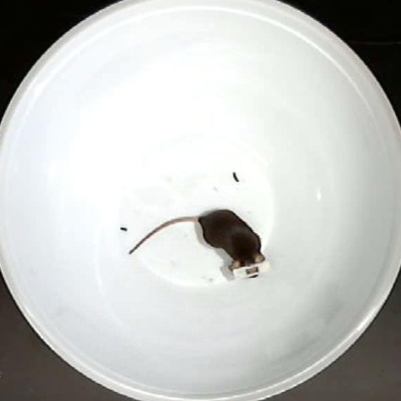
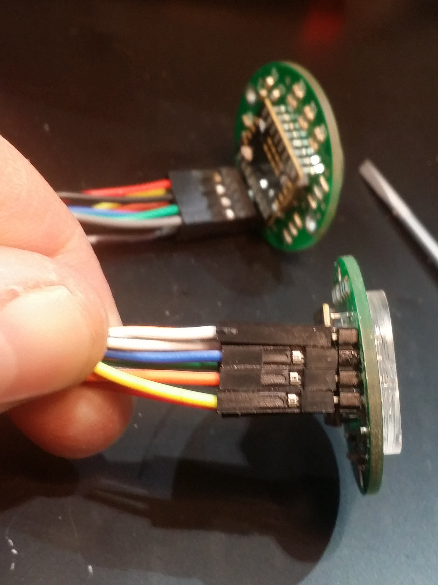
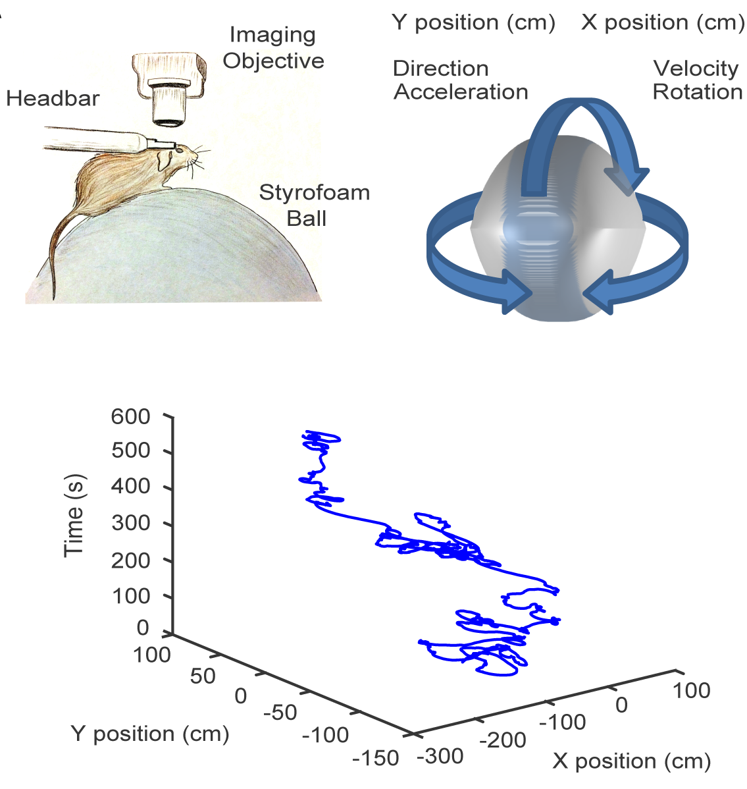
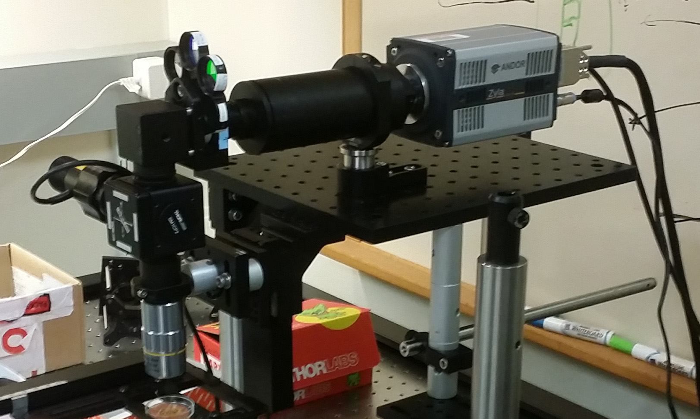
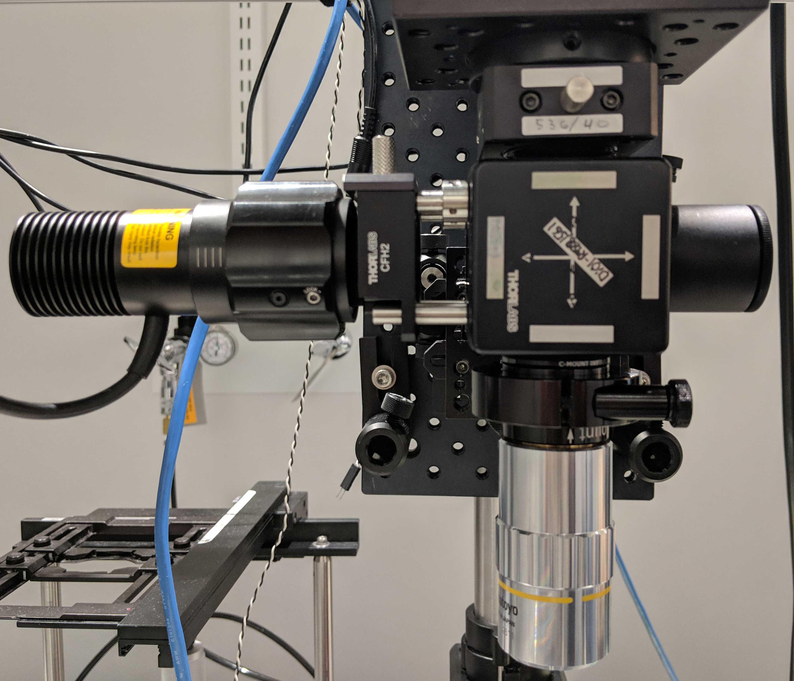

  - [List of Figures](#sec:list-of-figures)
  - [1 Introduction: Background and Literature
    Review](#sec:introduction-background-and-literature-review)
  - [2 Neural Interface Construction: Fabrication, programming, and
    assembly of of an automated system to open the channel to your
    mouses
    mind.](#sec:neural-interface-construction-fabrication-programming-and-assembly-of-of-an-automated-system-to-open-the-channel-to-your-mouses-mind.)
      - [Animal Tracking](#sec:animal-tracking)
          - [Behavior Box](#sec:behavior-box)
          - [Mouse in a Bowl](#sec:mouse-in-a-bowl)
          - [Spherical Treadmill](#sec:spherical-treadmill)
          - [Headplate Holder](#sec:headplate-holder)
          - [Motion Sensors](#sec:motion-sensors)
  - [3 Neural Analytics: Computational considerations and approaches to
    manage the continuous flow of neural imaging data… and if not making
    sense of it, perhaps making use of
    it.](#sec:neural-analytics-computational-considerations-and-approaches-to-manage-the-continuous-flow-of-neural-imaging-data-and-if-not-making-sense-of-it-perhaps-making-use-of-it.)
      - [Image Processing](#sec:image-processing)
          - [Image Processing: Tonemapping and
            Filtering](#sec:image-processing-tonemapping-and-filtering)
  - [4 Discussion: Broader considerations for clinicians, engineers, and
    research scientists preparing to make use of an increasingly
    hyper-connected
    future](#sec:discussion-broader-considerations-for-clinicians-engineers-and-research-scientists-preparing-to-make-use-of-an-increasingly-hyper-connected-future)
  - [Appendix](#sec:appendix)

# List of Figures

# 1 Introduction: Background and Literature Review

# 2 Neural Interface Construction: Fabrication, programming, and assembly of of an automated system to open the channel to your mouses mind.

## Animal Tracking

### Behavior Box

### Mouse in a Bowl

Figure 2.1: Automated animal Tracking for “Mouse in a bowl” type
experiments. a — Raw frame of video being tacked, b — Area of detected
mouse, c — Overlay of 3 consecutive frames showing movement of mouse
between each, d — video overlay showing tracked points, e — video
overlay showing tracked points, f — video overlay showing tracked
points, g — video overlay showing tracked points

### Spherical Treadmill

Figure 2.2: Spherical treadmill. a — 01-treadmill-mouse-running, b —
01-water-port, c — 03-water-delivery-zoom

### Headplate Holder

Figure 2.3: Headplate holder. a — front, b — top, c — bottom

### Motion Sensors

 

Figure 2.4: Widefield fluorescence microscope. a — schamatic showing
relation of microscope and mouse on spherical treadmill, b — setup1, c —
setup2, d — setup3-front, e — setup3-closeup, f — setup3-side, g —
setup4-front, h — setup4-closeup, i —
setup4-side

# 3 Neural Analytics: Computational considerations and approaches to manage the continuous flow of neural imaging data… and if not making sense of it, perhaps making use of it.

## Image Processing

### Image Processing: Tonemapping and Filtering

# 4 Discussion: Broader considerations for clinicians, engineers, and research scientists preparing to make use of an increasingly hyper-connected future

# Appendix
