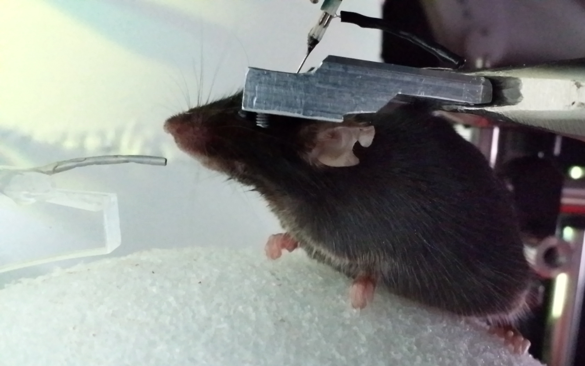
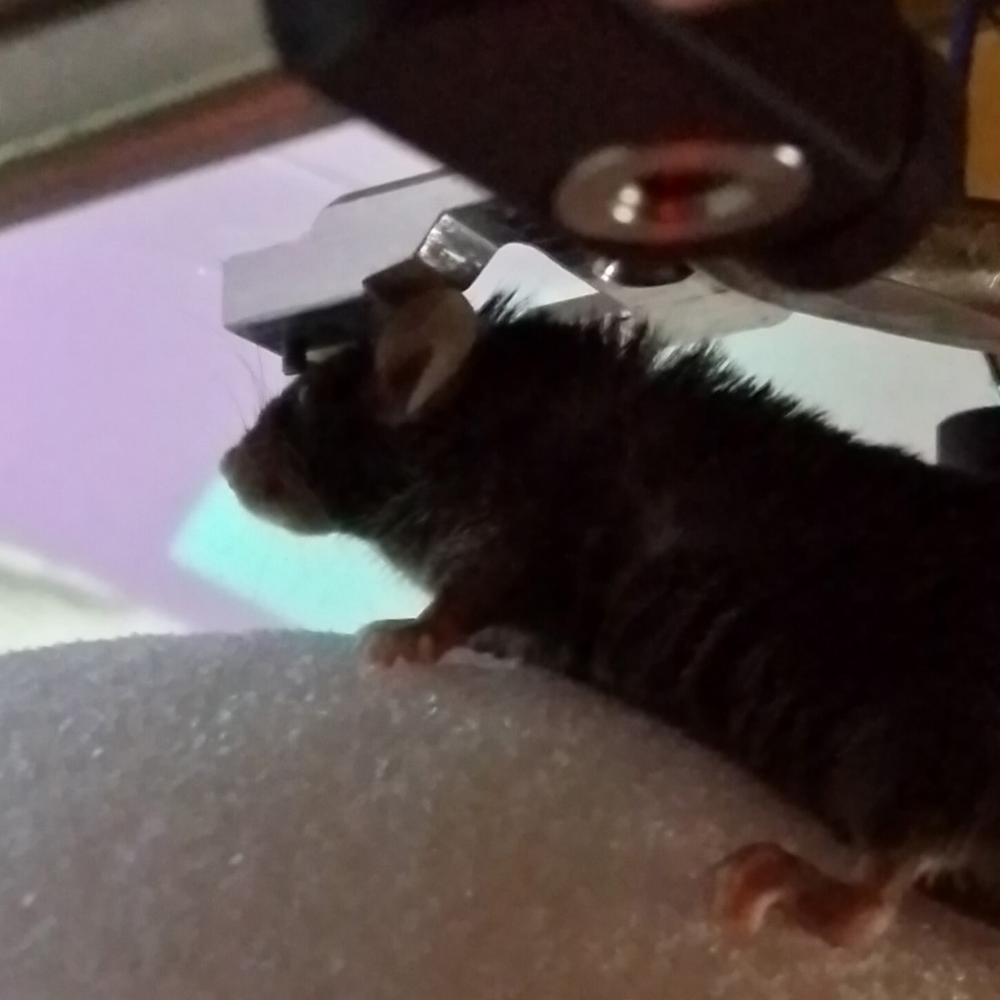

<!-- {_class="reveal stretch"} -->
<!-- {_class="reveal stretch"} -->
<!-- {_class="reveal stretch"} -->
<!-- {_class="reveal stretch"} -->
<!-- {_class="reveal stretch"} -->
<!-- {_class="reveal stretch"} -->
<!-- {_class="reveal stretch"} -->
<!-- {_class="reveal stretch"} -->
<!-- {_class="reveal stretch"} -->
<!-- {_class="reveal img"} -->
<!-- {_class="reveal stretch"} -->
<!-- {_class="reveal stretch"} --> Not ideal, but universal compaitibility is a plus
<!-- {_class="reveal stretch"} -->
<!-- {_class="reveal stretch"} -->
<!-- {_class="reveal stretch"} -->
<!-- {_class="reveal stretch"} -->
<!-- {_class="reveal stretch"} -->
<!-- {_class="reveal stretch"} -->
<!-- {_class="reveal stretch"} -->
<!-- {_class="reveal stretch"} -->
<!-- {_class="reveal stretch"} -->
<!-- {_class="reveal stretch"} -->
<!-- {_class="reveal stretch"} -->
<!-- {_class="reveal stretch"} -->
<!-- {_class="reveal stretch"} -->
<!-- {_class="reveal stretch"} -->

<!-- {_class="reveal stretch"} -->
<!-- {_class="reveal stretch"} --> Pixel features are useful for segmentation
<!-- {_class="reveal stretch"} -->

<!-- {_class="reveal stretch"} -->
<!-- {_class="reveal stretch"} -->

<!-- {_class="reveal stretch"} -->
<!-- {_class="reveal stretch"} -->
<!-- {_class="reveal stretch"} -->
<!-- {_class="reveal stretch"} -->
<!-- {_class="reveal stretch"} -->
<!-- {_class="reveal stretch"} -->
<!-- {_class="reveal stretch"} -->
<!-- {_class="reveal stretch"} -->
<!-- {_class="reveal stretch"} -->
<!-- {_class="reveal stretch"} -->
<!-- {_class="reveal stretch"} -->
<!-- {_class="reveal stretch"} -->
<!-- {_class="reveal stretch"} --> <!-- {_class="reveal stretch"} -->
<!-- {_class="reveal stretch"} -->
<!-- {_class="reveal stretch"} -->
<!-- {_class="reveal stretch"} -->
<!-- {_class="reveal stretch"} -->
<!-- {_class="reveal stretch"} -->
<!-- {_class="reveal stretch"} -->
<!-- {_class="reveal stretch"} -->
<!-- {_class="reveal stretch"} -->
<!-- {_class="reveal stretch"} -->
<!-- {_class="reveal stretch"} -->
<!-- {_class="reveal stretch"} -->
<!-- {_class="reveal stretch"} -->
<!-- {_class="reveal stretch"} -->
<!-- {_class="reveal stretch"} -->
<!-- {_class="reveal stretch"} -->
<!-- {_class="reveal stretch"} -->
<!-- {_class="reveal stretch"} -->
<!-- {_class="reveal stretch"} -->
<!-- {_class="reveal stretch"} -->
<!-- {_class="reveal stretch"} -->
<!-- {_class="reveal stretch"} -->
<!-- {_class="reveal stretch"} -->
<!-- {_class="reveal stretch"} -->
<!-- {_class="reveal stretch"} -->
<!-- {_class="reveal stretch"} -->
<!-- {_class="reveal stretch"} -->
<!-- {_class="reveal stretch"} -->
<!-- {_class="reveal stretch"} -->
<!-- {_class="reveal stretch"} -->
<!-- {_class="reveal stretch"} -->
<!-- {_class="reveal stretch"} -->
<!-- {_class="reveal stretch"} -->
<!-- {_class="reveal stretch"} -->
<!-- {_class="reveal stretch"} -->
<!-- {_class="reveal stretch"} -->
<!-- {_class="reveal stretch"} -->
<!-- {_class="reveal stretch"} -->
<!-- {_class="reveal stretch"} -->
<!-- {_class="reveal stretch"} -->
<!-- {_class="reveal stretch"} -->
<!-- {_class="reveal stretch"} -->
<!-- {_class="reveal stretch"} -->
<!-- {_class="reveal stretch"} -->
<!-- {_class="reveal stretch"} -->
<!-- {_class="reveal stretch"} -->
<!-- {_class="reveal stretch"} -->
<!-- {_class="reveal stretch"} -->
<!-- {_class="reveal stretch"} -->
<!-- {_class="reveal stretch"} -->
<!-- {_class="reveal stretch"} -->
<!-- {_class="reveal stretch"} -->
<!-- {_class="reveal stretch"} -->
<!-- {_class="reveal stretch"} -->
<!-- {_class="reveal stretch"} -->
<!-- {_class="reveal stretch"} -->
<!-- {_class="reveal stretch"} -->
<!-- {_class="reveal stretch"} -->
<!-- {_class="reveal stretch"} -->
<!-- {_class="reveal stretch"} -->
<!-- {_class="reveal stretch"} -->
<!-- {_class="reveal stretch"} -->
<!-- {_class="reveal stretch"} -->
<!-- {_class="reveal stretch"} -->
<!-- {_class="reveal stretch"} -->
<!-- {_class="reveal stretch"} -->
<!-- {_class="reveal stretch"} -->
<!-- {_class="reveal stretch"} -->
<!-- {_class="reveal stretch"} -->
<!-- {_class="reveal stretch"} -->
<!-- {_class="reveal stretch"} -->
<!-- {_class="reveal stretch"} -->
<!-- {_class="reveal stretch"} -->
<!-- {_class="reveal stretch"} -->
<!-- {_class="reveal stretch"} -->
<!-- {_class="reveal stretch"} -->
<!-- {_class="reveal stretch"} -->
<!-- {_class="reveal stretch"} -->
<!-- {_class="reveal stretch"} -->
<!-- {_class="reveal stretch"} -->
<!-- {_class="reveal stretch"} -->
<!-- {_class="reveal stretch"} -->
<!-- {_class="reveal stretch"} -->
<!-- {_class="reveal stretch"} -->
<!-- {_class="reveal stretch"} -->
<!-- {_class="reveal stretch"} -->
