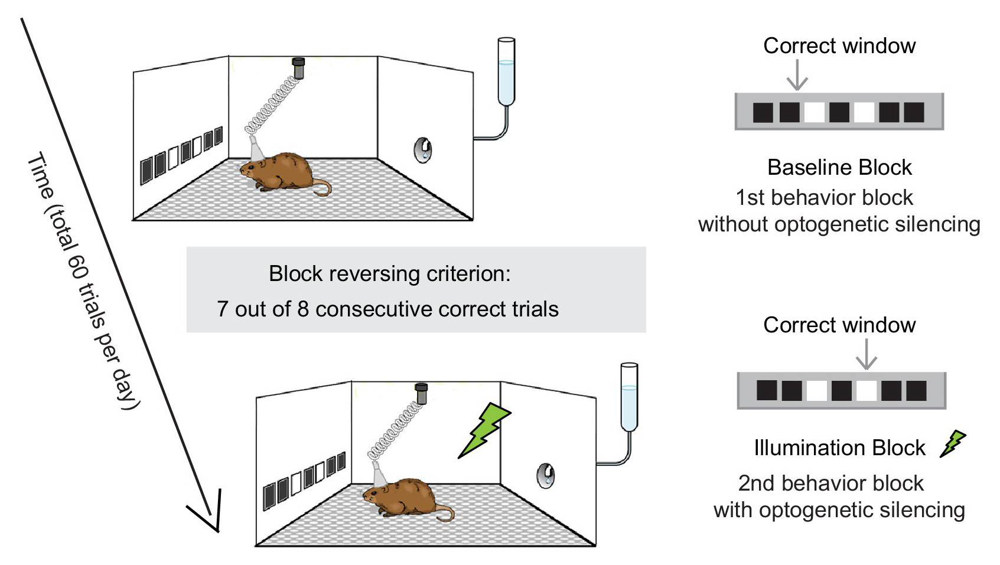
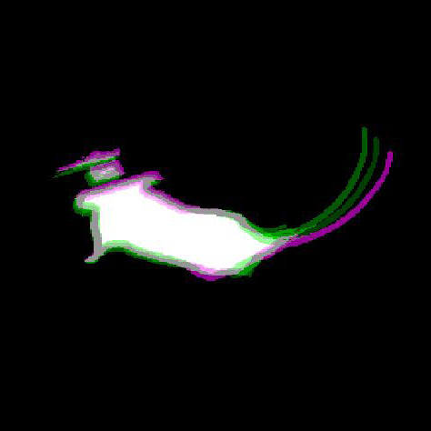
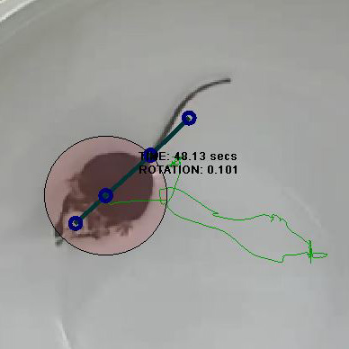
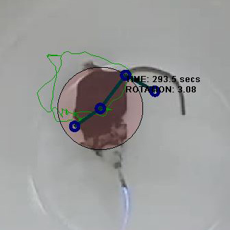
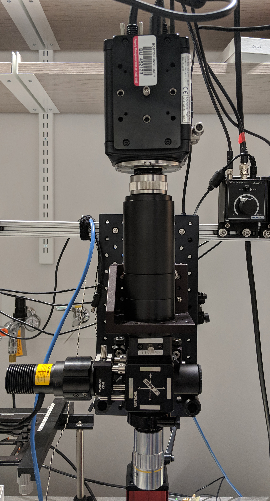

# All Figures

## Introduction: Background and Literature Review

## Neural Interface Construction: Fabrication, programming, and assembly of of an automated system to open the channel to your mouses mind.

::: {#fig:animal-tracking .subfigures}

{width="40%"}
{width="40%"}

{width="20%"}
{width="20%"}
{width="20%"}
{width="20%"}

Figure 1: Automated animal Tracking for "Mouse in a bowl" type
experiments. a --- Raw frame of video being tacked, b --- Area of
detected mouse, c --- Overlay of 3 consecutive frames showing movement
of mouse between each, d --- video overlay showing tracked points, e ---
video overlay showing tracked points, f --- video overlay showing
tracked points, g --- video overlay showing tracked points
:::

<!-- Headplate Holder -->

<!-- Spherical Treadmill -->

Not ideal, but universal compaitibility is a plus

<!-- Microscopes -->

## Neural Analytics: Computational considerations and approaches to manage the continuous flow of neural imaging data... and if not making sense of it, perhaps making use of it.

 Pixel features are useful for segmentation

 

## Discussion: Broader considerations for clinicians, engineers, and research scientists preparing to make use of an increasingly hyper-connected future

## Appendix

 

.png)
_Label_Initialization_(first_8_frames).jpg)

.jpg)

