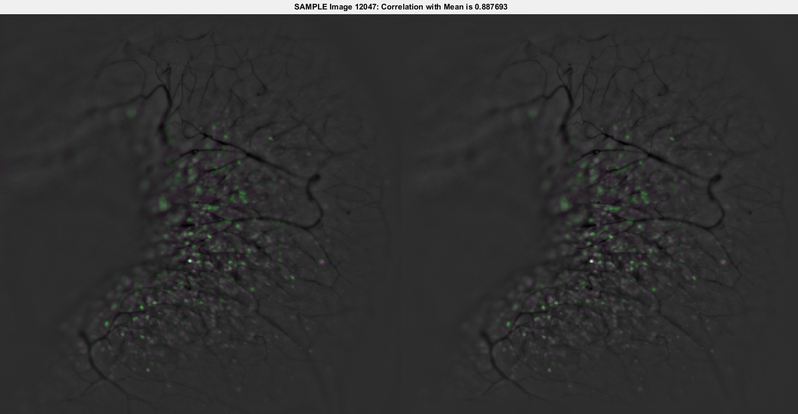

### Development & Application of a Closed-Loop Continuous Optical Neural Interface
###### Procedures for real-time image processing, neural signal extraction, and application to closed-loop control using wide-field Ca2+ fluorescence with awake behaving animals
May 31, 2019
##### Mark Bucklin

---

#### Lab Contributions
* Behavior Box for spatial discrimination study
* Mouse tracking software for Parkinson's model
* Virtual Reality presentation and motion tracking on spherical treadmill
* Microscopes for fluourescence imaging
* Image acquisition software
* Video processing software

---

#### Outline
* Wide-field Fluourescence Microscopy to image brain activity
  * Optical and Mechanical requirements
    * cameras
    * LEDs
    * Control
  * Cranial-Implant
* Video processing: *Batch* processing *Pipeline*
  * Feature Extraction, Stream Reduction
  * Storage issue: *Stream* processing *Graph*
* Compression as a Universal Framework
  * ... and a biomarker

---

#### Imaging Brain Activity in Mice with a Wide-field Fluourescence Microscope
* Sensor: GCaMP
  * Fluourescence change when calcium enters cell
* Virus
  * Delivers the GCaMP sensor
* Blue LED
  * sensor excitation
* Optical Filters
  * excitation filter + dichroic mirror + emission filter
* scientific-CMOS Camera

---


#### Microscope and Mouse Behavioral Apparatus

<!-- {_class="reveal stretch"} -->

---

#### Microscope and Mouse Securing Apparatus (headplate holder)

<!-- {_class="reveal stretch"} -->

---

#### Image Processing
* Noise filtering
  * time-series decomposition
* Motion Correction
* Cell Segmentation
  * Cell signal extraction: in manageable size

---

#### Motion Correction
* approaches to find displacement
* Lucas-Kanade iterative search
* Phase correlation, aka normalized cross correlation
* Feature Matching
    * Detect features (i.e. corners)
    * Triangulate best match



---

#### Cell Segmentation
* Adaptive thresholding
* Morphological condensation
* Temporal clustering with reduced feature descriptor of cells

---

#### Functional connectivity network behavior and behavioral relevance
* Connections across source
* Connections across time

---

### 3 Reasons we need to consider the future NOW

---

#### 1. Storage CRISIS: Data Volume
* Traditional in science labs to store raw data
  * 1 gb/s
* current capitalization 2 MB/s (16 mb/s)
* Storage capacity is fixed
  * cumulative

---

#### 2. Information Loss: Opportunites to use expanded perspectives rather than reduced form
  * Contrast
    * Linear Scaling
    * Lookup Tables
  * Spatial and Temporal Filtering
  * "Feature" images
    * Gradients
    * Surface Curvature

---

#### 3. Trend Sensor Performance and Ubiquity are **Exploding**
Two core innovations in available technology
* Molecular Engineering
  * (i.e. GCaMP)
* Cameras
  * scientific CMOS
  * inexpensive "machine vision" cameras
* (so is software)

---

#### Feature Extraction is fast
* "Feature" images (temporally independent)
    * Gradients
    * Surface Curvature
* Long Term Memory -> Storage structure
    * Statistics changes (single pixel)
    * Mutual information changes (inter-pixel)
* Continuity

---

#### Graphs identifying network connectivity can be built/updated online
* Think
    * Facebook
    * Google
    * Netflix

---

#### Computing Power and Open Software
* Computing Power and Connectivity
  * Remote Clusters (AWS)
  * Graphics Processing Units (NVIDIA GTX)
  * Embedded Units (NVIDIA Tegra X2)
* Well developed libraries
  * SciFio, OpenImageIO, BioFormats
  * OpenCV, OpenVX
  * GStreamer (much better)
  * Shader Language extensions (GLSL, HLSL, Halide)
  * CUDA
* Scalable Computing frameworks


---

#### DataFlow processing model

* Tensorflow


---

#### Standard graphics solutions
* FFmpeg
* GStreamer

---

#### Compression is everything
  - Consciousness

---

#### Map-Reduce -> Dataflow Processing
* Actors model
* Petri Nets
* **Graph** Processing
* i.e. Tensorflow


---

#### (for my parents who may wish to know what MATLAB looks like)
##### Incremental Update of Statistics
```matlab
  function [m1,m2,m3,m4,fmin,fmax] = updateStatistics(x,m1,m2,m3,m4))
  n = n + 1;

  % GET PIXEL SAMPLE
  f = F(rowIdx,colIdx,k);

  % PRECOMPUTE & CACHE SOME VALUES FOR SPEED
  d = single(f) - m1;
  dk = d/n;
  dk2 = dk^2;
  s = d*dk*(n-1);

  % UPDATE CENTRAL MOMENTS
  m1 = m1 + dk;
  m4 = m4 + s*dk2*(n.^2-3*n+3) + 6*dk2*m2 - 4*dk*m3;
  m3 = m3 + s*dk*(n-2) - 3*dk*m2;
  m2 = m2 + s;

  % UPDATE MIN & MAX
  fmin = min(fmin, f);
  fmax = max(fmax, f);
end
```

---

#### Incremental Update of Statistics
##### Extract Feature
```matlab
  function [dm1,dm2,dm3,dm4] = getStatisticUpdate(x,m1,m2,m3,m4)
  % COMPUTE DIFFERENTIAL UPDATE TO CENTRAL MOMENTS
  dm1 = dk;
  m1 = m1 + dm1;
  dm4 = s*dk2*(n^2-3*n+3) + 6*dk2*m2 - 4*dk*m3;
  dm3 = s*dk*(n-2) - 3*dk*m2;
  dm2 = s;
  m2 = m2 + dm2;
  % NORMALIZE BY VARIANCE & SAMPLE NUMBER -> CONVERSION TO dVar, dSkew, dKurt
  dm2 = dm2/max(1,n-1);
  dm3 = dm3*sqrt(max(1,n))/(m2^*5);
  dm4 = dm4*n/(m2^2);
end
```
```matlab
  [dm1,dm2,dm3,dm4] = arrayfun(@getStatisticUpdate(x,m1,m2,m3,m4)

  [dm1,dm2,dm3,dm4] = arrayfun(@getStatisticUpdate(rowidx,colidx)
```

---

#### Acknowledgements
The support and patience I have received from my committee has gone far beyond what should be expected of anyone. I can't thank you enough.
* Xue Han, Ph.D.
* Jerome Mertz, Ph.D.
* Ian Davis, Ph.D.
* Tom Bifano, Ph.D.
* David Boas, Ph.D.
