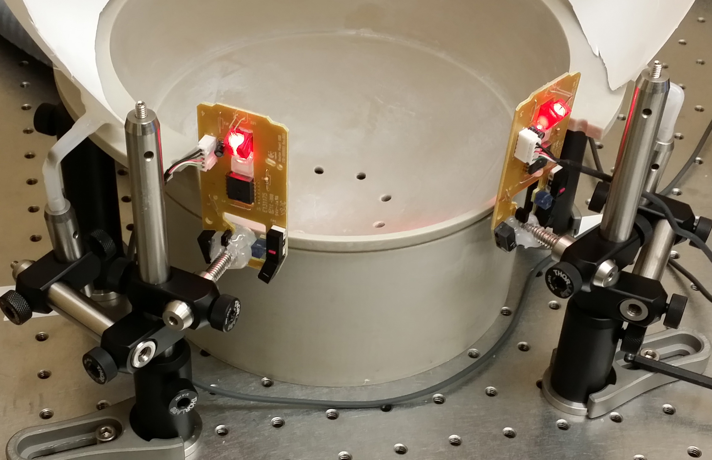

### Development & Application of a Closed-Loop Continuous Optical Neural Interface

###### Procedures for real-time image processing, neural signal extraction, and application to closed-loop control using wide-field Ca2+ fluorescence with awake behaving animals

May 31, 2019

##### Mark Bucklin

<!-- s -->

#### Lab Contributions

- Behavior Box for spatial discrimination study
- Mouse tracking software for Parkinson's model
- Virtual Reality presentation and motion tracking on spherical treadmill
- Microscopes for fluourescence imaging
- Image acquisition software
- Video processing software

<!-- s -->

#### Outline

- Wide-field Fluourescence Microscopy to image brain activity
  - Optical and Mechanical requirements
    - cameras
    - LEDs
    - Control
  - Cranial-Implant
- Video processing: _Batch_ processing _Pipeline_
  - Feature Extraction, Stream Reduction
  - Storage issue: _Stream_ processing _Graph_
- Compression as a Universal Framework
  - ... and a biomarker

<!-- s -->

#### Imaging Brain Activity in Mice with a Wide-field Fluourescence Microscope

- Sensor: GCaMP
  - Fluourescence change when calcium enters cell
- Virus
  - Delivers the GCaMP sensor
- Blue LED
  - sensor excitation
- Optical Filters
  - excitation filter + dichroic mirror + emission filter
- scientific-CMOS Camera

<!-- s -->

#### Microscope and Mouse Behavioral Apparatus

<!-- {_class="reveal stretch"} -->

<!-- s -->

#### Microscope and Mouse Securing Apparatus (headplate holder)

<!-- {_class="reveal stretch"} -->

<!-- s -->

#### Image Processing

- Noise filtering
  - time-series decomposition
- Motion Correction
- Cell Segmentation
  - Cell signal extraction: in manageable size
    <!--  -->

<!-- s -->

#### Motion Correction

- approaches to find displacement
- Lucas-Kanade iterative search
- Phase correlation, aka normalized cross correlation
- Feature Matching
  - Detect features (i.e. corners)
  - Triangulate best match


<!-- s -->

#### Cell Segmentation

- Adaptive thresholding
- Morphological condensation
- Temporal clustering with reduced feature descriptor of cells

<!-- s -->

#### Functional connectivity network behavior and behavioral relevance

- Connections across source
- Connections across time

<!-- s -->

### Online Processing

<!-- s -->

#### 1. Storage CRISIS: Data Volume

- Traditional in science labs to store raw data
  - 1 gb/s
- current capitalization 2 MB/s (16 mb/s)
- Storage capacity is fixed
  - cumulative

<!-- s -->

#### 2. Information Loss: Opportunites to use expanded perspectives rather than reduced form

- Contrast
  - Linear Scaling
  - Lookup Tables
- Spatial and Temporal Filtering
- "Feature" images
  - Gradients
  - Surface Curvature

<!-- s -->

#### 3. Trend Sensor Performance and Ubiquity are **Exploding**

Two core innovations in available technology

- Molecular Engineering
  - (i.e. GCaMP)
- Cameras
  - scientific CMOS
  - inexpensive "machine vision" cameras
- (so is software)

<!-- s -->

#### Feature Extraction is fast

- "Feature" images (temporally independent)
  - Gradients
  - Surface Curvature
- Long Term Memory -> Storage structure
  - Statistics changes (single pixel)
  - Mutual information changes (inter-pixel)
- Continuity

<!-- s -->

#### Graphs identifying network connectivity can be built/updated online

- Think
  - Facebook
  - Google
  - Netflix

<!-- s -->

#### Computing Power and Open Software

- Computing Power and Connectivity
  - Remote Clusters (AWS)
  - Graphics Processing Units (NVIDIA GTX)
  - Embedded Units (NVIDIA Tegra X2)
- Well developed libraries
  - SciFio, OpenImageIO, BioFormats
  - OpenCV, OpenVX
  - GStreamer (much better)
  - Shader Language extensions (GLSL, HLSL, Halide)
  - CUDA
- Scalable Computing frameworks

<!-- s -->

#### DataFlow processing model

- Tensorflow

<!-- s -->

#### Standard graphics solutions

- FFmpeg
- GStreamer

<!-- s -->

#### Compression is everything

- Consciousness

<!-- s -->

#### Map-Reduce -> Dataflow Processing

- Actors model
- Petri Nets
- **Graph** Processing
- i.e. Tensorflow

<!-- s -->

#### (for my parents who may wish to know what MATLAB looks like)

##### Incremental Update of Statistics

```matlab
  function [m1,m2,m3,m4,fmin,fmax] = updateStatistics(x,m1,m2,m3,m4))
  n = n + 1;

  % GET PIXEL SAMPLE
  f = F(rowIdx,colIdx,k);

  % PRECOMPUTE & CACHE SOME VALUES FOR SPEED
  d = single(f) - m1;
  dk = d/n;
  dk2 = dk^2;
  s = d*dk*(n-1);

  % UPDATE CENTRAL MOMENTS
  m1 = m1 + dk;
  m4 = m4 + s*dk2*(n.^2-3*n+3) + 6*dk2*m2 - 4*dk*m3;
  m3 = m3 + s*dk*(n-2) - 3*dk*m2;
  m2 = m2 + s;

  % UPDATE MIN & MAX
  fmin = min(fmin, f);
  fmax = max(fmax, f);
end
```

<!-- s -->

#### Incremental Update of Statistics


<!-- s -->

##### First 4 Central Moments

- over time
- incremental update
  - normalized and eventually resampled


--

##### Extract Feature

```matlab
  function [dm1,dm2,dm3,dm4] = getStatisticUpdate(x,m1,m2,m3,m4)
  % COMPUTE DIFFERENTIAL UPDATE TO CENTRAL MOMENTS
  dm1 = dk;
  m1 = m1 + dm1;
  dm4 = s*dk2*(n^2-3*n+3) + 6*dk2*m2 - 4*dk*m3;
  dm3 = s*dk*(n-2) - 3*dk*m2;
  dm2 = s;
  m2 = m2 + dm2;
  % NORMALIZE BY VARIANCE & SAMPLE NUMBER -> CONVERSION TO dVar, dSkew, dKurt
  dm2 = dm2/max(1,n-1);
  dm3 = dm3*sqrt(max(1,n))/(m2^*5);
  dm4 = dm4*n/(m2^2);
end
```

```matlab
  [dm1,dm2,dm3,dm4] = arrayfun(@getStatisticUpdate(x,m1,m2,m3,m4)

  [dm1,dm2,dm3,dm4] = arrayfun(@getStatisticUpdate(rowidx,colidx)
```

<!-- s -->


#### Acknowledgements

The support and patience I have received from my committee has gone far beyond what should be expected of anyone. I can't thank you enough.

- Xue Han, Ph.D.
- Jerome Mertz, Ph.D.
- Ian Davis, Ph.D.
- Tom Bifano, Ph.D.
- David Boas, Ph.D.


<!-- s -->

## Generated


<!-- v -->

[1](img/1.png)<!-- {_class="reveal stretch"} -->

<!-- v -->

<!-- {_class="reveal stretch"} -->

<!-- v -->

<!-- {_class="reveal stretch"} -->

<!-- v -->

<!-- {_class="reveal stretch"} -->

<!-- v -->

<!-- {_class="reveal stretch"} -->

<!-- v -->

<!-- {_class="reveal stretch"} -->

<!-- v -->

<!-- {_class="reveal stretch"} -->

<!-- v -->

<!-- {_class="reveal stretch"} -->

<!-- v -->

<!-- {_class="reveal stretch"} -->

<!-- v -->

<!-- {_class="reveal stretch"} -->

<!-- v -->

<!-- {_class="reveal stretch"} -->

<!-- v -->

<!-- {_class="reveal stretch"} -->

<!-- v -->

<!-- {_class="reveal stretch"} -->

<!-- v -->

<!-- {_class="reveal stretch"} -->

<!-- v -->

<!-- {_class="reveal stretch"} -->

<!-- v -->

<!-- {_class="reveal stretch"} -->

<!-- v -->

<!-- {_class="reveal stretch"} -->

<!-- v -->

<!-- {_class="reveal stretch"} -->

<!-- v -->

<!-- {_class="reveal stretch"} -->

<!-- v -->

<!-- {_class="reveal stretch"} -->

<!-- v -->

<!-- {_class="reveal stretch"} -->

<!-- v -->

<!-- {_class="reveal stretch"} -->

<!-- v -->

<!-- {_class="reveal stretch"} -->

<!-- v -->

<!-- {_class="reveal stretch"} -->

<!-- v -->

<!-- {_class="reveal stretch"} -->

<!-- v -->

<!-- {_class="reveal stretch"} -->

<!-- v -->

<!-- {_class="reveal stretch"} -->

<!-- {_class="reveal stretch"} -->

<!-- {_class="reveal stretch"} -->

<!-- {_class="reveal stretch"} -->

<!-- v -->

<!-- {_class="reveal stretch"} -->

<!-- v -->

<!-- {_class="reveal stretch"} -->

<!-- v -->

<!-- {_class="reveal stretch"} -->

<!-- v -->

<!-- {_class="reveal stretch"} -->

<!-- v -->

<!-- {_class="reveal stretch"} -->

<!-- v -->

<!-- {_class="reveal stretch"} -->

<!-- v -->

<!-- {_class="reveal stretch"} -->

<!-- v -->

<!-- {_class="reveal stretch"} -->

<!-- v -->

<!-- {_class="reveal stretch"} -->

<!-- v -->

<!-- {_class="reveal stretch"} -->

<!-- v -->

<!-- {_class="reveal stretch"} -->

<!-- v -->

<!-- {_class="reveal stretch"} -->

<!-- v -->

<!-- {_class="reveal stretch"} -->

<!-- v -->

<!-- {_class="reveal stretch"} -->

<!-- v -->

.png)<!-- {_class="reveal stretch"} -->

<!-- v -->

.png)<!-- {_class="reveal stretch"} -->

<!-- v -->

.png)<!-- {_class="reveal stretch"} -->

<!-- v -->

.png)<!-- {_class="reveal stretch"} -->

<!-- v -->

.png)<!-- {_class="reveal stretch"} -->

<!-- v -->

.png)<!-- {_class="reveal stretch"} -->

<!-- v -->

.png)<!-- {_class="reveal stretch"} -->

<!-- v -->

.png)<!-- {_class="reveal stretch"} -->

<!-- v -->

.png)<!-- {_class="reveal stretch"} -->

<!-- v -->

.png)<!-- {_class="reveal stretch"} -->

<!-- v -->

.png)<!-- {_class="reveal stretch"} -->

<!-- v -->

.png)<!-- {_class="reveal stretch"} -->

<!-- v -->

.png)<!-- {_class="reveal stretch"} -->

<!-- v -->

.png)<!-- {_class="reveal stretch"} -->

<!-- v -->

.png)<!-- {_class="reveal stretch"} -->

<!-- v -->

.png)<!-- {_class="reveal stretch"} -->

<!-- v -->

<!-- {_class="reveal stretch"} -->

<!-- v -->

<!-- {_class="reveal stretch"} -->

<!-- v -->

<!-- {_class="reveal stretch"} -->

<!-- v -->

<!-- {_class="reveal stretch"} -->

<!-- v -->

<!-- {_class="reveal stretch"} -->

<!-- v -->

<!-- {_class="reveal stretch"} -->

<!-- v -->

<!-- {_class="reveal stretch"} -->

<!-- v -->

<!-- {_class="reveal stretch"} -->

<!-- v -->

<!-- {_class="reveal stretch"} -->

<!-- v -->

<!-- {_class="reveal stretch"} -->

<!-- v -->

<!-- {_class="reveal stretch"} -->

<!-- v -->

<!-- {_class="reveal stretch"} -->

<!-- v -->

<!-- {_class="reveal stretch"} -->

<!-- v -->

<!-- {_class="reveal stretch"} -->

<!-- v -->

<!-- {_class="reveal stretch"} -->

<!-- v -->

<!-- {_class="reveal stretch"} -->

<!-- v -->

<!-- {_class="reveal stretch"} -->

<!-- v -->

<!-- {_class="reveal stretch"} -->

<!-- v -->

<!-- {_class="reveal stretch"} -->

<!-- v -->

<!-- {_class="reveal stretch"} -->

<!-- v -->

<!-- {_class="reveal stretch"} -->

<!-- v -->

<!-- {_class="reveal stretch"} -->

<!-- v -->

<!-- {_class="reveal stretch"} -->

<!-- v -->

<!-- {_class="reveal stretch"} -->

<!-- v -->

<!-- {_class="reveal stretch"} -->

<!-- v -->

<!-- {_class="reveal stretch"} -->

<!-- v -->

<!-- {_class="reveal stretch"} -->

<!-- v -->

<!-- {_class="reveal stretch"} -->

<!-- v -->

<!-- {_class="reveal stretch"} -->

<!-- v -->

<!-- {_class="reveal stretch"} -->

<!-- v -->

<!-- {_class="reveal stretch"} -->

<!-- v -->

<!-- {_class="reveal stretch"} -->

<!-- v -->

<!-- {_class="reveal stretch"} -->

<!-- v -->

<!-- {_class="reveal stretch"} -->

<!-- v -->

<!-- {_class="reveal stretch"} -->

<!-- v -->

<!-- {_class="reveal stretch"} -->

<!-- v -->

<!-- {_class="reveal stretch"} -->

<!-- v -->

<!-- {_class="reveal stretch"} -->

<!-- v -->

<!-- {_class="reveal stretch"} -->

<!-- v -->

<!-- {_class="reveal stretch"} -->

<!-- v -->

<!-- {_class="reveal stretch"} -->

<!-- v -->

<!-- {_class="reveal stretch"} -->

<!-- v -->

<!-- {_class="reveal stretch"} -->

<!-- v -->

<!-- {_class="reveal stretch"} -->

<!-- v -->

<!-- {_class="reveal stretch"} -->

<!-- v -->

<!-- {_class="reveal stretch"} -->

<!-- v -->

<!-- {_class="reveal stretch"} -->

<!-- v -->

<!-- {_class="reveal stretch"} -->

<!-- v -->

<!-- {_class="reveal stretch"} -->

<!-- v -->

<!-- {_class="reveal stretch"} -->

<!-- v -->

<!-- {_class="reveal stretch"} -->

<!-- v -->

<!-- {_class="reveal stretch"} -->

<!-- v -->

<!-- {_class="reveal stretch"} -->

<!-- v -->

<!-- {_class="reveal stretch"} -->

<!-- v -->

<!-- {_class="reveal stretch"} -->

<!-- v -->

<!-- {_class="reveal stretch"} -->

<!-- v -->

<!-- {_class="reveal stretch"} -->

<!-- v -->

<!-- {_class="reveal stretch"} -->

<!-- v -->

<!-- {_class="reveal stretch"} -->

<!-- v -->

<!-- {_class="reveal stretch"} -->

<!-- v -->

<!-- {_class="reveal stretch"} -->

<!-- v -->

<!-- {_class="reveal stretch"} -->

<!-- v -->

<!-- {_class="reveal stretch"} -->

<!-- v -->

<!-- {_class="reveal stretch"} -->

<!-- v -->

<!-- {_class="reveal stretch"} -->

<!-- v -->

<!-- {_class="reveal stretch"} -->

<!-- v -->

<!-- {_class="reveal stretch"} -->

<!-- v -->

<!-- {_class="reveal stretch"} -->

<!-- v -->

<!-- {_class="reveal stretch"} -->

<!-- v -->

<!-- {_class="reveal stretch"} -->

<!-- v -->

<!-- {_class="reveal stretch"} -->

<!-- v -->

<!-- {_class="reveal stretch"} -->

<!-- v -->

<!-- {_class="reveal stretch"} -->

<!-- v -->

<!-- {_class="reveal stretch"} -->

<!-- v -->

<!-- {_class="reveal stretch"} -->

<!-- v -->

<!-- {_class="reveal stretch"} -->

<!-- v -->

<!-- {_class="reveal stretch"} -->

<!-- v -->

<!-- {_class="reveal stretch"} -->

<!-- v -->

<!-- {_class="reveal stretch"} -->

<!-- v -->

<!-- {_class="reveal stretch"} -->

<!-- v -->

<!-- {_class="reveal stretch"} -->

<!-- v -->

<!-- {_class="reveal stretch"} -->

<!-- v -->

<!-- {_class="reveal stretch"} -->

<!-- v -->

<!-- {_class="reveal stretch"} -->

<!-- v -->

<!-- {_class="reveal stretch"} -->

<!-- v -->

<!-- {_class="reveal stretch"} -->

<!-- v -->

<!-- {_class="reveal stretch"} -->

<!-- v -->

<!-- {_class="reveal stretch"} -->

<!-- v -->

<!-- {_class="reveal stretch"} -->

<!-- v -->

<!-- {_class="reveal stretch"} -->

<!-- v -->

<!-- {_class="reveal stretch"} -->

<!-- v -->

<!-- {_class="reveal stretch"} -->

<!-- v -->

<!-- {_class="reveal stretch"} -->


<!-- _2015Sep02_210AM.jpg)<2!-- {_class="reveal stretch"} --2> -->


<!-- _2015Sep02_209AM.jpg)<2!-- {_class="reveal stretch"} --2> --1> -->


<!-- <2!-- {_class="reveal stretch"} --2> --1> -->


<!-- v -->

<!-- {_class="reveal stretch"} -->

<!-- v -->

<!-- {_class="reveal stretch"} -->

<!-- v -->

<!-- {_class="reveal stretch"} -->

<!-- v -->

<!-- {_class="reveal stretch"} -->

<!-- v -->

<!-- {_class="reveal stretch"} -->

<!-- v -->

<!-- {_class="reveal stretch"} -->

<!-- v -->

<!-- {_class="reveal stretch"} -->

<!-- v -->

<!-- {_class="reveal stretch"} -->

<!-- v -->

<!-- {_class="reveal stretch"} -->

<!-- v -->

<!-- {_class="reveal stretch"} -->

<!-- v -->

<!-- {_class="reveal stretch"} -->

<!-- v -->

<!-- {_class="reveal stretch"} -->

<!-- v -->

<!-- {_class="reveal stretch"} -->

<!-- v -->

<!-- _vs._Minimum_Estimate_(BLUE).jpg)<1!-- {_class="reveal stretch"} --1> -->

<!-- v -->

.png)<!-- {_class="reveal stretch"} -->

<!-- v -->

_Label_Initialization_(first_8_frames).jpg)<!-- {_class="reveal stretch"} -->

<!-- v -->

<!-- {_class="reveal stretch"} -->

<!-- v -->

<!-- {_class="reveal stretch"} -->

<!-- v -->

<!-- {_class="reveal stretch"} -->

<!-- v -->

<!-- {_class="reveal stretch"} -->

<!-- v -->

<!-- {_class="reveal stretch"} -->

<!-- v -->

<!-- {_class="reveal stretch"} -->

<!-- v -->

<!-- {_class="reveal stretch"} -->

<!-- v -->

<!-- {_class="reveal stretch"} -->

<!-- v -->

<!-- {_class="reveal stretch"} -->

<!-- v -->

<!-- {_class="reveal stretch"} -->

<!-- v -->

.jpg)<!-- {_class="reveal stretch"} -->

<!-- v -->

<!-- {_class="reveal stretch"} -->

<!-- v -->

<!-- {_class="reveal stretch"} -->

<!-- v -->


<!-- .slide: data-background="./img/1.png" -->


